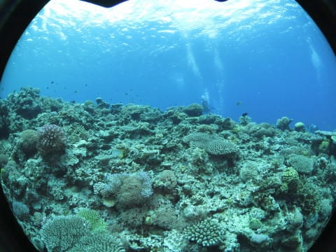

# 2019年8月，座間味で小6の娘と親子ダイビング！その8…ダイビング2日目の2本目＆お昼休み

📅 投稿日時: 2019-11-09 02:05:21

🏷️ カテゴリ: [ダイビング日記](ce3a7a8d424d112fce83ee85c81a0e344.md)

某国出張中で、昨晩も夜までディスカッションが続き。

今朝も8時からブレックファーストディスカッションで、

記事を書いてる時間がないけど。

書きためておいたダイビング旅行記です。

…もう、スキーシーズン始まってますが…

こちらはまだ金曜朝。

これから午後まで某国で仕事して、

そのまま夜の飛行機に飛び乗り帰国予定です。

とりあえず、ダイビング旅行記へ、Go!

---

ってなことで．

1本目終了後，子供たちは

しばらく晴天の海で遊んでましたが…

1本目終了後の水面休憩1時間となった

11時半ごろ．

2本目のダイビング，スタートです！

2本目のポイントは，「儀名」．

これまでに何度も潜っている

ポイントです…

ポイントは，こんな感じで

いくつかの根を伝って

潜っていきますが．

ちょっと深いポイントがあり，

最大深度12mの制限がある娘は，

私と二人で浅めの根の上で

ちょっとお留守番．

みんなは，深いところに進んで行きます…

だもんで，私のカメラには

あまりいい写真が残ってませんでしたが…

深いところに行くと，キンメモドキが

ごっちゃりついている根があって．

うちの妻のカメラには，こんな写真が

残ってました…

そして，他のメンバーが深場から

戻ってきたら，また合流して．

しばし，サンゴの上を進んで行きますが…

うむ．

深場に行けなかった我々．

あまり見どころなくボートの

下に戻ってきて．

エグジットとなりました…

そして．

ボートの上に戻ってくると…

もう，見事な日差しの南国の海！

そして，お昼ご飯タイムなので．

今日も星砂さんのお弁当で

お昼ご飯です．

…ただ．

娘は，ゆっくり座って食べるのも

時間が惜しいという感じで，

立ったままお弁当を掻き込み…

そして．

いつも通りに，

食べ終わったと同時に，

すぐに他の子どもたちと一緒に，

海にとびこんでました…

いや…

君たち，ホントに海が好きだね…

大人たちは，きれいな海を愛でつつ，

ゆっくりお昼ご飯を食べて．

そのあとは，また目の前の

嘉比島まで泳いで行って，

海岸を散歩したりと．

ゆっくりと昼休みを

堪能したら…

午後1時半ごろ．

ボートは嘉比島前を離れて．

3本目のポイントに向かい，

移動を開始しました…
