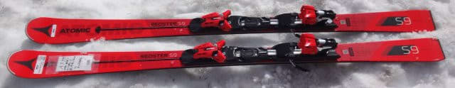
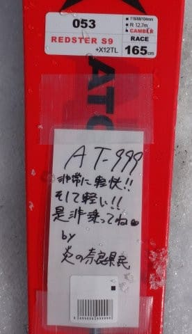
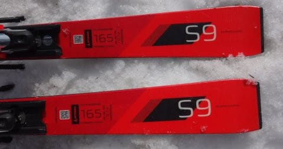
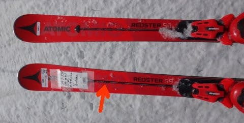
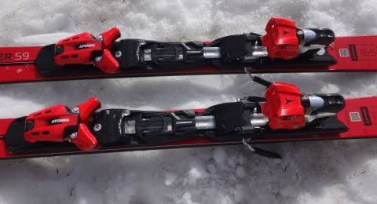

# 2018シーズンモデル，スキー試乗レポート第19回…ATOMIC編その3

📅 投稿日時: 2017-06-15 01:38:38

えー．

今週末の月山は，久しぶりにいい天気に

なるんじゃないか…と思っている，Skier_Sです．

…あぁ…天気がいいのか…

雪もまだたっぷりあるみたいだし…

参観日が．

参観日さえなければ…（涙）．

とりあえず．

スキーに思いを馳せながら．

本日も，スキー試乗レポートです．

今回は，アトミック編．

Bluesterの後継である黒い板じゃなく，

Redsterの後継の赤い板の方に乗ってきました…

では，どうぞ～！

---

◎ATOMIC REDSTER S9 X12TL 165cm

SL競技用・基礎小回り用

この板，本来試乗会に出る予定がなかったらしく．

説明書きが手書きになってますが…

＃それもスキーブロガーの「[炎の奈良県民](http://ski-yoshi.jugem.jp/)」さんの

＃手書きですね…

モデルラインナップが全く変わる来シーズンのATOMIC．

SLモデルは，

　ビンディングがVARビンディングになり，

　Servotecがつかない選手用のREDSTER S9 FISと．

　ビンディングがTLで，Servotecがつく，

　セカンドモデルのREDSTER S9

の2種類がありますが．

（この矢印の棒がServotec)

今回試乗したモデルは，セカンドモデルのS9になります．

…このS9と基礎モデルのS9iとの違いは，

・色が赤い

・コアが軽量カルバコアじゃない

という違いくらいで，それ以外はサイドカーブも

Servotec付きというところも，ビンディングが

TLビンディングというところも同じです…

（ビンディングはTL)

ちなみに，VARビンディング＋ServotecなしのS9 FISを，

軽量カルバコアにした「S9 Pro」というモデルも

限定生産ながら販売されるようですが．

こちらは試乗板がありませんでした…（涙）

うむ．

ATOMICを買うなら．このモデルが本命だったんですが…

とりあえず．

Servotec付き＆TLビンディングのS9.

こいつで滑ってみたところ．

板はS9iより強く感じます．

フレックスも，グリップもS9iより

強めに感じます．

ただ，ガッツリグリップして，エッジが効いて

キューンと回っていく…というよりは，

張りの強い板がずれていく中で，

トップが抵抗を受けて回っていく感じ．

しかし，谷回りの操作性は驚くものがあります．

板はS9iよりは重いけど，これまでのATOMICに

比べると十分軽く．

この軽快さが生み出す谷回りのコントローラビリティは

特筆もの．

谷回りで板がガッツリとらえていくというより，

谷回りでどこにでも好きなように板が動かせて，

それで乗り手の意図通りにターンを作っていける．

そんな感じの板です．

これまでのATOMICのような，谷回りから

ガッツリエッジが効いていく板ではありません．

テールの張りはS9iより感じられるけど，

板の反発は弱め．

山回りでテール気味に乗っていくんだけど，

これまでのSXで期待してしまうような，

板の早い返りでテールがすっと抜けていく…

という感じは弱いです．

やはり，これまでのATOMICの，ガッツリエッジが効いて，

山回りの最後までしつこく粘るような乗り味とは

全く違うので，

これまでATOMICが嫌いだった人にも，ぜひ乗って

欲しい板ですね…

…逆に言うと．

これまでのATOMICに慣れすぎた自分にとっては，

ATOMICの基礎小回り用として期待したものと

かなり違うので，戸惑いが禁じえませんが…

でも．

ガッツリグリップしすぎない分，スキー板を

動かす自由度は極めて高く．

軽量で，軽快な板を自由に動かしていって，

乗り手の思い通りに板をコントロールする…

そういう板になったなぁ，と感じました．
