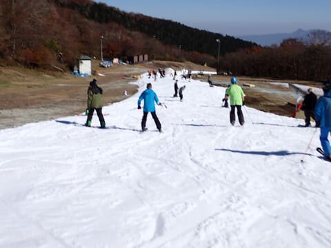

# 2023/11/3(祝)，祭日のイエティで滑ってきたよ！速報レポート&動画…昼間はそこまで混まなかったけど暑い．ナイター激込み

📅 投稿日時: 2023-11-04 01:43:51

🏷️ カテゴリ: [2024スキー滑走日記](c453f687e8a0f05679e95831d0a02cd0c.md)

ってなことで．

今日もイエティに滑りに行ってきました～！

…それも睡眠時間2時間半で（涙）

で．

本日，軽井沢に滑りに行った特派員が

いたようですが…

軽井沢はリフト待ちがピークでこのくらいと，

意外とそこまで混まなかったみたいですね…

プリンスゲレンデもそれほど人が多くは

ないみたいに見えますね…

午前中は硫安がしっかり効いて，それほど

雪が緩まなかったみたいですが，

さすがに午後はちょっと荒れてきたみたいで．

下の方はこの写真みたいに，ちょっと両端が

盛り上がった小回りレーンっぽくなり，

ちょいと滑りにくかったみたいです…

ってなことで．

以上が軽井沢からの特派員レポートでしたが…

ここからは私が滑りに行ったイエティの

レポートです．

予想通り，今日は朝から終日晴れ！！

…というか，昼間は暑かった…

最高気温は20℃近くまで上がったようで．

11月の標高1000mの気温としてはあり得ない

気温の高さ（涙）

そのせいで，昼間の雪はちょっと滑りが

悪い雪になっちゃいました（泣）

でも，コース幅はオープン時に比べ

1.5～2倍くらいに広がった感じで．

さらに今日もペアリフトは動かず，クワッド

だけ運転だったので，コース上の人口密度も

あり得ないほど高くなることはなく．

クワッド1本だけの運転でも，昼間の

最高リフト待ちはこの程度．

大体5分待ち程度でした．

むしろナイターのリフト待ちが一番

長かった…（涙）

こちらは10分以上待ちました（泣）

ってなことで．

いつもの定番，コース動画はこんな感じです～！
