# 2024年8月，5度目の子連れモアルボアル，コロナ後初の海外へ！その11…ダイビング初日の3本目，本日のダイビング終了！

📅 投稿日時: 2024-10-23 00:45:56

🏷️ カテゴリ: [ダイビング日記](ce3a7a8d424d112fce83ee85c81a0e344.md)

気象庁の2週間予報を見ても．

これからまだしばらく，首都圏近辺では

異常高温が続きそうで．

気象庁からは[早期天候情報が出され](https://www.data.jma.go.jp/cpd/souten/?reg_no=20)，

「関東甲信地方　１０月２７日頃から

　かなりの高温」

「関東甲信地方の向こう２週間の気温は、

　暖かい空気に覆われやすいため、

　かなり高くなる見込みです。」

という恐ろしい予報がでてますね…（涙）

うーん．

イエティの造雪は進んでいるようですが…

たぶん，例年よりゲレンデの幅は狭いかも．

とりあえず．

明日もう少し詳細に，今後の天気を予想

しますが…

少なくとも，スキーヤーの元気が出る

天気予想にはならなさそう（泣）

…でも．

あと2日でイエティオープンですよ～！

…もう日付が変わって水曜なので．

明後日にはもう，スキー場がオープン

しますよ～！

と言っておきながら．

今日も本題はまだまだ夏の話題．

モアルボアルのダイビング旅行記です…！

ーーー

ということで．

我が家族で貸し切りの，今日の午後のダイビング．

好きなポイントに行きますよ～！

ということだったのですが…

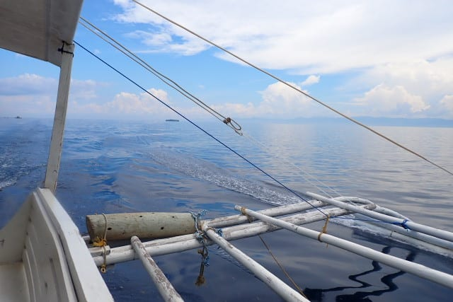

うーん．

1本目がサンゴとハナダイ系，

2本目がイワシの群れだったので…

3本目はハゼポイントがいいかな？

と思ったけど．

明日午前中2本，他のお客さんのリクエストで

ハゼポイントに行くそうなので…

またサンゴとハナダイ系のポイントを

リクエストしてみました～！

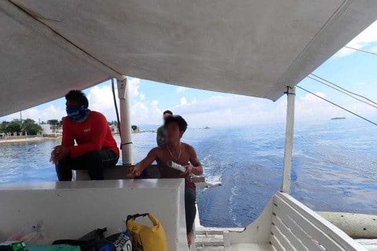

ってなことで．

向かったポイントは「ドルフィンハウス」

ドロップオフ沿いがきれいなポイントの

ようで．

ショップから15分ほどで到着！

手短にブリーフィングを受けて…

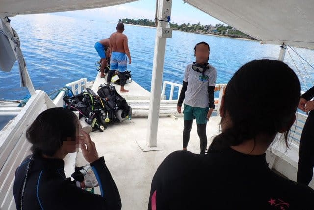

ブリーフィングが終わったら，準備を始めますが．

もう，完全に殿様ダイビングなので．

ウェイトは着けてもらえるし，フィンの

ストラップは緩めてくれるし，

器材は背負わせてくれるし．

至れり尽くせりですね～

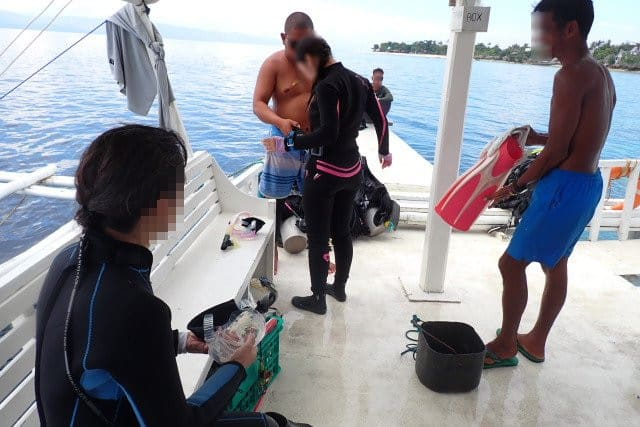

ってなことで．

今日の3本目へエントリー！！

エントリー後，いきなり後ろをウミガメが

横切っていってますね…

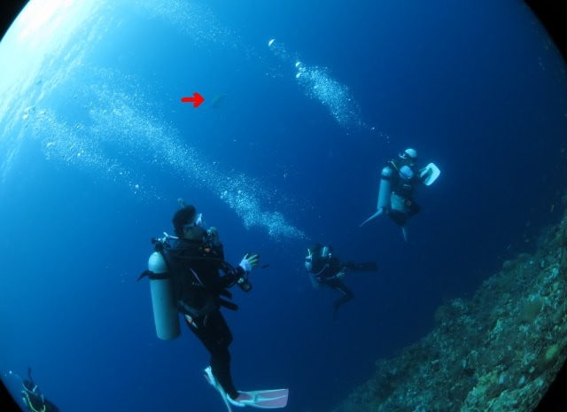

エントリー後は，ドロップオフ沿いを

落としていきますが．

…そういえば，前回モアルボアルに

来たときは，まだ娘もジュニアオープン

ウォーターだったので，最大水深12m

制限があり，我が家族がどうしようもなく

1チームにならざるを得なかったけど．

今日がコロナ禍以降，久しぶりの家族3人だけの

ダイビングじゃないかな…？？

（座間味では祖父母も潜っているので，

3人だけのダイビングはなかった）

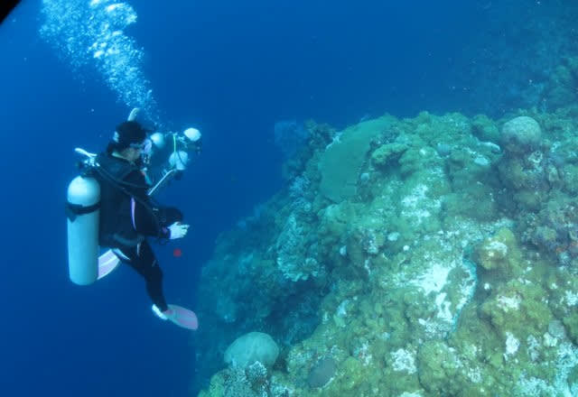

ということで．

我が家貸し切りの3本目．

ガイドのじゅんこさんがまず案内して

くれたのが，スパインチークアネモネフィッシュ．

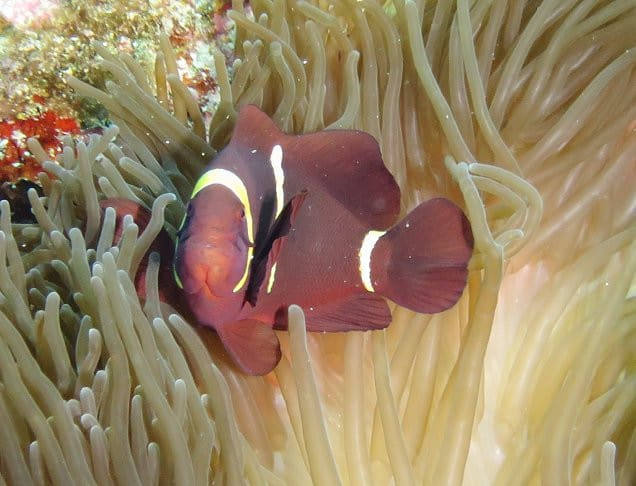

その名のもとになるほっぺたのトゲが特徴的な

クマノミですね…

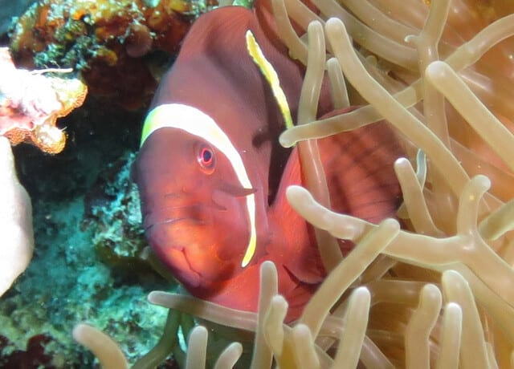

さらにドロップオフ沿いを流していくと．

目の前をパープルビューティーの群れが

通りすぎていきます…

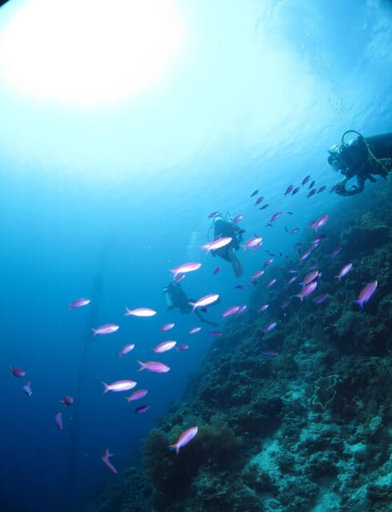

うん．

ドロップオフでサンゴもキレイで．

ハナダイ系もいるけど…

やっぱり，魚影はペスカドールの方が

圧倒的に濃いかな～…

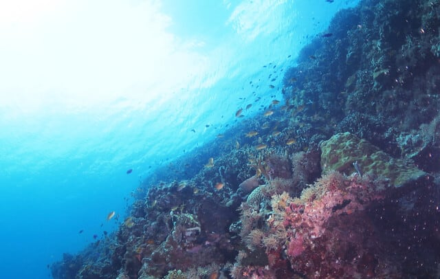

でも．

このきれいに空が見える透明度と，

サンゴのきれいさは，結構気持ちいいよ！

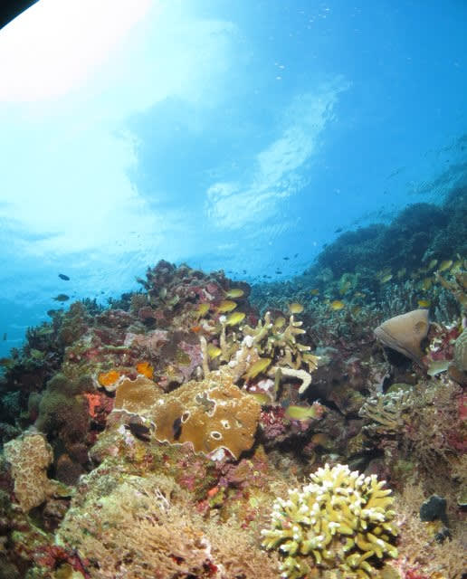

ってな感じで．

セジロクマノミとか眺めつつ，

ドロップオフ沿いを流していると…

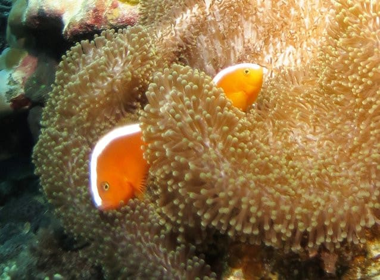

あっという間にダイビング終了タイム．

エグジットポイントへ先回りしたボートの下へ

戻ってきました…

うーん．やっぱりペスカドール島の方が，

魚影も濃いし見ごたえがあったというのが，

写真の枚数の少なさでもわかります…

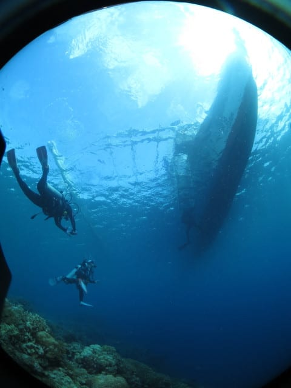

1，2本目がすごかったから，それと比べると

3本目はちょっと地味な感じだったけど…

でも，初日からかなり満足度の高い3本

でした！！！

ということで，本日の3本目，本日ラストの

ダイビングも無事終了！

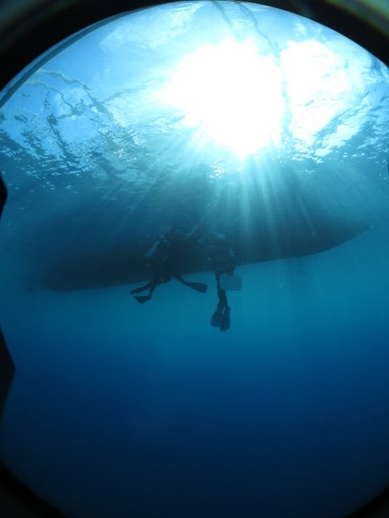

ボートはショップへ向かって走り出しますが．

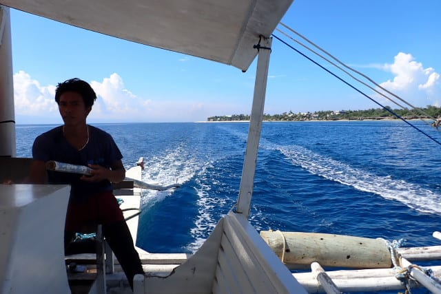

ダイビング後，いつものサービスの暖かい

飲み物をもらって．

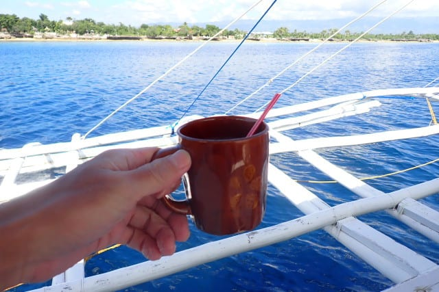

ゆっくりと飲み物をすすりながら，

南の島の風に吹かれて，海の上を

船で進んでいく，この充実感…

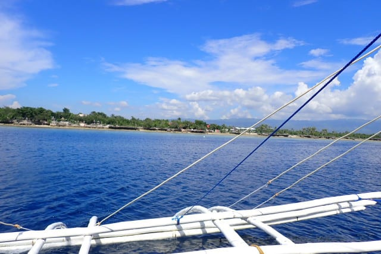

いつまでも，このボートの上でくつろいで

過ごしてるのも，リゾート感があっていいよな…

と思っていたけれども

やはり行きと同じ15分で，無情にもボートは

ショップ前に到着してしまったのでした…

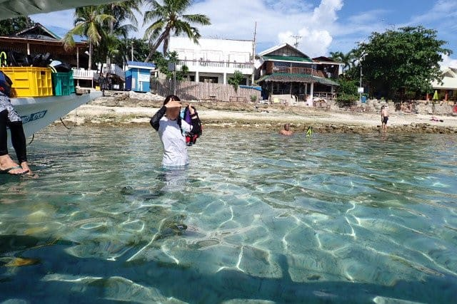

（続く）
