# 10月28日（土）のイエティ詳細モード…雨はそれほどひどくなく，ガラガラ！

📅 投稿日時: 2017-10-30 01:31:08

ということで．

土曜は雨の予報にもかかわらず，

イエティで滑ってきたわけですが．

昨日速報した土曜のイエティ．

本日は詳細モードにて…

まず．

朝8時の営業開始前に到着したわけですが．

駐車場に着くまでは雨が降らずに持っていた天気．

駐車場に着いたタイミングでちょうど雨が

降り始めた感じで，

ポツポツと雨粒が…（涙）．

雨のせいか．

駐車場も車が少ないです…

そしてなんと．

朝8時の窓口に，誰も人が並んでません…！

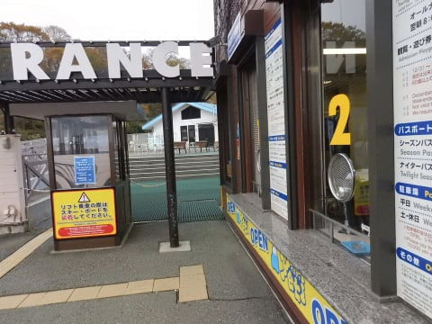

これは…

今日もゲレンデは，ガラガラっぽいなぁ…

ってことで．

ゲレンデに出ると…

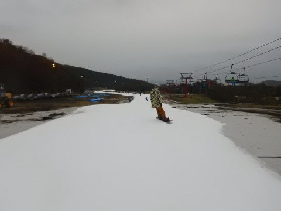

いや．

この週末は，2度目の営業中止．

先週の激烈台風での雪解けからの復活でしたけど．

…大体，シーズン初めと同じ程度のゲレンデ幅が

キープされてますね！

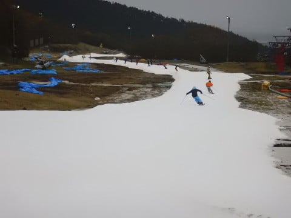

よくまぁ，数日でここまで回復させたものだ…

朝イチの雪は，硫安が効いてかなり締まり気味で，

意外と気持ちよく飛ばせるよ！

雨で雪がグズグズに崩れるかと思ったら…

かなり大量の硫安が効かせてあるようですね～．

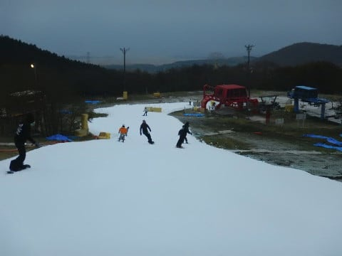

で．

こんな日に滑りに来ようってバカ人はそんなにいないので．

リフト待ちは当然無くて，

もう飛び乗りぐるぐる状態！

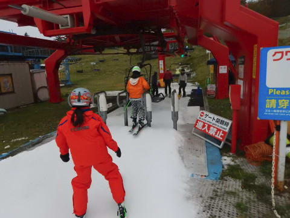

でも…

意外とゲレンデは，そこそこ人がいたかな．

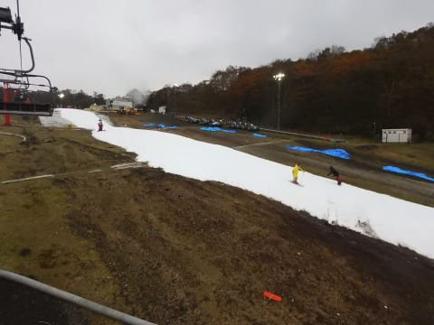

こうやって見ると，雪の厚みもそこそこ

キープされているのが分かるかと．

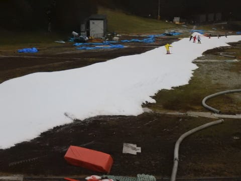

朝のうちは，こんな感じで寂しい雨が

降っていたものの…

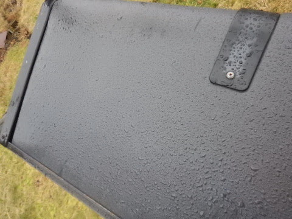

30分ほどたつと，雨が上がってきましたよ！

…そして，1時間も経つと．

富士山も見えてきました！

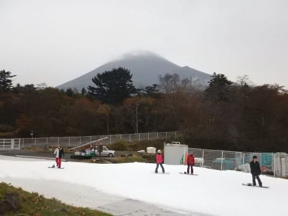

をを！

雨も止み，人も少なく，

ゲレンデは硫安で締まっているので…

午前中は，割と気持ちいいよ！（幅は狭いけど）

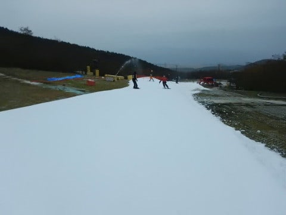

午前中，それほど降らなかったので．

リフト搬器も乾いてきましたね…

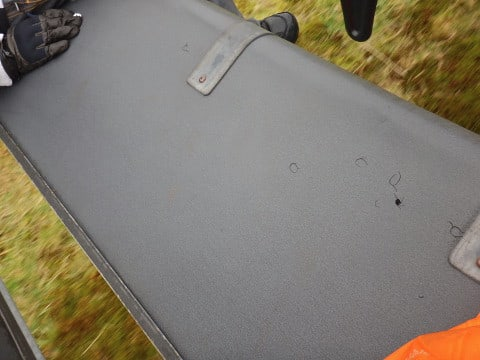

いや．

今日の午前中，それほど雨が降らなかったのは，

やはり私の祈りのおかげ…

昼近くになっても，リフトは飛び乗り状態で

グルグルできます！

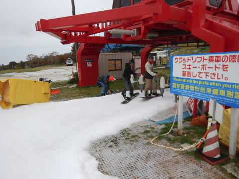

素晴らしい…

ただ，昼過ぎに一瞬ちょっと雨が強まりましたが．

せいぜいパラパラ程度で．

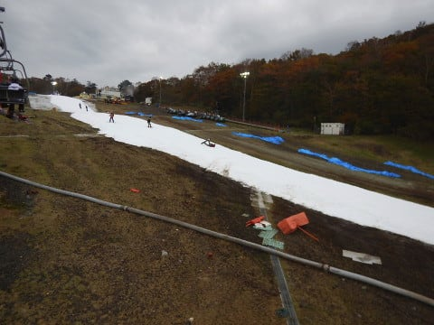

まぁ，それもすぐに弱まり．

…意外と，今日は悪くないなぁ…←あなたは滑れればどんなところでもいいんでしょ

午後になると，ちょいとゲレンデの人が増えてきて．

タイミング的にはこのくらいの人口密度に

なることもあったけど…

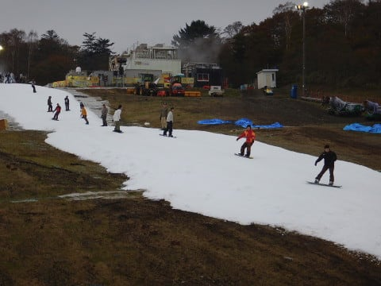

でも，午後までずっとリフト待ちは0が

続き．

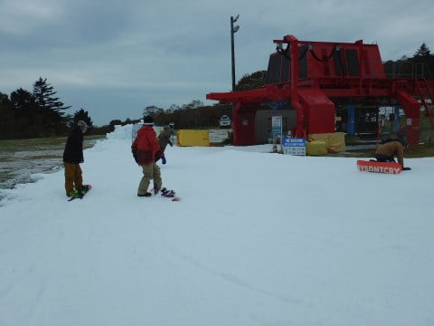

さらに，午後は雨が強くなるかと思ったら．

意外と午前中と同じ調子で，

時々パラパラと雨が降ったかな…

と思ったら，すぐ止むような感じ．

午後は強めの雨の予報だったけど．

それが外れたのは，

…これはやはり．

私の祈りのおかげ…（ドスっ）←読者に差される音

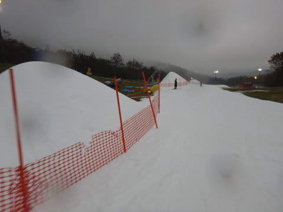

とりあえず．

これまでの歴史をくりかえさないように（？）

朝から全力で雪を造り続けているみたいで．

午後になると，コースが雪山だらけになってましたが．

雪を全力で作るため，今日もアイスクラッシュの

建物の中の人は，必死にかき氷機を

回し続けているようです！

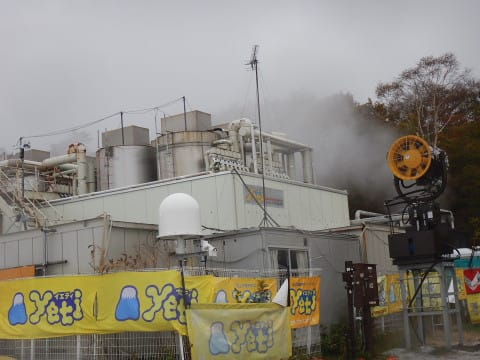

今日も，男たちの汗が，蒸気となって建物の外に

流れています…

そして．

天気もそんなに良くないし，早めに帰ろうかな…

と，思っていたのと裏腹に．

予想よりマシな天気に，ついつい予想外に，

コース整備のリフトストップタイム，16時まで

滑ってしまいました…←いや，みんなの予想通りだから

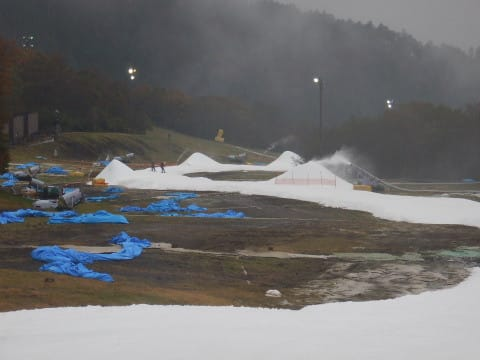

コース上にためられた，アイスクラッシュマンの

努力の賜物の雪が，圧雪車で延ばされていってます…

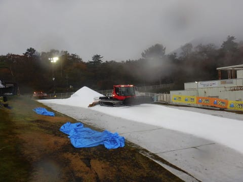

まぁ，今日はそれほど雨も強くなく．

さらに，気温もそこそこ冷え気味で，

10℃を下回るほどだったので．

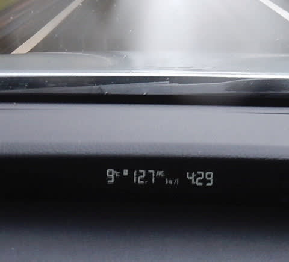

雪も薄くなったり，穴が開いたりすることはなく．

普通なら，全く問題なくこのまま行けそうな

雪の状態でしたが…

無事，日曜の夜を乗り越えられるのでしょうか？？

とりあえず．

日曜は15時に営業が終わってしまい．

明日は7時には営業ができるかどうか案内する，

とYetiのホームページに書いてありましたが…

無事にこの台風を乗り越えてくれるのを

願いましょう…

## 💬 コメント一覧

### 💬 コメント by (yama)
**タイトル**: イエティ
**投稿日**: 2017-10-30 23:15:11

本日３０日イエティに行ってきました。オープンは１０時だったのですが、諸事情により１１時過ぎのスタートになりました。さすがに平日はリフトはガラガラほとんど飛び乗り状態です。昼間は硫安が効いて狭いながらも楽しく滑れました。ナイターは圧雪が弱く３本ほどで荒れてしまいました。

### 💬 コメント by (Skier_S)
**タイトル**: yamaさま
**投稿日**: 2017-10-31 01:45:44

あ，今日行ってこられたのですね…

天気が良くてガラガラで，恵まれた一日でしたね！

ここ2回雨に祟られた私にとっては

うらやましい限りです…

また11月3連休最終日にご一緒しましょう！

### 💬 コメント by (ほっぽ)
**タイトル**: 10/31のイエティ
**投稿日**: 2017-11-01 06:30:46

昨夜、イエティナイターで滑ってきました。

まだまだ狭い廊下ですがこれで寒さが安定してくれば徐々に広がってくれるのかなと思います。

昨夜は人も少な目、雪質も締まっていてなかなか快適でした。

大雨が来なければ今週末は良いコンディションで滑られると思います。

リンク先のＨＰに滑走記録をアップしておきました。

### 💬 コメント by (Skier_S)
**タイトル**: ほっぽさま
**投稿日**: 2017-11-02 02:32:19

昨日も行かれたんですね！

…でも，HPに滑走記録がアップされてないように

見えるのですが…

平日の夜は，人も少なくてガラガラで

イイでしょうね～！！

この3連休は，天気も良さそうなので，

ここしばらくの悪天候の憂さが晴らせる

のかも…

でも．

天気が良い3連休って混みそう…

今のところ，5日日曜に出没予定です！

### 💬 コメント by (ほっぽ)
**タイトル**: Unknown
**投稿日**: 2017-11-02 06:57:08

Ｓさん

11/5、ナイターに出撃するかもしれません。

ナイターまでいらっしゃるようでしたら探してみます。

ＨＰですが、クリックしたら見えました。

### 💬 コメント by (Skier_S)
**タイトル**: ほっぽさま
**投稿日**: 2017-11-03 01:16:03

あ，HPの「What's New」

のところにありましたね！

「今シーズンの滑走記録」

のページが更新されていなかったので，

てっきりまだアップされていないのかと…

5日，ナイターまで滑るかまだ未定ですが，

yamaさんと行く予定ですので，

ナイターまで滑っていたら，こんどこそよろしく

お願いします～！

