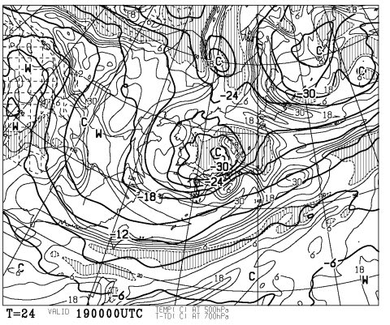
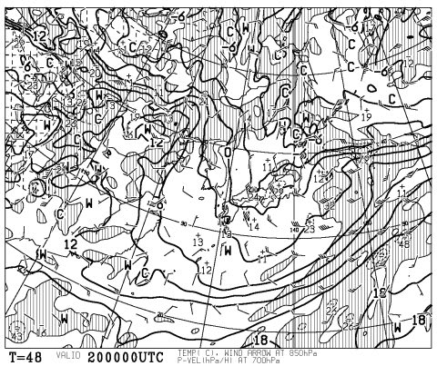
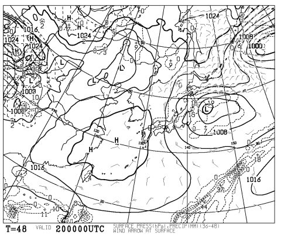

# 19，20日は雪？？？

📅 投稿日時: 2011-04-19 00:21:07

🏷️ カテゴリ: [スキー天気予想](c6554f5c3c106093b511a8daae23757e8.md)

そろそろ4月も下旬に入ろうとしてますが．

なんだ？？

この，19日朝9時の500hpa気温予想は？？

これは，いわゆるニュースなんかでよくやっている，上空5000mの

寒気とかいうやつですが．

マイナス30度っていう寒気が入ってきてます．

これは，真冬並みです．

これは，かなり冷たい空気です．

マイナス30度は，真冬に入ってくれば，そこそこの雪を降らす目安の寒気．

…こんな寒気が4月下旬に入ってくるとはっ！

19日午前中までは，地上では低気圧に向かって

暖かい南風が入り込むので，雨になりそうですが．

低気圧の通過後，地上には低気圧背面のかなり冷たい空気が

入ります．

20日朝9時の予想では，上空850hpa気温の0度線が本州を

すっぽり覆ってます．

850hpaが0度以下になると，標高1500mくらいでは．

降れば雪です．雨にはなりません．

んで…

20日朝9時には，日本海側に降水量予想がありますね…

あまり本降りにはならないでしょうが，19日の夜から

20日朝にかけて，日本海側の山沿いでは雪ですね…おそらく．

残念ながら，大量に積もるほどではないですが，19日の

夜から20日朝にかけて，志賀高原は雪がちらつきそうです．

うーーん．

しかし．

水曜日に雪が降っても．

週末，また天気悪そうなんだよなぁ…

雨かも…
