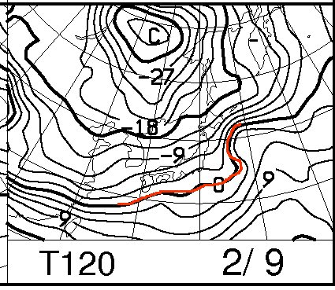

# 定番！今週末の志賀高原の天気は…？うーむ．まだなんとも…

📅 投稿日時: 2014-02-06 00:14:38

ってことで．

本日は，定番の天気予想をば…

とりあえず．

今日はむちゃくちゃ冷えて，超冷えひえの雪がどっさり積もっている

ようですね～．

この週末のひどい雪は，完全に覆い隠されたようで．

一安心．

なんてったって，今日の夜9時の850hpa気温が…

こ～んな感じで．

いつも赤でマークする0度線．

はるか日本の南まで行ってしまい，志賀高原にかかっているのは

青でマークした，マイナス16度！

…こんなのが志賀にかかったら，スキー場山頂はマイナス20度クラスです．

凍死しますよ．これは．

滑ってるどころじゃないです．

で．金曜日の7日の朝9時でも…

まだ，志賀高原にはマイナス12度線がかかってます．

木，金まではかなーり冷たい空気が入ってます．

…ただし．赤線で記した0度線．こいつが矢印の向きに，だんだん北上

してくるんですね～．

ということで．

土曜8日の，午後9時には．

うーーーーーむ．

850hpaの0度線，志賀高原近辺まで上がってくるんですが…

そのせいで．

こんな感じで8日の温度が異常に高い予想にっ！

…でも．

まだ，赤矢印で示したように，予想の温度幅がかなり大きいので．

まだ，どのくらいの気温になるか，まだ正確にはわかりにくい段階です．

運がよければ例年以下．

運が悪ければ，例年より12度くらい上がっちゃうかも…

土曜8日の地上予想図は，こんな感じで．

地上には南岸低気圧が近づいてくるので．

…何かが，降りそう．

…運がよければ雪．

…運が悪ければ………ぶるるる．それは，考えたくない…(涙)．

しかし，なぜ．週末に限って…っ！！！

まぁ，予想ばらつきがまだ大きいので，すごく運がよければ，晴れるかも．

で．日曜9日ですが．

こんな感じで，0度線は南に下がるので，また冷え込みそうです．

天気は…微妙なところ，曇り～雪，と言った感じかな～．

とりあえず．

今週は，まだ土日の予想のばらつきが大きい段階で，正確な予測は難しいです．

現時点では…

土曜：運が悪ければ(低気圧が志賀より北を通れば)先週並みの「4月か？」って

　　　暖かさになり，雨かも…

　　　運がよければ(低気圧がかなり南を通れば)それほど温まらないで，

　　　平年よりちょいと高い程度．曇りか，晴れ．

日曜：平年並みの気温．午前は雪がちらつき，午後に天気が回復していく…かも？

ってところかな～．

うーーーーむ．

この週末の天気．

自分の運がいいか悪いか，試される週末ですな～．

また直前に予想します…

## 💬 コメント一覧

### 💬 コメント by (ゆうこ)
**タイトル**: 土曜日は、雪？
**投稿日**: 2014-02-06 23:18:55

天気予報では、土曜日は都心でも雪かも、長野などは大雪って出てきましたね。

本当ですかね。

私は既にニセコにいるですが、今日からバカみたいに寒いです。

土曜日に東京から家族が合流して来るんですが、飛行機心配です。

### 💬 コメント by (Skier_S)
**タイトル**: ゆうこさま
**投稿日**: 2014-02-07 03:41:55

ニセコ，良いですね～

パウダー楽しめましたか？

土曜は北海道は荒れないでしょうけど…

関東も雪が積もることはないんじゃないかな～，

と，思っています…．

### 💬 コメント by (ゆうこ)
**タイトル**: パウダー楽しんでます！
**投稿日**: 2014-02-07 16:26:19

毎日降るのでパウダー楽しんでます。

今日日中チラッと晴れ間がのぞいて、やっと羊蹄山がぼんやり見えました。

来週水曜日まで8日間の滞在なので、一回くらいははっきりと羊蹄山見たいです。

### 💬 コメント by (Skier_S)
**タイトル**: ゆうこさま
**投稿日**: 2014-02-07 18:46:49

パウダーいいなあ…

今シーズンは私はあんまりパウダーにあたって

ない気がします

私の分もパウダー楽しんできてくださいね！

### 💬 コメント by (ゆうこ)
**タイトル**: 飛びました～
**投稿日**: 2014-02-08 22:43:13

今日は、雪で飛行機どうなるかと思いましたが、45分くらい遅れましたがなんとか飛んで家族と合流できました。

よかった！

これも、Sさんの日頃の行いがいいからですね。

### 💬 コメント by (Skier_S)
**タイトル**: ゆうこさま
**投稿日**: 2014-02-09 21:49:49

いやー．飛びましたか！

関東の交通事情はすごかったみたいで，

高速道路は練馬から長野県内全域，すべて

通行止めだったので…

そうです．飛行機が飛んだのも，私の

日ごろの行いのおかげですっ！←違うって

