# 4月12日の志賀高原詳細モード…晴天の快適春スキー日和だったよ

📅 投稿日時: 2015-04-14 00:52:07

🏷️ カテゴリ: [2015スキー滑走日記](c09ea645cfc085f86dfcd80f49599dd89.md)

ということで．

昨日速報した，志賀高原の詳細レポートをば…

えー．

昨日もまたまた，6:30から営業開始の，

焼額第2ゴンドラ早朝営業に行ってきたわけですが…

うむ．

これは．

早朝スタート時から，もうピカピカな快晴ですな！

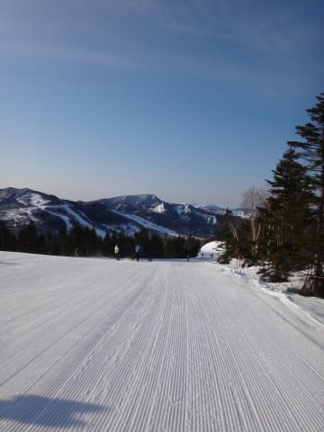

いや，これ．

ピカピカ晴天ってことは…

日差しで早朝から雪はダメになってるかも…？

と，心配したけど．

晴天の放射冷却で冷えてくれたおかげで…

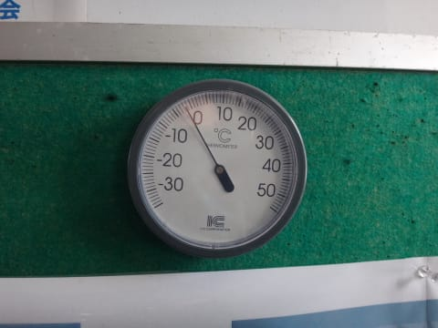

をを！

すごく久しぶりの，朝からマイナス気温！

素晴らしいっ！←ってか，4月上旬だとこれが普通のはず…これまで3週間がおかしすぎたのでは？

マイナス気温になってくれたので…

うはははっは！

雪はしっかり硬くしまってますよっ！

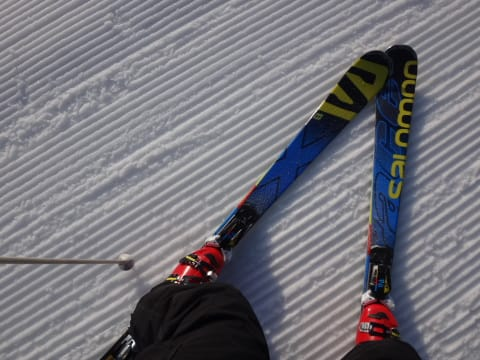

しっかり硬い，ハイスピードバーンですよっ！！

固いけどエッジが効く，スピード好きにはもう

よだれじゅるじゅるモノの最高ハイスピードバーンだ～っ！！！（歓喜）

＃固いのがダメな人にはつらいけど

そして．

SALOMONのX-Race．

やっぱりこの板，固い雪では最高にイイんですけどっ！

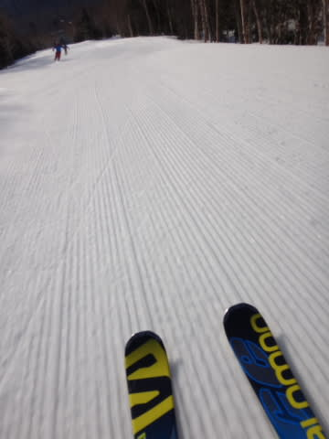

固い雪でガッツリ食い込み，固いビリビリバーンに負けることなく，

安心してぐんぐん加速していけるんですけどっ！！

雪面が固ければ固いほど本領を発揮するこの板．

スピードを出してガッツリ傾いて行ける，この快感…（恍惚）．

アイスバーンが怖い人はこの板を履けばいいかも…って思うほど，

いやー．こーゆー雪では，最高だわ．この板．

もう，すっきり晴天の早朝バーンを．

強烈に気持ちよく飛ばせるよっ！

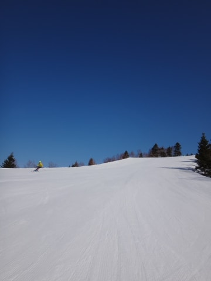

うはははは！…やっぱり，早朝はこうじゃないとっ！！！

って感じで．

早朝スキーを堪能しまくった後．

通常営業開始の8:30になっても，まだ結構滑れる感じで…

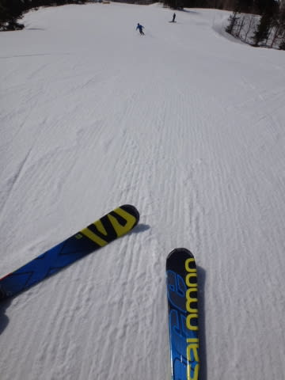

10時近くまでは，X-Raceを履いて快感ハイスピードを堪能！

でも…10時頃には，やっぱりかなり緩んできたかな．

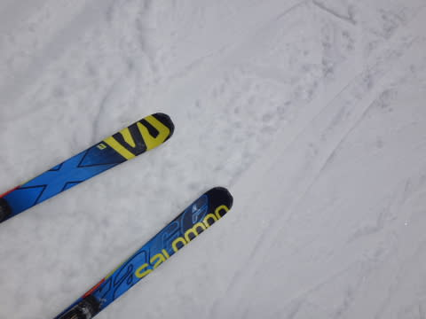

とはいえ．

早朝時には，こんな感じですっきりくっきり北アルプスが見える

天気だったけど．

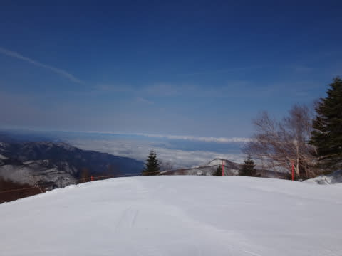

10時過ぎには，なぜかちょっとうっすら雲がかかったような

感じになり…

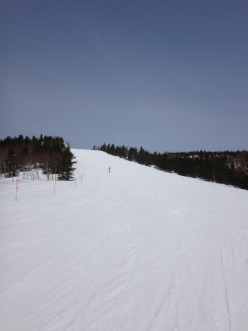

曇っているわけでもないけど，日差しがちょっと

やわらげられて．

雪が強烈な日差しで，致命的にザブザブにならずに済むという，

丁度いい理想の天気になってくれた感じ…

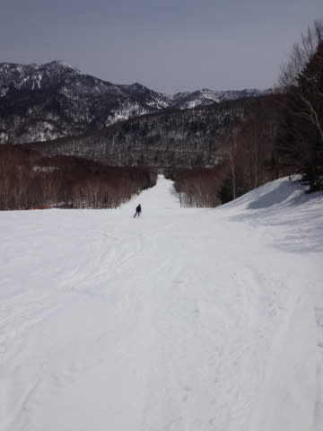

日差しが穏やかになってくれたおかげで，昼間の気温はプラス10℃

近かったというのに…

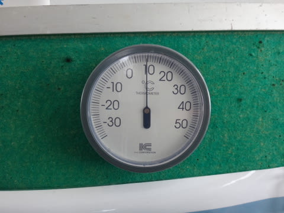

午後になって雪が緩みはじめても，スキーが埋まっていく

ような，ドボドボにはならずに済んで，結構いい感じ…

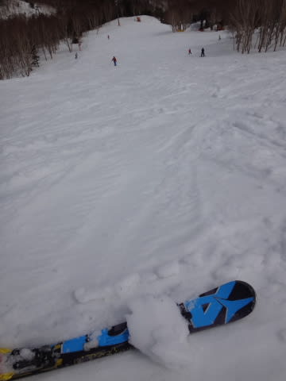

ゲレンデの人は，午前中はそこそこいたけれども．

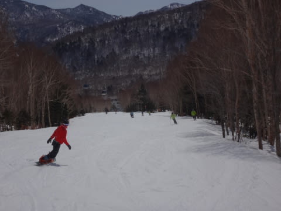

ゴンドラ待ちはそれほどなく，ゲートの外まで並ぶってことは

無かったですね～．

んで．

やっぱり．

昼からは，

かなり人のいない，寂しい感じのゲレンデになり…

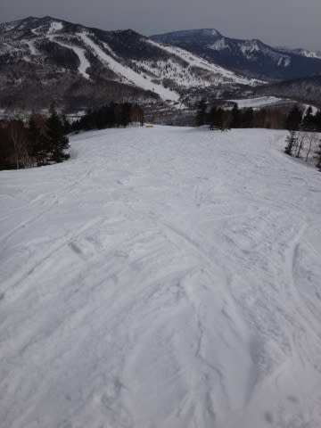

おかげでなんだか，夕方になっても意外とゲレンデが荒れないんですけど？

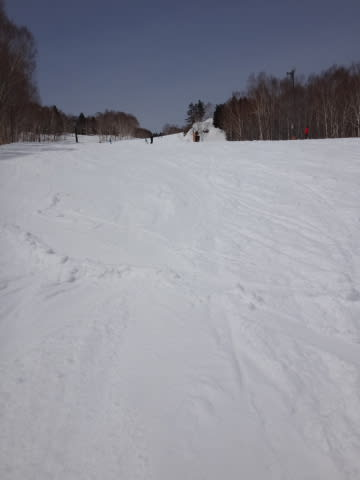

ゴンドラ営業終了時間間際になっても．

いつもならかなりのコブコブになる，コース落ち込み部分も，

全くコブになる気配はないですね～．

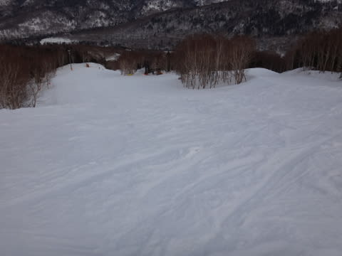

春の重い雪ではあるけども．

雪も，汚れが浮いたりストップスノーにならず，板も走るし．

夕方になっても，結構大回りを楽しめるんですけど…？？

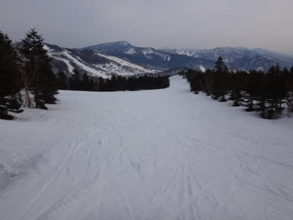

って感じで．

この日曜．

早朝から夕方のリフトストップまで．

穏やかな日差しに恵まれて．

結構楽しく滑れた一日だったのでした…

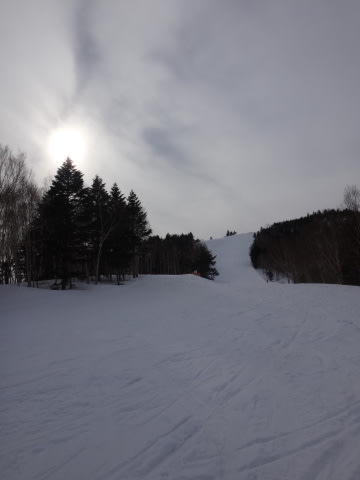

うーむ．

来週も．

ちゃんと冷えてくれるとうれしいんだけどな～．

## 💬 コメント一覧

### 💬 コメント by (いか)
**タイトル**: Unknown
**投稿日**: 2015-04-14 22:12:51

八方も朝のリーゼンは締まっていて、最高(速)でした！

板もなんだか長くなった気がします！(あら)

### 💬 コメント by (Skier_S)
**タイトル**: いかさま
**投稿日**: 2015-04-15 00:45:25

しっかり締まった朝イチリーゼン，良さそうですね～（じゅるる）←よだれが垂れる音

固い斜面は，やっぱりしっかりした板がいいなぁ，と思いましたが…

そちらは，板が長くなりましたか（笑）．

