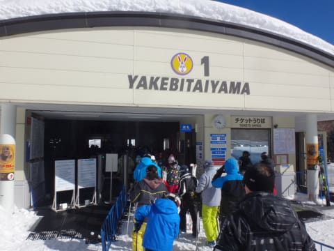

# 1月28日（土）の志賀高原は…晴天っ！人も少なめ，今日も恵まれてました…

📅 投稿日時: 2017-01-28 22:57:51

🏷️ カテゴリ: [2017スキー滑走日記](c7d777cecfc91bdf0fa464ad62c6d49ab.md)

ということで．

ふはははは．

今日は，私の予想通り晴れたのだ！

いやーー．

今日も先週に引き続き．

良かったですよ～！！

まず．

朝．

昨日ちょっと気温が上がったからか．

志賀高原の登り坂は，積雪路というより．

ちょっと緊張する，凍結路っぽい感じでスタート．

で．

いつも通り焼額へやってくると…

ふむ．

山頂の気温はマイナス9℃．

この時期であれば，まぁこんな感じでしょうか．

まあ，今日は雪質の心配はいらなさそうかな？？

そして，山頂は．

残念ながら，うっすらガスがかかっているものの…

んでも．

朝イチきれいなシマシマがお出迎えっ！！

で．

今日の朝イチシマシマは…

かなりしっかり踏まれて硬くパックされたような．

結構スピードが出る雪だよっ！！

久しぶりの，しっかり締まってカッツリ

エッジが利く，高速圧雪バーン！

うはーーーー！

カ・イ・カ・ンっ！！！

そして，標高が低いところまで滑ってくると…

だんだん雲が薄れてきましたよ…

そして．

午前9時ごろには…

うむ！？？

山頂から，太陽が顔を出したかと思えば…

それから30分も経たず，ゲレンデ全面すっきり晴れに！

いやこれ気持ちいい…

気持ちいいよっ！！

そして．

本日も午前中は，ゲレンデにそこそこ人がいるものの…

でも，タイミングによっては，全然人がいないような

ゴーストタウン化…

晴天の土曜がこれで，経営大丈夫か？←かなり心配

ゴンドラ待ちも，午前10;50ごろ，いったん駅舎の外に

人が並ぶほどになったけど…

11時過ぎには，昼休みを取る人が多いからか．

あれ…超ガラガラに…！！

今日は終日，第1ゴンドラには待ちらしい

待ちはほとんどないままでした…

まぁ，今日の雪質は．

先週に比べると，新雪が硬くパックされた感じで．

ふわふわやわらかというわけではないけど．

それでも，昼間も予想通り，マイナスを

キープした本日．

コース上も時折この程度人がいることもあったけど．

でも，全体的に人は少なく．

そして，お日様ピカピカなのに，

気温は低く雪は緩んでしまうことはなく．

いや…

これは．結構いいんでないかい！！？？

午後になっても，雪質は悪くなることはなく…

このような人が少ないゲレンデで

雲海を見たり

きれいな青空を見ながら．

娘と一緒に，たっぷり滑りました…

人が少なかったし．

しっかりハードにパックされた雪だったので．

夕方ラストタイムまで，雪はそんなに荒れることなく…

急斜面のオリンピックコースなど，一部凸凹した

ところもあったけど…

でも．

終日，おおむねフラットなバーンを

夕方ラストまで，おなか一杯に楽しめたのでした…

で．

おなか一杯ですが．

でも．

ナイターは別腹ですから．←なんのこっちゃ？

…当然，行ってきました．

一の瀬ダイヤモンドナイターへ！！

今日も，圧雪かけたてのシマシマを

ちょっと人は多めだったものの．

気持ちよく2時間半，ひたすらナイターストップまで

攻め続けたのでした…

いや～．

今日はいい一日だった．

明日もそうなってほしいんですが…

明日はすっきり晴れるものの．残念ながら．

昼頃から気温がぐんぐん上がって，

プラス気温になりそう…

でも．

すっきり晴れるので．楽しめるかな～？

## 💬 コメント一覧

### 💬 コメント by (Goku)
**タイトル**: わずか届かず・・・
**投稿日**: 2017-01-29 00:22:34

今日は（すでに昨日か）お世話様でした。

ナイター超楽しかったです～

skilineはあと僅か、１ゴン２本分足りませんんでした(T_T)/~~~

### 💬 コメント by (つーちゃん)
**タイトル**: 呪い
**投稿日**: 2017-01-29 07:02:51

絶好のスキー日和だったようですね！！

私は北海道の富良野スキー場に来ています

シルバーステッカーの呪いでしょうか恵みでしょうか

二日間ずっと雪なんですが！？ちょっとは晴れて欲しいなぁ！

今日いれてあと３日あるので、晴れ晴れ踊りでも踊りますか。。。

### 💬 コメント by (FCAMEL)
**タイトル**: 1ゴンの日
**投稿日**: 2017-01-29 07:32:12

昨日はヤケビイチゴンの日でしたね。

いつもは3本くらい回したら飽きて他へ移る私も

午前中だけでついうつい11本も滑り続けるくらい悪魔的によかったです。特にオリンピックが荒れなかったのがサイコーでした！

それにしてもタイミングが悪いのか今シーズンはなかなかお目にかかりませんね。相当同じタイミングでいるはずなのですが、私の日ごろの行いが悪い？（笑）

### 💬 コメント by (しんちゃん)
**タイトル**: ずっとにやけていました
**投稿日**: 2017-01-29 09:59:10

1/28（金）のヤケビは抜群のスキー日和でした。

初めてご一緒させていただきまして、5時間かけて家にたどり着くまで感動でいっぱいでした。

スキーって楽しいなと改めて思いました!(^^)!

またヤケビで会ったら、よろしくお願いします。

### 💬 コメント by (Skier_S)
**タイトル**: そして今日も深夜に帰宅（涙）
**投稿日**: 2017-01-30 02:00:29

＞Gokuさま

昨日はどうもありがとうございました～！！！

ナイター，良かったでしょ？？

また一緒にナイター行きましょう！

で．

次の機会に，あとゴンドラ2本分行っちゃいましょう！

＞つーちゃんさま

絶好のスキー日和でしたよ！！

富良野は荒れた天気でしたか…

北の峰ゴンドラ動きましたか？

30日は，午前中はちょっと落ち着いた天気に

なるかもです…

富良野楽しんできてください！

＞FCAMELさま

土曜は私も午前中は11時近くまで，

1ゴングルグルしていたのですが…

ホントに今シーズン，お会いしませんね…

シルバーシールお渡ししたいのですが…

何かのタイミングがずれてるんでしょうか？？

また次の機会にお会いしましょう…！

＞しんちゃんさま

土曜はお世話になりました～！

こちらも楽しませてもらいました！

しかし，往復10時間運転，お疲れ様でした…

また志賀高原にお越しの際は，

一緒に滑りましょう！

