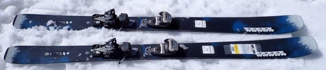
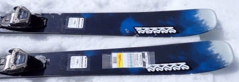
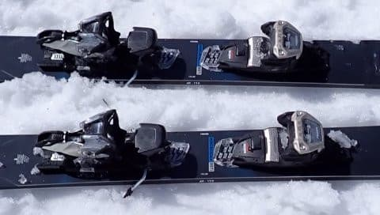
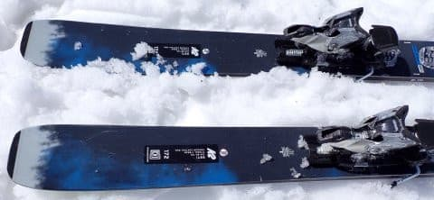
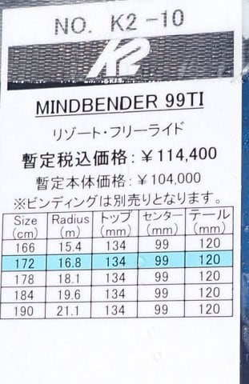

# 2025シーズンモデルのスキー板，試乗レポートその35・ラスト…K2 MINDBENDER 99TI

📅 投稿日時: 2024-07-25 01:11:17

🏷️ カテゴリ: [スキー板試乗](c0bd8048615710cee890e403a36cc9a2b.md)

眠い…

眠いよ．

今週は，普段の週より睡眠時間が

取れていて，私にしては珍しく

週の平均睡眠時間が6時間近く

あるんだけど．

でも，なんだか，夜しっかり寝るように

なると，夜中にすぐ眠たくなってしまい，

夜更かしできなくなってきた…

そして．

夜6時間以上寝るようになって，寝足りた

感があるかというと．

むしろなんだか逆に寝足りない感じが…

うーん．

空腹になりすぎたり，普段から食事を

抜いたりする生活を続けると空腹が

気にならなくなるけど，

ある程度毎日食べるようになると

お腹がすくようになってしまう現象と

同じか…？←そんな経験してる人そんなにいないと思う

ってなことで本題へ．

長らく続いた2025シーズンモデルの

スキー板の試乗レポートも，これが最後と

なりました…

最後はちょっと忌まわしい思い出となって

しまった板，K2のレポートです！！

〇K2 MINDBENDER 99TI 172cm

パウダー・オールマウンテン

センター幅99mmで，メインはパウダー・

オフピステ用ながらも，メタルが入っており

トップ＆テールロッカー，センターは軽い

キャンバーで，ある程度はオンピステでも

行ける…

という触れ込みの板．

とりあえず，履いてみましたが…

うん．圧雪された整地では，メタルが入った

板らしく，しっかりした張りとグリップ感

があり，R=16というよりはもう少し大回り

っぽい感じで回っていきます．

ただ，この板を試乗したのは春のザブ雪．

ザブザブで荒れ荒れな雪でも，ファット板

なら荒れ雪を踏みつぶして滑っていけるか…

と思ったところ．

整地とは全く異なり，グリップ感がかなり

弱くなり，板がズルズル逃げていく感じに

なってしまいます…

板に圧をかけるとズルズルと逃げていく

感じなので，あまり圧をかけずに板なりに

降りていくか，あえてずらして滑るかに

なりますが…

幅が広いので，ずらしのコントロールは

あまりやりやすくない感じ．

センター100mm近いファット板で，

プルークやらずらしやらは難しい（涙）

ファット板って，新雪ふかふかに強い

ので，板が潜るようなザブザブでも強い

かと思ったら…意外とそうでもないんだな．

ただ，荒れていない，フラットな整地では

見てくれによらず，しっかりとしたグリップ

できれいにカービングしていってくれます．

あと，荒れた斜面でも緩斜面なら，

あまり圧をかけずに板なりに行けば，

エッジが食い込んで，サイドカーブに乗った

大回りのカービングで降りていけます．

しかし．

やっぱりこういう板は，パウダーがメインで．

「ゲレンデでも滑ることができる」という

程度であり，ゲレンデでもガッツリ滑るのは

板の狙いとは違うんだな，ということを実感．

なんてったって．

春のザブ雪バーンで自分の板よりグリップが

弱いことをすっかり失念した状態で，

[とある出来事に慌ててザブ雪バーンを
かっ飛ばして，予想外の板の挙動に
転倒してしまう](ec5a3ca28778255cb4044a565b03d34f2.md)

という悲しい出来事を生んでしまった板

なので…

滅多に転ばない私を転ばせるほどの板

ということで，ついつい評価が厳しめに

なっちゃっていることは，ご容赦いただきたく．

うーん．

やはり悲しい思い出があるだけに，あんまり

いい評価ができなかったけど．

おそらく，この板を正しく評価するには，

こんな春のザブ雪バーンじゃなく，

新雪パウダーのバーンで試乗すべき

なので．

この板のレポートは，あまり参考にしないで

ください…

## 💬 コメント一覧

### 💬 コメント by (you160)
**タイトル**: Unknown
**投稿日**: 2024-07-25 06:18:13

この板でしたか…

その節は、貴重なシーズン転倒のきっかけを作り、ご迷惑をおかけしました！

それにしても、Sさまでも平気睡眠6時間取ることがあるんですね。てっきり、人間食べなくても生きていければという思想？なので、寝てる時間は勿体ない、何かやらねばという思想だと思ってましたw

### 💬 コメント by (Skier_S)
**タイトル**: ＞you160さま
**投稿日**: 2024-07-26 02:16:26

いや…あの時は見事にギャラリー前で転倒しました（笑）．

私もたまにはちゃんと寝ないと死ぬので…

というか，起きてられなくなるので，倒れるように寝る時があるんです…

ホントに気づいたら，気を失ったように床で6時間寝ていたのに気づくという（笑）

