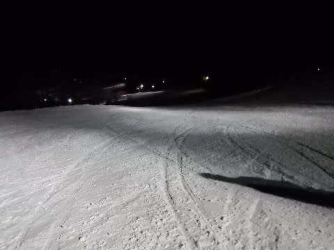

# 2019/2/2(土)の志賀高原スキー場は…朝は曇ってたけど，じきに晴れて最高雪質＆晴天の一日だったよ！

📅 投稿日時: 2019-02-02 23:23:20

🏷️ カテゴリ: [2019スキー滑走日記](c3e4496fc0fb7f9c17ff21214a35b1ace.md)

というところで．

今日も志賀高原にやってきていますが．

いやーーー．

やっぱり，太陽の下でやるスキーは

いいですね～！！

これまで，呪われたかのように週末に悪天候が

続いてましたが．

（私が来れない1月4日や1月19日に限って晴れるという…（涙））

実に，1月1日の元日以来．

約一か月ぶりに，すっきり晴れた中でスキーが

できました！！（感動）

ってなわけで．

本日朝．

中野の町中はそれ程積雪がなかったですが…

志賀高原の登りはツルツル道路で，

途中で登れなくなる車多数…

おかげで，登りはかなり数珠つなぎの

トロトロ運転（涙）

だもんで．

焼額第1ゴンドラに乗ったのは，営業開始後

10分後という，

今日も屈辱のスタートでした（泣）

出遅れを取り戻すために，急ぐんだ，

第1ゴンドラっ！！←あなたのゴンドラだけ先につくわけがないから

ってな感じで．

山頂に着くと．

気温は-10℃と，結構冷え冷え！

水曜予想で，

　朝の気温は-8～-9℃程度．

というのが，大体あたりですね…

そして．

天気は曇り空で，わずかに雪が舞ってるかな…

という感じで．これも，

　朝は金曜夜から降り続けた雪がまだちらちら

　舞っている，雪降りでスタート．

という，水曜の予想が当たり！←金曜夜予想の，朝から晴れるかもってのは外したということだ

で．

あさイチのバーンは…

これも予想通りの，柔らかめ最高

シマシマ圧雪！！

ここしばらく，朝は雪が積もっている

パターンが多かったので．

超久しぶりのシマシマ圧雪バーン！！

うはははははは！

久しぶりのシマシマバーン…

ガッツリエッジが食い込んで，

シアワセ度100％！！

いつもは新雪を楽しむオリンピックコースも，

今日はフラットなやわらか圧雪バーン！！

ってな，シアワセバーンを堪能していると…

ここも予想通り．

だんだん雲が減って，ちらちらと日が

さすようになって…

バーンがきれいに見えるようになって

きましたよ！！

午前中は予想通り，雲がところどころ

残ってましたが…

昼頃には，すっきり晴れてきました～！

実に．

実に…1月1日以来の，すっきり晴れた中の

スキーですよ！！

10時頃になると，ちょっとコース上の

人は増えてきましたけど…

でも，2月の週末というのに．

なぜかゴンドラはピークでも

ゲートの外に出るかどうかという

程度の待ちで…

ほとんどは飛び乗りに近いガラガラ！

当然，リフトも混んでなくて…

本来ならピークのはずの2月の週末で．

こんなにガラガラでいいの？？？

こんな天気が良くて．

こんなに雪がいい週末なのに．

昼間でもせいぜいこの程度の混雑とは…

焼額，経営大丈夫か？？

…で．

今日はしっかり晴天で日差しが強かったけど．

　昼間の最高気温は-3℃くらいまで上がりそうだけど．

　雪質が悪くなるほどではなさそう．

という予想がほぼ当たりで，

最高気温は予想からわずか1℃ずれの，-2℃！

ふははははは．

みよ．わが天気予想の正確さを！！

そして．

雪質が悪くなるほどではなさそう…

という予想もあたりで．

昼間もやわらかい，冷え冷え雪質を

キープ！

…ただし．

雪が柔らかかったので…

午後になると，

コースはちょいと荒れ始めて…

水曜予想の．

　でも，人が多いバーンは夕方には荒れるかな．

って通りのバーンコンディションになってきました…

…いや．今日も私の予想は，すごい当たったよ！！←自画自賛

でも．

荒れてるけど，雪はやわらかいので．

ひどく滑りにくくはなかったかな…

ってことで．

夕方はちょっと荒れたバーンではあったけど．

16:20のリフトストップまで，しっかり滑り倒したのでした…

いやーーー．

やっぱり，晴れたスキー場はいい！

久しぶりの晴れのゲレンデ，良かったなぁ…

…ってことで．

まだ終わらない．

そうです．

今日は悪天候じゃないから，ナイターがあるはず！

…と．

サンバレーナイターに繰り出しました～！

いやーーー．

風邪，法事，悪天候のジェットストリームアタックで

3週連続ナイターに行けませんでしたが．

今週は無事，ナイターに来れたよ…（感動）

が．

しかし．

でも．

なんということか…

今日のサンバレーナイター．

一番広いメインバーンが，圧雪されてないんですが！

なんだか，昼間に滑った荒れたバーンの

ままなんですが…（涙）

志賀高原のナイターは．

圧雪シマシマが滑れるのが楽しみなのに…（泣）

…なぜ．

なぜ今日に限って圧雪されてないんだ～っ！！！

今日4週間ぶりにナイターを滑ることはできたものの．

4週連続でシマシマ圧雪ナイターを逃すとは…

どうやら，おそらく．

圧雪車がリフトのポールにぶつかって．

動けなようになっていたので…

これが原因で，メインバーンが圧雪できなかったんじゃ

ないかな…

うがーーー！！

なぜ．

なぜ4週間ぶりにナイターを滑れたと思ったら，

その週に限って，シマシマ圧雪バーンナイターを

逃すのか…

とりあえず．

圧雪されてないバーンを，

夜9時のナイターストップまで滑り続けましたが…

どうやら．

今シーズンの私．

お祓いを受けないといけないレベルかも…（涙）

明日は朝は晴れで，午後は雲が増えるものの．

何とか，夕方のリフトストップまで，

雨は降らないでいてくれそうだけど…

明日，雨に降られたら．

その時は．

今年の私は呪われている

ということを，認めざるを得まい…
