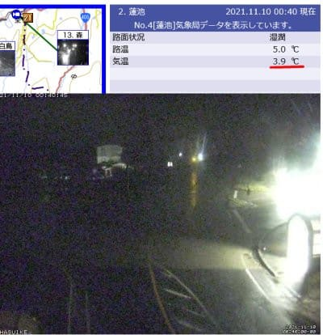
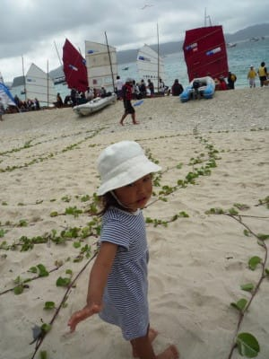
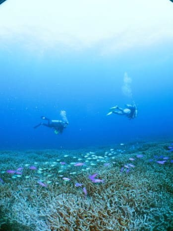
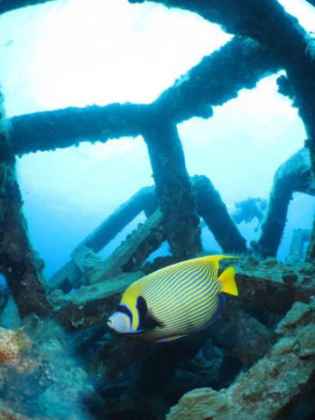
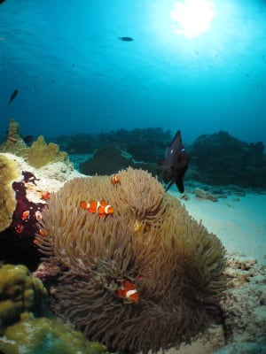
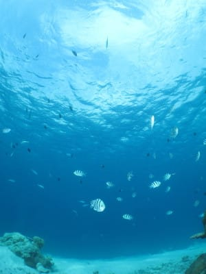
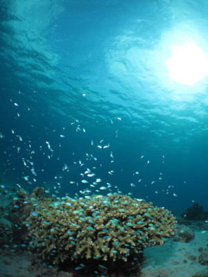
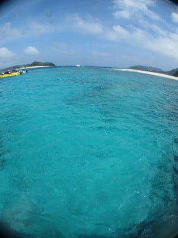
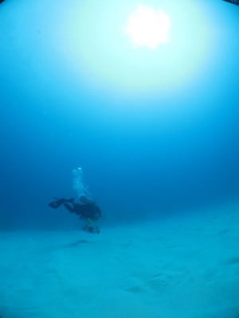

# 2010年7月，2歳の子連れで座間味でダイビング！…エピローグ１

📅 投稿日時: 2021-11-10 01:21:08

🏷️ カテゴリ: [ダイビング日記](ce3a7a8d424d112fce83ee85c81a0e344.md)

えー．

今日…というか，もう昨日ですね．

9日の火曜はやはり残念ながら，志賀高原は

朝から終日高温の暴風雨降りだったようで

すね…(涙）

そして．

深夜1時近くの今になってもまだ蓮池で

気温は3.9℃と高めで．

雨が降っているようで，路面も濡れてますね(泣）

([北信建設事務所道路状況カメラ](http://hokushin.pref-nagano-roadcamera.jp/)より)

おそらく横手山の人工降雪はほぼ完全に

消え去ったでしょうし．

やっぱり，これから歌っても踊っても

転がって笑っても泣いても，

13日に熊の湯，横手がオープン不可能

なのは確実ですね(激涙)

一週間ほど前から，8日あたりに

高温の雨が降り，

　横手山のせっかくの人工降雪，

　跡形もなく消えてしまいそう

と[予想はしていました](e27f7c3c7ad3ef828a5863e04523b03e6.md)が．

この残念な予想が現実となり．

目の前に示されると．

出てくる言葉は．

あぁ…残念

の一言に尽きます…

とりあえず．11日夜~12日にかけての

わずかな冷え込みに期待…っ！！

…その後13日からはしばらく冷えないけど(涙)

あぁ…

20日は鹿沢，アサマ2000，湯の丸とかが

オープン予定だけど．

そこでオープンできるかどうかも

心配…

とりあえず．

信心深い皆様におかれましては，

ひたすら休まずに冷え冷え踊りを踊り続け．

かつ，寒いギャグを連発して地球を

冷やしてくださいますよう，

よろしくお願いします…

ってなことで．

本題へ．←だからスキーブログとしてはここまでが本題だったのでは？？

実は[前回で終わったはず](ed480d2827d531590a63b45d088191317.md)の座間味ダイビング旅行記．

今回は，エピローグです…

ーーーー

ということで．

子連れダイビングも早くも3回目．

娘も2歳になり，前回までと違い

会話でコミュニケーションが

できるようになったし．

乗り物が大好きで，旅行には全く

気を遣わなくて済む，ありがたい

娘に育ってくれたし．

相変わらず海は大好きだし．

…もう，

「子連れでダイビングに行って大丈夫かな…？」

という心配は，ほとんどなくなりましたね～！！

実は今回．

次のダイビング旅行に行けるかどうかという

テストも兼ねていたのですが．

今回の旅行で，もっとヘビーな旅行に

行っても大丈夫…

という自信を深めました．

ということで．

次回の子連れダイビング旅行．

無謀か？

と思っていた計画を実行することにしましょう…

それは．

ダイビングクルーズ船に2歳児を乗せて

親はダイビング三昧

という．

普通の人が聞いたらひっくり返りそうな

ご無体なプランです！！！

果たして．

1週間船の上で暮らすというご無体．

何かあったらどうするのか？

そして．

行く先は海外…インドネシア．

それも飛行機を3本乗り継いで，

現地まで途中1泊という．

大人でも辛い旅程．

無事旅行に行って，

何事もなく帰って来れるのか？？？

コドモとコモドダイブクルーズ，

乞うご期待！！！

（ということで，この座間味旅行の

　一か月後に実行したコモドダイブ

　クルーズ旅行記は[こちら](e71f0faf0d2dbf98590a16bb7abe5a502.md)

　いろんな出来事があって，一生の思い出に

　残るような濃い旅行でした…)

　

　

　

