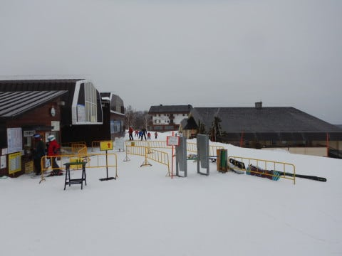

# 2020/3/8(日)の志賀高原スキー場詳細レポート！…朝は雪降り，昼から曇り空の天気．気温は上がったけど日差しが無くて雪は緩まず，午後までいい感じ！午後はガラガラ

📅 投稿日時: 2020-03-11 00:49:39

🏷️ カテゴリ: [2020スキー滑走日記](c282e9230de179e245c7334eabeb0a3b3.md)

えー．

やはり．

昨日の記事で予想したように．

　志賀高原も，空から無慈悲に

　一日中液体が降ってきます．

　(略）

　そして．風も強いので．

　ゴンドラはヤバそう．

と書いたように．

朝からありえないほどの高温で，

かつ終日雨が降り（涙）

（[北信建設事務所道路気象情報ページ](http://hokushin.pref-nagano-roadcamera.jp/)より）

そして．

高温な南風が激しく吹き．

ゴンドラどころか，

午前11時過ぎには，ほとんどの

リフト・ゴンドラが止まったようです…（激涙）

（[志賀高原索道協会リフト運行状況ページ](https://www.shigakogen-ski.com/live-lift-status/list)より）

なんという事か…！！

高温＆強風＆雨という凶悪3連コンボで，

ただでさえ少ない雪が，かなりやられて

しまったのではないかと心配…

まだ，志賀高原は全山滑走可能で，

他のスキー場に比べればマシだったから

いいけど．

他のスキー場には，かなり壊滅的だったの

では…？？

うーむ．

でも．

詳細はまた明日予想しますが．

昨日も予告したように，11日の水曜は，

冷えて終日雪が降りそうです…っ！！！

今はまだ雨っぽい感じですが．

明け方に雪に変わります…！

が．

降り始めは明け方なので．

11日の朝はそれほど積もってなさそう…（泣）．

そして．

見事な西風なので．

志賀高原は積もっても10cmかな…（涙）

とはいえ，雪がちょっとでも積もってくれる

だけでもゲレンデ状況は改善するので．

恵みの雪と言えるはず…

で．

そのあとは．12，13日は最高気温0℃を

ちょいと超えそうなくらいの晴れ～曇りで，

積雪は期待できませんが…

そのあとの，14日の土曜日．

この日はそこそこ冷えて，

雪が降りそう！！

…っていうより，吹雪かも（涙）

でも，15日の日曜は，曇り空ながら

いい感じに冷えた一日になりそうなので．

日曜朝は，冷え冷えシマシマが滑れるんじゃ

無いかな？？

とりあえず．

週末にかけての天気の詳細予想は，

また明日やりますので…

…ってな感じで．

今日も前フリだけで普通のBlog記事くらいの

分量になってますが．

さらにこれから，

昨晩書きかけて寝てしまった，

日曜の志賀高原詳細レポートです！！

（今さら感が無くはないですが…）

まず．朝イチの志賀高原．

　もしかすると，朝は雪がわずかにぱらついているかも

と書いた，「もしかすると」の方が

当たったようで．

小雪が舞っており，道路はうっすら

雪道です．

そして．

いろいろ都合により，本日も奥志賀スタート！

ホームゲレンデの焼額スタートじゃないと，

「裏切者！」と声をかけられ，

焼額からの刺客に背後からプスッと

やられるんじゃないかという不安感が

ありますが…←そんな刺客いないから

でも，あさイチの奥志賀高原．

小雪が舞って視界がそれほど

良くないとはいえ．

雪は冷え冷えで，そこそこ締まった

いい感じのシマシマっ！！

昨日もいい感じの柔らか圧雪だったけど，

柔らか圧雪とは違って，板がいい感じで

加速していく締まった雪なのに，

しっかりエッジが食い込んで，

傾きたい放題の高速快楽バーン！！

さらに，朝8時から8時半は，滑っている人も

少なくて，好きなライン取りたい放題で，

最高っ…！

…でしたが．

やはり，ホームゲレンデは焼額である私．

焼額からの刺客にプスッと殺られないように，

ちゃんと朝8:30の，奥志賀⇒焼額連絡用の

第4ペアリフトの営業開始と同時に，

焼額へ戻ってくると…

そうです．

第1ゴンドラの営業開始の一番ゴンドラに

乗った人が着くタイミングと，ほぼ同時に

焼額山頂にやって来れるのです！

…しかし．

今日は8:20ごろに焼額ゴンドラが

動いたようなので，ゴンドラ営業開始に

乗った人に比べると，10分ほど遅れての

山頂到着になりましたが…（涙）

でも．

奥志賀で30分滑った後に，

再び焼額の営業開始直後の，

朝イチシマシマが堪能できるのだ…っ！！

…残念ながら気温が高めの本日．

朝の気温は-2度と，それほど冷え冷えでは

無いものの．

でも，まだ雪が緩むほどの気温ではなく．

いい感じで板が走る，朝イチ最高シマシマ！！

いやーー．

いい感じだよね～…！！

と，思っていたら．

うーむ．

朝9時ごろには，早くも人口密度が

上がりはじめ…

そして，乗車定員が4人に制限されている

第1ゴンドラ．

まだ朝9時過ぎというのに，

早くもゲートを超えて列が

伸び始めました…（涙）

で．

うげげげげげげげげげげ！！！

なんじゃこりゃーっ！！

まだ時計は9:30を過ぎたばかりというのに．

1ゴン10分待ち，2ゴン20分待ち！？？

…コロナウイルス対策で乗車定員が

半分に減らされている，輸送力の

低下がモロに響いてます…（涙）

第2高速，第3高速リフトは全く待ちが

無かったようですが．

焼額ゴンドラの混雑を避けて，

再び奥志賀へ！

奥志賀のリフト沿い，エキスパートコースは．

朝のうちは人も少なく．

まだ全然荒れてませんね…！

気温が高いにもかかわらず．

雪も結構いい感じで．

そして，リフトは飛び乗り！

いやーー．

今日は奥志賀がいいかな～．

…と，思っていたところ．

やはり，焼額の混雑から逃げてきた

人が多いのか…

いつものエキスパートコースより

混んできたような気が？？

そして，タイミングによっては

ちょっとリフト待ちも出るようになり．

うーん．

ちと人口密度が高めなので．

雪はそれほどひどく緩んでませんが，

昼前には，バーンがちょいと荒れ気味に

なってきました…

でも．

奥志賀も，お昼になると，一気に

ガラガラになってきたので．

「…これは，焼額ももうガラガラなのでは？？」

と，浮気先の奥志賀から，わが住家の

焼額に戻ると…

うほーーー！

やっぱりガラガラ！

そして，ゴンドラもほぼ飛び乗り！

…だのに．

午前中はゴンドラ輸送力の低さのため，

いつもより滑った人数が少なかったからか…

ゲレンデはかなりフラットで，

かつしっかり踏み固められたような感じの，

全然緩みのないいい感じのバーン！！

…これ，いいよ．

想定以上にいいバーンコンディションなんですけど！？？

昼間の最高気温は+3℃と，

雪が解けてしまいそうな気温にまで

上がってしまったものの…

太陽が全く射さず，

曇り空にガードされたため，

雪は全然緩む気配を見せず．

それでいてガラガラなので…

シーズンでもそうそうない，

いい感じの快楽ハイスピード

大回りバーンなんですけど！？？

まさか，プラス気温予想の日の

午後になって．

こんないい感じの無人フラットバーンを

かっ飛ばせるとは…っ！！

…と．

　午後は雪質もしっとりした重めの雪に

　なっていき，人の多いコースは

　荒れていく．

という予想を外してしまったことは

知らなかったことにして．

今日も日が暮れる営業終了まで，

たっぷり滑り倒したのでした…

いやーー．

午前中の焼額のゴンドラ混雑はちょっと

あれだったけど．

午後のガラガラフラットバーンを

お腹いっぱい楽しめたので．

気温が高かったわりには，

楽しかった一日だったな！

とりあえず．

11日＆14日に予想されている積雪で，

次の週末には，またいいコンディションに

なってくれることを祈るばかり…

## 💬 コメント一覧

### 💬 コメント by (ゆーき)
**タイトル**: Unknown
**投稿日**: 2020-03-11 01:50:17

9日は子供の体調がいまいちだったので、近場の木曽福島スキー場で、ギリ雪になった湿り雪で滑りました。今週末どうしましょうね、日曜だけか、土日か迷いますなぁ、天気が悪いのは、嫌な偽物スキーヤーなんで。。。午前だけでも、もってくれればなぁ。とりあえず、今後のS天気予報を待ちます。。

### 💬 コメント by (レインボー)
**タイトル**: Unknown
**投稿日**: 2020-03-11 14:06:25

水曜日な志賀高原情報

今日は新雪以外の様々な雪が楽しめました。

2ゴンスタート、パノラマやや硬めの気持ち良いバーン。勇んで入ったオリンピック。ギャー！圧雪車のキャタピラ跡のボコボコで足裏マッサージを楽しんで?いたら、急斜面下部の２箇所で地肌が。

硬めのＧＳから、前日お休みの奥志賀へ。ダウンヒルはカチカチ。第三はやっぱりベスト。エキスパートも硬めの快適バーン。

すぐにヤケビ第三へ。なんともう既に柔らかい。

パノラマ、カラマツは快適。

そのあと11時過ぎから屋外昼食。もうこたえられない幸せ感です。

昼前な寺子屋はカチカチ山で、見るも無惨にでっかい地肌。

ファミリーはスケート靴が最適かと。

### 💬 コメント by (レインボー)
**タイトル**: Unknown
**投稿日**: 2020-03-11 14:19:28

長文なので、念の為。続きです。

ダイヤモンド、カラマツ、サウス、どれもすでにズクズクで、1時終了でした。奥志賀で滑った仲間は、特にエキスパートをベタほめしてました。

こんなにも様々な雪が楽しめるなんて、この時期も捨てたもんじゃない。ただ、帰路に西館は悲惨な姿をさらしていました。

### 💬 コメント by (レインボー)
**タイトル**: Unknown
**投稿日**: 2020-03-11 19:16:51

たびたび恐れ入ります。

友人が3時過ぎのファミリー滑ったら、多少緩んで滑りやすかったとのことです。

これからの時期、時間によって大きく条件が変わることを、頭に入れておくべきですね。

明日は好条件、悪いけど、また楽しませていただきまーす。

### 💬 コメント by (いちと)
**タイトル**: Unknown
**投稿日**: 2020-03-11 20:00:37

最後の3連休、宿の予約しました！

踊り続けます　ですので何とか良い予報をお願い申し上げます🙏

### 💬 コメント by (Skier_S)
**タイトル**: この週末はそこそこ冷えそう
**投稿日**: 2020-03-12 00:34:26

＞ゆーきさま

今週末は，日曜の方が雪になりそうです…

土曜の方が天気は良さそうだけど，雪は硬いかな？

せっかくだから，土日1泊2日でどうぞ(笑)．

＞レインボーさま

あら．意外と今日は楽しめたのですね…

パノラマ，唐松が良かったのですか．

しかし，ファミリーは全面アイスバーンだったのですね…

明日は冷えますよ～！

でも，思ったほど積雪はなさそうですが…（涙）

＞いちとさま

とりあえず，3連休がいいコンディションになるよう．

祈り，踊り続けるしかありません…

