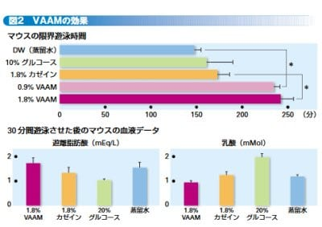
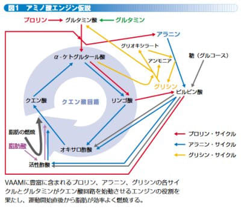

# なぜ登山でVAAMを試してみようと思ったのか？その2…論文を探してみた

📅 投稿日時: 2022-08-30 01:23:33

🏷️ カテゴリ: [日記](cc4b5682fb7b8b144980957a978653fb0.md)

というわけで．

[昨日の記事](e8b6d72454481512a12bcfd15198af308.md)に書いたように，

VAAMに対する客観的なデータが見つかった

わけですが…

とすると．

人間の当然の欲求として，

そもそも，VAAMって一体どういうもので，

どういう効果があるものなのか？

ということを，おそらく全人類，

誰もが知りたいと思うはず．

…いや．

世の中ほとんどの人，そう思いますよね．

そう思うはずですよね（強い断言）

となると．

ここでも伝聞形や2次情報ソースではなく．

根本的な情報を探したくなる私．

過去の論文をひっくり返したのですが…

残念なことに，この分野が専門ではない私．

原著の論文は難しすぎて良く分からん（涙）．

なので．

論文以外で，素人でも分かる文献を探してみると…

実に，非常に分かりやすくまとまっている

記事を発見しました！

スズメバチのアミノ酸混合物の効果を最初に

発見した理研の阿部先生のインタビュー，

[2005年の「RIKEN NEWS」の記事](https://www.riken.jp/medialibrary/riken/pr/publications/news/2005/rn200511.pdf)に突き当たりました．

…いや，これ，良くまとまってる！

これによると．

スズメバチの成虫は，なんと固形物が食べられず．

液体や流動食しか摂れないらしく…

幼虫に固形物のえさを与えて，幼虫が出す

「栄養液」を成虫がもらって生きてる

ようなんです…

スズメバチの成虫が個体を食べられないとは

知らなかった！！

で．この栄養液で生きてるスズメバチ．

飛翔筋は1分に2000回も収縮できるという，

地球上のあらゆる生物で最高の能力を

もつ筋肉．

固形物を食べられないのに，この筋肉を

使って1日100kmも飛べる秘密が，

このアミノ酸混合液にあると踏んだ阿部先生．

で．

この栄養液を調べると…

17種類のアミノ酸の混合物であることが

分かり．

詳しくは後述しますが，このアミノ酸の組合せが

脂肪を効率的にエネルギー化するための

アミノ酸代謝回路を起動させるという

「アミノ酸エンジン仮説」

というのを作ったわけですね．

で．

アミノ酸の代謝回路は，昆虫も脊椎動物も

同じだし…

これ，ヒトを初めとする哺乳類でも効果が

あるんじゃないの？

…と思い，マウスで実験したところ．

なんと．

他の栄養液では150~180分しか泳げないところ，

VAAMを与えたマウスでは230~240分くらい

泳げたというスタミナ向上を示すデータが

得られて．

それだけじゃなく，

運動後の乳酸値がVAAM投与時では著しく

減っているというデータも出てるじゃ

ないですか！！

（[RIKEN NEWS No.293 (Nov. 2005)　11月 「スズメバチに学んだスポーツ飲料VAAM」](https://www.riken.jp/medialibrary/riken/pr/publications/news/2005/rn200511.pdf)より引用）

ってなことで．

「VAAM（スズメバチ由来のアミノ酸混合物）に，

スタミナ向上だけじゃなく，乳酸を抑える

疲労防止効果もあるよ…！！」

と発表したのが始まりとのこと．

とりあえず，単体アミノ酸じゃなく，

アミノ酸混合物が機能を発揮するという概念

を世界で始めて示したのが，このVAAMの

研究だったようです…

（以上，[RIKEN NEWS No.293 (Nov. 2005)　11月 「スズメバチに学んだスポーツ飲料VAAM」](https://www.riken.jp/medialibrary/riken/pr/publications/news/2005/rn200511.pdf)を参考に引用，サマライズ）

で．

この解説記事の中で，さらに秀逸なのが

この図．

（[RIKEN NEWS No.293 (Nov. 2005)　11月 「スズメバチに学んだスポーツ飲料VAAM」](https://www.riken.jp/medialibrary/riken/pr/publications/news/2005/rn200511.pdf)より引用）

この図は，アミノ酸を用いた代謝機構が

端的に分かりやすく示されているんですが．

この分野を全く知らない私としては．

この図をヒントに，いろんな専門分野の

解説資料やら論文やらを読み漁って

みました…

いろいろ学んでいくと．

いや…

生体のアミノ酸代謝の仕掛けって素晴らしい…！！

TCA回路やら呼吸鎖，解糖・糖新生経路とか…

すごいいろんな反応が芸術的にリンクしてたり，

結局アミノ酸のアミノ基は代謝にとって

邪魔ものなんじゃないか

とかいう基本的なことを知って，

感動を覚えつつ，さらに詳細を調べると…

…この上のアミノ酸代謝サイクルの図，

人体の場合とちょっと違うな…

ということが分かり始めてきて．

人体の場合に合わせて図を書き換えていくと．

「あれ？これって，人体に適用しようとすると，

　スズメバチのアミノ酸組成と一緒じゃダメな

　ところもあるよね…」

とか．

知らぬ間にVAAMがモデルチェンジして

いた話とか．

そういう細かい話に気づいて行ったのでした…

（[続く](ed5e79774900d797b5d648594f6d5519a.md)…続くよ．まだまだ続くよ．

　ここから先はマニアックになりすぎて，

　続きを読みたくなる人がいるのか心配だよ）

## 💬 コメント一覧

### 💬 コメント by (副院長)
**タイトル**: Unknown
**投稿日**: 2022-08-30 10:26:58

おおおお、勉強になります。最後まで付き合います。

うる覚えのところが、はっきり再確認出来て、ありがたいです。肝臓で起こってることや、筋肉内で起こること、さらにカーボローディング、乳酸はある程度たまる方がよいとか言われてるところもよろしくお願いします。

さらにS様の睡眠時間を削ってしまうようで、申し訳ありません。

VAAMモデルチェンジしてたんですね。

### 💬 コメント by (スシネコ)
**タイトル**: Unknown
**投稿日**: 2022-08-30 12:35:02

ｷｬ━━━━(ﾟ∀ﾟ)━━━━!!　

この４月から理系の人たちに囲まれて暮らしているうちに、論文や応用化学的な話が楽しくなってきました。マニアックな世界ってロマンの塊で痺れますねぇ。

VAAMモデルチェンジの話は興味深々です！

### 💬 コメント by (真美子)
**タイトル**: Unknown
**投稿日**: 2022-08-30 13:21:44

詳しく調べていく、スキーヤー様、スゴし!

20,000m筆頭に要るべくしているのですね。

私も飲みます!

股関節の痛さに負けず頑張ります。

### 💬 コメント by (Skier_S)
**タイトル**: VAAMの記事がウケるとは…
**投稿日**: 2022-08-31 03:01:53

＞副院長さま

そうですよね…専門職で，かつて勉強されてるんですよね…

こんな素人の解説でいいんでしょうか…？（ちょい心配）

そうなんですよ．人体の場合，肝臓と筋肉ではプロセスが違うので，

今後コリ回路とかアラニンサイクルとか尿素回路とかが出てきます…

＞スシネコさま

ようこそ，理系の世界へ（笑）．

私が理系人間の典型例です…

VAAMは2021年3月にリニューアルされました！

そして．「あれ？最初のスズメバチから学んだ17種類のアミノ酸はどうなったの…？」

という，ドラスティックな変化がありました…

＞真美子さま

不思議に思うと徹底的に調べないと気が済まない人間なので…

長時間運動する時にはVAAMは良いですよ！

ただ，運動しないとか短時間しか運動しないときは，あんまり効果はなさそうです…

