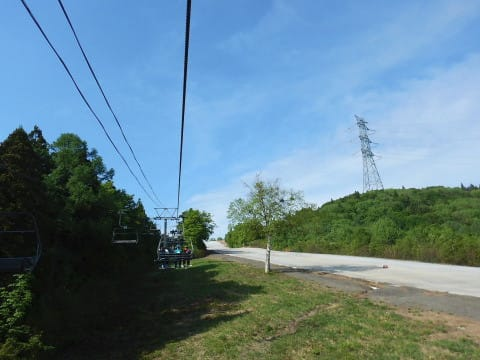
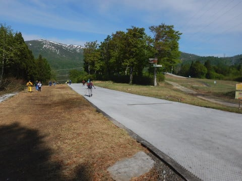

# 2019/5/26(日)，かぐらスキー場ファイナル，詳細レポート前半…暑かったよ！雪は薄くてコブ溝に土も出てきたよ（涙）

📅 投稿日時: 2019-05-29 02:11:14

えー．

どうやら，雪がある限り営業する宣言を

していた渋峠ですが．

残念なことに，昨日をもって終了

してしまったようです…

これで，ついに．

…残るは月山のみとなりましたね…

あぁ…なんということか…

もうシーズンも，ホントにラストスパートな

感じです…←いや，普通の人はもうとっくの昔にシーズン終わってるから！

とりあえず．

昨日，記事を書くパワーがなくて

一日遅くなってしまい，今さら感が

ありますが…

この週末で終わってしまった

かぐらスキー場のファイナルデー．

詳細レポートです！！

えー．

まず．

あさイチの7:30のロープウェーに

並んだところ…

先週より混んでませんね．

やっぱり，みつまたが滑って降りられ

なくなると，来る人は減りますね～．

そして，ロープウェーに乗って，

山頂駅にやってくると…

ピスラボマットを滑りたくない人のために，

スキーキャリアサービスのトラックが

待ち構えています…！

こういうところに板とブーツなどの

荷物を置いておけば，ゴンドラ乗り場まで

運んでくれるので…

板はもたず，ストックだけ持って，

みつまたリフトに乗れます！

…しかし．

みつまたエリア．

完全に雪が消えましたね～（涙）

当然，帰り道のみつまたコースも．

全く雪は残ってませんね…（泣）

んで．

リフトを降りたら…

ゴンドラまでは．

このピスラボを滑っていくか．

その横を歩いていくかなので．

ピスラボを滑りたくない私は，

とぼとぼとピスラボの横を

歩いていくわけですが…

土の上の坂道を歩くので．

汚れてもいい，歩きやすい靴で

行くのがおススメ．

スキー靴で歩くのは不可能と

思った方がいいです…

ってことで．

歩くこと7～8分．

ゴンドラ乗り場前までやってきましたが．

ロープウェー降り場で預けた荷物は，

ここに届いてます．

スキーブーツをもってゴンドラに

乗ってもいいですが．

ゴンドラ乗り場にこんな感じで

ベンチと荷物置き場があるので．

ここでスキーブーツに履き替えて，

歩き用の靴とブーツバッグをこの

荷物置き場に置いていきました…

そして，ゴンドラに乗って．

ようやくやってきました，

かぐらメインバーン！！

…ロープウェーに乗ってからここまで．

はるか50分の道のりです…（遠いよ）

うーん．

しかし．

雪は先週に比べ．

かなり減りましたね…（涙）

和田小屋前から高速リフト乗り場に向かう

部分も，幅がかなり狭くなってますね（泣）

…そして．

ジャイアントも，先週滑れたと

思えないほど雪が無くなってますし…

先週はまだギリギリ滑って降りれた

テクニカル下部も，もう完全に

終わってます（涙）

さらに．

メインバーンも，端はかなり

土が出てきて．

幅が狭くなり始めてますが…

でも．

メインバーンはまだこれだけの幅が

滑れるので，ファイナルと考えれば

結構いい感じかな！

山頂付近も，まだまだ雪が残ってますよ～！

では，いざ行かん！一本目へ！

ってことで，メインバーンに

飛び込みますが．

…いや，コースはフラットで．

あさイチは人も少ないんだけど．

残念ながら．

あさイチから雪は緩く．

滑りが悪い感じです（涙）

うーむ．

一見．

この時期にしてはコース幅も広く．

フラットで滑り良さそうなんだけど．

朝から気温は20度近くまで上がり．

長袖Tシャツでも暑いくらいなので．

雪の表面が融けて，粘りつくような

雪になってます…（泣）

うーん．

せっかくフラットなバーンだけど，

楽しめないなぁ…

と．思っていたら．

なんだか大勢でコブを掘り始めましたよ！？？

すげーーー！

一気に大勢で掘ったので．

一発で完全な溝コブが完成してました…

しかし．

一旦掘れたこのライン．

多くの人が滑ったので…

一気に溝が深くなり．

完成後30分後には，コブ溝に

土が出始めてきました（涙）

うーーーーむ…

メインバーン，意外と雪は

薄そうな気配…

午前10時ごろになると．

ゲレンデの人が増えてきて．

ゲレンデ上を，かなりの人が滑っているので…

そうです．

だんだんゲレンデが荒れ始めて…

10時半ごろには．

荒れた部分に，ところどころ土が

顔をのぞかせる部分も出てきました（涙）

いや，まぁ，

これだけの人が掘削作業を

続けるんだから．

コースが荒れ始めるのは

当然ですが…

もう，雪の厚みはそんなに

たっぷり無いようですね（泣）

でも，土が出てきているのはごく

一部に集中していて．

そこ以外は，あんまり雪が出ておらず．

まだ午前中は，コースは真っ白に見えますね．

そして．

コースの上の人は多かったけど．

リフト待ちは先週よりはずっと少なく．

最大でもこの程度．

これで3分待たないくらい．

少ないときは飛び乗りでしたね…

かぐら第1ロマンスリフトも，

それほど待ちなく乗れてる感じでした…

…ってな感じで．

なんだか．

かなり詳細にレポートを書いていると．

すごく記事が長くなってしまっていることに

気づいた自分…

ここまでで，すでに6000字突破．

ってなことで．

異常に記事が長くなりそうなので．

すみませんが，本日はこの程度にして．

続きは明日！
