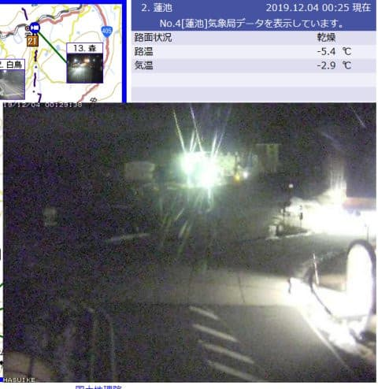
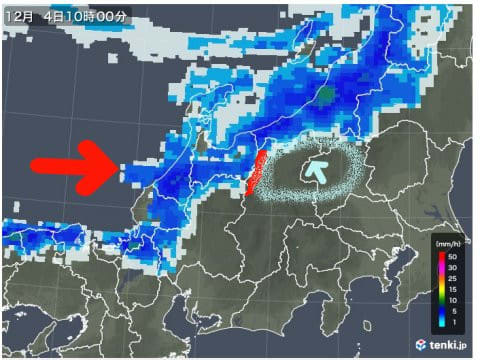

# これから今週末まで冷える！この週末のスキー場の積雪にちょっと期待だけど…志賀はそんなに積もらないかも（涙）

📅 投稿日時: 2019-12-04 01:26:29

えー．

月曜の雨で，かなり雪が解けてしまい．

かぐらは，かぐらクワッドの営業ができなくなり，

ペアリフトのみになったようですが…

（[かぐらスキー場HP](https://www.princehotels.co.jp/file.jsp?id=304743)より）

一旦オープンしたスキー場が，

融雪によりクローズしてしまう

というような，悲しい事態には

ならず．

鹿沢も，湯の丸も，アサマ2000も，

なんとか無事営業を続けられた

ようで…

ちょいと一安心．

…そんな中，わがホームゲレンデ，

焼額スキー場が今週末にオープン

するわけですが．

本日，焼額のホームページに掲載された

案内によると…

（[焼額山スキー場HP](https://www.princehotels.co.jp/ski/shiga/informations/open/)より）

…やっぱり，オープン日は4ロマしか

動かないのね…

高速リフトは動かず．

10分かかる鈍足リフトで滑らざるを

えないのね…（涙）

…先に第2高速の唐松コース側に

雪を付けてくれると嬉しいんですけど…

…まぁ．

今週末までに1mほど天然雪が積もって．

いきなりゴンドラが滑れるように

願いましょう！！←無理だから．無理なお願いだから，それ．

ってなことで．

果たして，その願いがかなうのか．

今の志賀高原のライブカメラを見て

見ると…

…

…ダメです（泣）

全然積もってません…

気温は冷えてるんだけど…

（[北信建設事務所道路気象状況ページ](http://hokushin-camera.org/)より）

誰だ！？？

3日午後から，それほどの量では

無いとはいえ，志賀でも積もり

始めるって言ったいい加減な

やつは！？？←自分でしょ

いや．

でも．

これは，やっぱり，

西風による残念なパターンで．

4日朝の雨雲の予想を見てみると…

赤矢印の方向に風が吹いていて，

矢印の方向に雲が伸びているのが

分かる降水パターン．

この雨雲が，赤い線で記した

北アルプスでブロックされて．

それより東側の，水色で囲った

エリアに，降水が無いことが

読み取れます…

（[tenki.jp](https://tenki.jp/radar/)より）

…水色矢印で示した志賀高原には，

雲が届いておらず．

雪が降らないパターンとなります…（泣）

4日朝の予想天気図の

降水量予想の水色で塗った領域．

西風にたなびくこの雨雲予想の形と，

ぴったり一致してます…

慣れてくると，この降水域の形を

見ただけで，

「西風が強いな…志賀には

　降らなさそうだな…（涙）」

と，読み取れるようになります．

ただ，この4日の850hpa気温図を見ると．

赤い0℃線が太平洋側まで下がり．

-3℃線が志賀より南にある

レベルなので．

いい感じで冷えそうな一日．

バッチリ人工降雪を打てます！

そして，5日の木曜日も．

850hpaの赤い0℃線は太平洋の

はるか南にまで下がり，

いい冷え込みになりそう…

5日の地上天気図は，日本海側に水色の

降水域がかかっていますが．

でも，まだ志賀高原にドサドサ

降りそうな感じじゃないかな…

でも，真西じゃなく，ちょっと風が

北に回っているようなので．

ちょっと期待！！

次に，6日金曜日は…

うおお！

志賀高原に水色の-9℃線が！！

これは，朝は-12℃程度に冷え込み，

昼間も-7℃を上回らない激冷えに

なります！！

そして，この図面の志賀高原付近を

拡大すると．

風向を示す矢羽は，志賀高原付近では

水色で示す北西の風になってますね．

このくらい北に回ってくれると．

志賀まで雪雲が届きそう…！！

期待しつつ，6日の地上天気図を見ると…

うむ？志賀高原近辺まで，水色の

降水域が伸びてるように見えます…！！

志賀高原付近を拡大すると．

志賀付近まで降水域が広がってる

ように見えるし．

さらに赤で囲った，新潟付近を示す

35という数字．

これは，24時間降水量が35mmなので…

積雪なら35cmってことですよ！！

5日から6日にかけて，新潟は30cm超の

積雪がありそう！！

そして，ドサドサと積もらないまでも，

志賀でも積もってくれそうな感じ！！

まとめると…

4日（水）　終日冷える．最高気温も-3℃を超えなさそうなので，

　終日人工降雪機フル稼働！！

　志賀は晴れ～曇りで，天然雪なし．

　新潟方面は10cmくらいの積雪があるかも…

5日（木）　終日冷える．人工降雪機ガンバレ！！

　この日も志賀は昼間は曇り～小雪程度で，

　天然雪はそれほど期待できなさそう．

　でも，夜から志賀でも積もり始めるか…

　新潟は10cmくらいの積雪かな？

6日（金）　すごい冷える．真冬並みの気温．

　志賀高原もさすがにこの日は積もってくれるか？

　10～20cm程度の積雪を期待…

　新潟はかなりの積雪になりそう！！

…ちなみに．

土日の志賀の天気は明日詳細予想しますが．

土日とも，気温は0℃前後．

地上天気図を見ると，7，8の

両日とも，網掛けの降水予測が

志賀にかかってないので．

おそらく，曇～晴れで推移

しそうな感じです．

とりあえず．

これから週末まで，志賀は

西風で雪が積もりにくい

パターンだけど．

3～6日にかけては，水色矢印で示す

ように，平年比-4℃くらい冷える日が

続くので．

ここでの人工降雪機の活躍に期待っ！！

でも．

本音で言えば．

この予想以上にドカ雪になり．

初日からゴンドラが動いてくれると

いいなぁ…

と，願わずにいられない，

Skier_Sなのでした…

## 💬 コメント一覧

### 💬 コメント by (若杉勲72)
**タイトル**: Unknown
**投稿日**: 2019-12-04 16:51:08

熊の湯は鹿児島県の高校生800人で、水木金は溢れかえっていますよ。皆様、心してお出掛けください。

### 💬 コメント by (naoちゃんねる)
**タイトル**: Unknown
**投稿日**: 2019-12-04 19:31:54

Sさんの予想通り、今日は雨雲レーダーを見ても見事に西から雲が流れて来てて、志賀高原に積雪ありませんね😢

寒さに弱く、遅いリフトが大嫌いな我が娘は、ゴンドラが動いてくれないと一日中滑れませ～ん(苦笑)

２ゴン動いて～🙏

### 💬 コメント by (しんちゃん)
**タイトル**: ２高
**投稿日**: 2019-12-05 00:26:27

予想以上のドカ雪と、予想以上の人工降雪量で、２高が動いて唐松が滑れるといいのになぁ。

２ゴンが動くとなおさらいいですね。

週が明けて12/9以降気温が上昇傾向なのが気になります。来週も水木金とドカ雪で土日の12/14-15は晴天になるといいのに（←そんな都合よくならないか（涙））

### 💬 コメント by (Skier_S)
**タイトル**: ゴンドラ動いて欲しい
**投稿日**: 2019-12-05 01:11:12

＞若杉さま

え！！

あのゲレンデで800人っ！！

それはすごいことになりそうですね…

＞naoちゃんねるさま

残念ながら，全く積雪がありませんでしたね…（涙）

しかし，4ロマで一日滑るのは酷ですよね．

今年はゴンドラがいつから動き始めるか，ちょいと心配です…

＞しんちゃんさま

一応唐松の人工降雪も始まっているようなので，

ぜひ2高が動いて欲しいところ…

来週は確かに気温が上がりそうなので，ちょっと怖いです．

昨シーズンも，オープンの週よりその次の週の方が雪が少ないという，

かなり悲しい状況になったので，そんなことが再び起きないよう，

祈るばかり…（というより，踊るばかり？）

