# HEAD Raptor WCR3のHEAD純正フォーミングインナーを作ってみた，その１…インソール作成

📅 投稿日時: 2023-12-15 00:30:05

残念ながら，予想通り15，16日は終日

高温の雨にやられそうな志賀高原ですが…

来ますよ来ますよ～！！

4日ごろから16日まで2週間近く続いた，

赤矢印で示す高温期間が終わって．

17日以降，クリスマスのころまでは，

水色矢印で示したように平年よりも

ぐっと冷える日々が続きますよ～！！

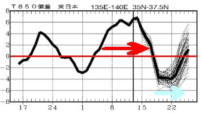

今の天気図を見ても，17日はそこそこ

積もりそうで．

20，21日あたりも結構な大雪に

なりそう…！！！

23，24日の週末は，かなり期待でき

ますよ～！！！

…もう1日早ければ，大雪が今週末に

間に合ってくれたのに…（ちょい涙）

でも，ちょっとだけいいニュースが．

今晩は人工降雪機無理だろうな…

と思っていたけど．

どうやら志賀高原，冷え込んで人工

降雪機が動かせているようです！！

焼額は第2高速側の唐松コース復活に向け，

唐松川に全力で人工降雪を打っている

みたいです…！！

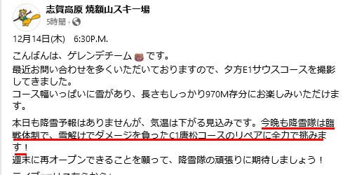

（[焼額山スキー場Facebook](https://www.facebook.com/watch/?v=684747287123963)より）

明日の雨がひどくならず，週末に唐松

コースが開いてくれるといいなぁ…

…ってなことで本題へ．

物欲選手権で敗れてGetした，

あたらしいHEAD Raptor WCR3と

フォーミングインナーですが．

昨シーズン終わりのGWごろに，

志賀高原帰りに[長岡のエキップさん](http://www.equipe.jp/)に

立ち寄り，フォーミングしてきましたので，

そのレポートです！

HEADのRaptorシリーズのブーツも，

2024シーズンモデルは2023シーズンと

シェルはモデルチェンジせず，旧モデルでも

全然問題ない上．

2023年モデルまではBOOSTERストラップの

技術を使ったストレッチするバンドだったのが，

2024シーズンモデルからは伸びない普通の

バンドに変わってしまい，むしろ新モデルの

ほうがちょっと見劣りするという状況．

それでいて，2024シーズンモデルから

お値段が爆上がりするということで．

2023シーズンモデルのシェルをこの際

抑えてしまえ，ということで．

2023シーズンモデルのシェルに…

日本では一般販売していないHEAD純正

フォーミングインナーを入れるという

組合せとなりました．

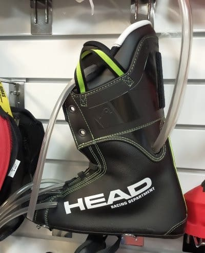

そして，これまで使っていたインソール．

これは，REXXAMを買ったときに作った

インソールをREXXAMとHEADで使いまわし

ていて．

これも3シーズン使って歪んできたし．

前のHEADのカントも結構ずれてきている

のもあって，足もちょっと以前と変わって

来ている可能性もあるし，作り直した方が

いいね…

ということで，インソールまで作ることに

なりました…

…いや．すごい出費だった…

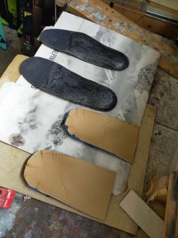

ってなことで．

エキップさんに到着すると．

私の足形を知り尽くしているエキップさん．

私の足の骨の出っ張りに合わせた型を

使って，すでにシェル成型をしていました…

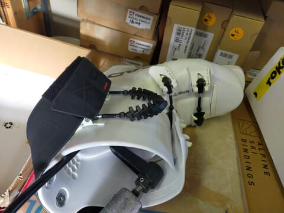

ちなみに，私の骨の出っ張りに合わせた

特殊型は，こんな感じ．

この特殊型で，私の足にぴったり合わせた

形になるようにシェルの当たり出しを

やってくれています．

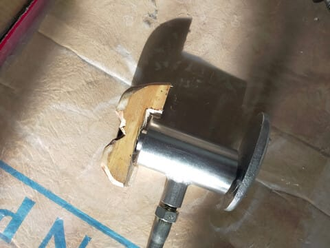

なので，本人が到着したら，まずは

シェル成型の次に時間がかかる，インソール

作り．

このインソールづくりも，かなりのこだわりが

あって…

まずは，スタンスが腸骨の幅になるよう，

水色矢印で示す木製定規で腸骨の幅を

測って，この幅になる用スタンスを調整して

立ちます．

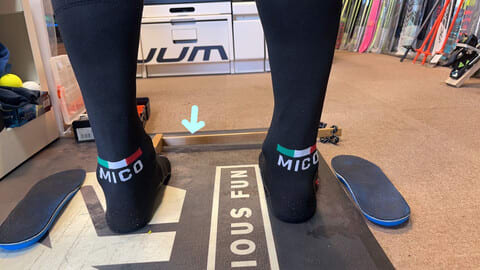

その状態で，足首や脛，膝の角度を見て…

インソールをどう調整するか決めます．

ちなみに，かかとの少し前に，

こんな風に木でできたくさびを入れて

足の角度を見ていたのですが…

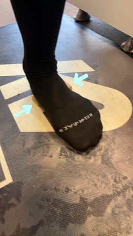

「大体のところでは，土踏まず側は

こうやって抑えるけど，足の外側の

この部分を抑えることはしない．

足の外側のここを抑えると安定するでしょ？」

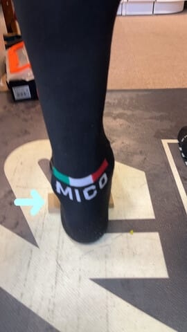

…確かに．

踵の前の部分，左右からくさびで抑えると

安定感が違うし，足の裏を左右に動かした

とき，しっかり外エッジと内エッジ側が

踏める感じがある…！！

その理由を，いろいろ骨格模型を使って

教えてもらいましたが．

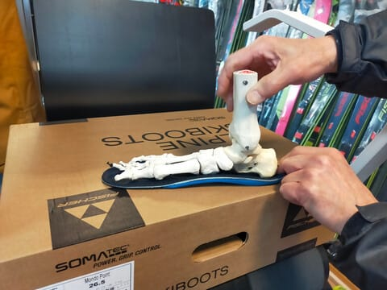

「そんな感じでしっかり足を抑え

　られる形が作れるよう，このインソール

　成型の下地が作ってある」

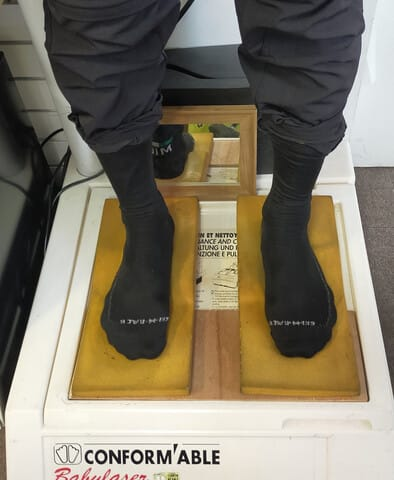

とのことで．

この下地をセットした上に…

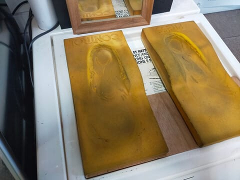

熱を加えたインソールを置いて…

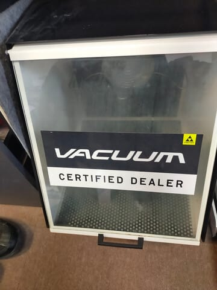

その上に立って，インソールを成形！

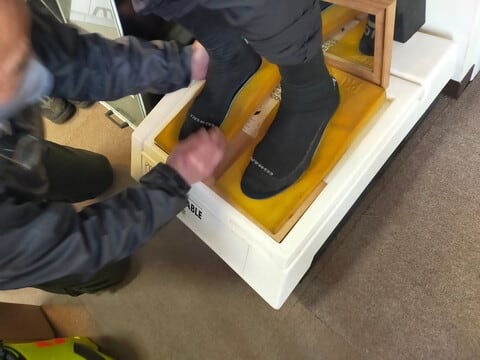

しばらく経つと…

ちゃんと踵の前の部分がしっかり左右から

ホールドされる，かなり立体的な

インソールが出来上がりました…！

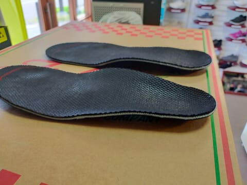

（[続く](ed44d0009d0d97ce999eab2644f2c8466.md)）

## 💬 コメント一覧

### 💬 コメント by (レインボー76)
**タイトル**: Unknown
**投稿日**: 2023-12-15 14:57:59

金曜日の志賀高原情報

朝の上林+5℃、蓮池+7℃。小雨というか微雨？で、四ロマスタート。ゴーグルに微かに水滴が付く程度。

雪は、コロコロな昨日と違って快適そのもの。

昨夜はえきっぷさんに、持病の後傾対策をブーツに施してもらい、期待のスタート。

気持ちいい滑りの確率が上がっていくのが実感できる充実の一日を送れました(実感してるだけで、他人から見ればひどいと思うけど)。

１時間も滑るとゴーグルに水滴が少し付く小雨に！

雨嫌いの隊員が「大雨になってきたからやめる」

こんなに雪がいいのに、でもあまり待たせるわけにはいかないので、10時30分に泣く泣く終了。

今は異常な暑さ。今夜は雨。

明日は大阪府の指導員研修200名程がヤケビに。

我らの対策は、朝のうちにパーっと滑って、早めに終了。全員同じ意見でまとまりました。

エス様ならどうするか？

「そんな時でもラスリフまで滑り続ける」に、一万両賭けます。

