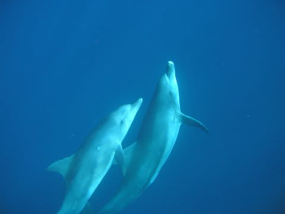
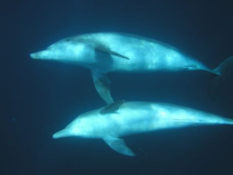
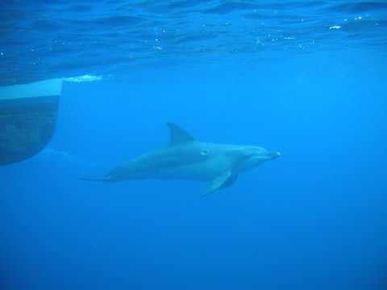
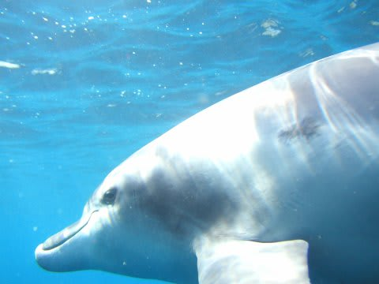
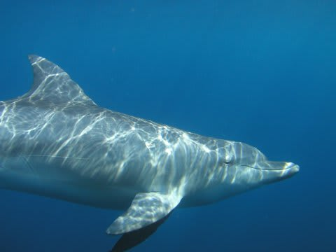
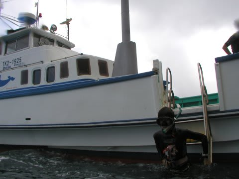

# 2007年8月　三宅島ドルフィンスイム＆ダイビング旅行記　その6

📅 投稿日時: 2013-09-15 00:31:41

🏷️ カテゴリ: [ダイビング日記](ce3a7a8d424d112fce83ee85c81a0e344.md)

そして．

イルカちゃんが，視界から消えていく…

と思ったとき．

3頭のイルカたちは，くるりと振り返り，水面近くから

水深5m程度に潜りながら，再びこちらに向かってくるでは

ありませんか！

よし！ここは潜行だ！

…と思うけど．

間違いなく，潜行するべきところですが．

潜行しないと，自分の下，かなり深くを通り過ぎてしまうのは

分かっているけど．

分かっているけど．

…さっきからの全力フィンキックで，息が上がってしまって．

シュノーケル越しの呼吸でも苦しいくらいで，とても潜れる状況ではないよ…(涙)．

周りでも，さすがにこの状態で潜っている，スーパータフ驚異の肺活量人間はいないようで…

イルカは，そんな人間たちをあざ笑うかのように，水深5m程度を

悠々と通り過ぎて行きます．

うーむ．人間は陸上で生きるようにできてるからなぁ…(負け惜しみ)

時々裏返って，おなかを見せたりしながら，ゆったりと

泳いで行っているのですが…．

ゆったりに見えるけど，すんごい速い．

追っかけ始めると，すぐに振り切られてしまいます．

イルカが完全に視界から消えたので，水面に顔を上げてみると，

船が回りこんでいます．

「船のへさきを見てー！舳先の波にのって遊んでるから～っ！」

という声で，船の方へ泳いでいくと…

おお．船のへさきが作る波に乗って，1頭だけ，イルカが泳いでいる！

このイルカを眺めていると，ほかの2頭が今度は違う方角からやってくる！

今度も近い！1m以内に接近！

しかし，やはりイルカは一瞬で通り過ぎて行きます…

うーん．イルカは泳ぐのが速いので，じっくり遊ぶって感じじゃなく，

一瞬真横を通過していく，って感じなんだなぁ．

また追いかけていくと，視界ぎりぎりの範囲をぐるぐる回って

泳いでいたのが，気が向いたときにまた人間の間に突っ込んでくる…

という感じがしばらく続きます．

なんだか，イルカと遊んでいるってより，

イルカにいいように遊ばれてるって感じがする…(^^;

…こんな感じで10分ほど，イルカをひたすら追いかけ続けたら．

もうヘロヘロ…

ヘロヘロになったころ．

どうやらイルカが遠くに泳ぎ去ったようで，

船の上から，「上がります～．集まって～」との声．

しばらく水面に漂っていると…

船が近くに寄ってくるので，

船べりのはしごから，船の上へ．

うはーーーーー．

ドルフィンスイムの1本目．

たった10分でこれだけヘビーなのが．

まだまだ続くのかっ！
