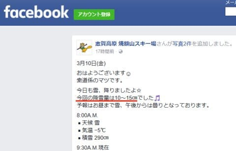

# 3月上旬のスキー場は冷え気味だけど…これからも冷えるのか？それとも気温が上がり雪が解けちゃうのか？1か月予想図を見てみた

📅 投稿日時: 2017-03-11 03:29:26

本来ならば．

明日からは土日で．

スキーに行っていたはずなのに．

…なぜ，この時間まで仕事をしているのだろう…（泣）．

そして，なぜ明日はスキーに行けないのだろう…（涙）．

ということで，今週末は日曜に日帰り志賀予定の，

Skier_Sです．

えー．

でも．本日．

…ってか，もう昨日ですね．

金曜の朝，志賀高原は．

雪が積もったようですね．

（[焼額山FB](https://www.facebook.com/yakebitaiyama/posts/1248218315273512)より）

そして，また今も降っているようですね．

（[北信建設事務所道路気象状況ページ](http://www.q0.ws302.smilestart.ne.jp/index.htm)より）

新しい雪が積もったうえ．

明日は気温も低いし．

朝のうちは雪雲が残るかもしれないものの，午前中から晴れるので．

…明日は最高の一日でしょうね．

なぜ，私が行けない日に

こんなにいいコンディションになるのか…（涙）．

でも．

…スキーに行けなくても．

悔しくなんかないもんっ！！！！

もし，明日スキーに行ってたら．

交通事故で大怪我したのかもしれないし．

スキーで転んで死んじゃう日だったのかもしれないし．

たまたま志賀高原に来ていた謎の国のヒットマンに狙撃されてたのかもしれないし（そんなことないから）

たまたま志賀高原に落ちてきた北の国のミサイルに当たって死んじゃう日だったのかもしれないし（だから，そんなことないから）

たまたま志賀高原にやってきたUFOに連れ去られて，宇宙人に人体実験されちゃう日だったのかもしれないし（ありえないって）

たまたま志賀高原に襲来してきた使途と，謎の人型兵器に乗って戦う羽目になる日だったのかもしれないし（なんじゃそりゃ）

…だから．明日，スキーに行かなくてよかったんだ，

きっと…←[どこかで見たパターン](e4f2342ee5b02407b6724cf19c5099e74.md)の自分のごまかし方である

…ってことで．

本題へ．

えー．

この3月上旬．

比較的気温が低く，3月というのにゲレンデは

結構いいコンディションが続いてますが．

…このいいコンディション．

これからも続いてくれるのか？

あるいは，これから気温がぐぐぐっと上がって，

雪が一気に解けたりしないのか…？？？

…ってあたりを．

また，一か月予想天気図，FCVX12を見て，

占ってみましょうか…

まず．

これから一週間，3/11～3/17の500hpa図ですが．

うぉ！

赤く囲った部分．

見事にブロッキングHが出ています…

だもんで，この期間．

冷えそうですね～！

この期間の850hpa気温予想を見てみると…

うむ．

赤く印した0℃線は，まだ太平洋側にありますし．

志賀高原は，水色で示した平年より1℃低いエリアに

入ってます．

来週いっぱいは，そこそこの冷えが続いてくれますね～．

そして．

それに続く3/18～3/24の週の850hpa気温平均ですが．

なんと！

この期間も志賀高原は，

引き続き水色で囲った平年比マイナス1℃の

エリアに入ってます！！

いや，1℃低いだけって，たいしたことないと

思うかもしれませんが．

一週間平均で1℃低いってのは…かなりの冷え込みです．

そして，赤く印した0℃線はまだ太平洋上…

3月下旬で，0℃線がまだこんなに南にあるのは珍しい…

この期間も，結構冷えてくれそうです！

で．

3/25以降の2週間，3/25～4/7の期間の850hpa気温平均ですが

さすがに，水色の平年比-1℃のエリアは縮小してますが．

でも，まだ平年より気温が低い網掛けエリアに

日本はすっぽり覆われており．

さらに，赤く印した0℃線がまだ志賀高原近辺にいますね～．

4月上旬のこの時期まで，こんなところに0℃線がいるとは…

FCVX14の気温傾向を見てみると．

水色矢印の期間，3月8日から4月2日まで，

ずっと平年より低い気温が続きそうです！

いや，一か月ずっと平年比マイナスが続くって…

珍しい…

ってことなので．

どうやら3月いっぱい，平年よりも冷え冷えの日々が続きそう！

雪が解ける心配はなく，昨年に比べるとむちゃくちゃまともな

3月が過ごせそうです…

いやーー．

ちょっと安心かな！

## 💬 コメント一覧

### 💬 コメント by (つーちゃん)
**タイトル**: Unknown
**投稿日**: 2017-03-11 05:06:42

更新が無かった日はわりと本気で

過労とスキーのやり過ぎでぶっ倒れたのかと思いましたf(^^;

日帰りですか、、、

オートクルーズ(居眠り)にならないようお気を付けて(^_^)/

私は今日から４日間ニセコに行ってきます

### 💬 コメント by (Skier_S)
**タイトル**: つーちゃんさま
**投稿日**: 2017-03-11 10:27:47

いや，ぶっ倒れても不思議じゃない生活を

しています…

でも，スキーしないと違う意味で

ぶっ倒れるので（笑）

ニセコ楽しんできてください～！

### 💬 コメント by (はなげ親分)
**タイトル**: いやいやいや…
**投稿日**: 2017-03-11 11:51:40

S様の直感、鋭いです！

今、志賀高原は突如現れた地底人に襲撃され、我々は応戦中です!!

### 💬 コメント by (Skier_S)
**タイトル**: はなげ親分さま
**投稿日**: 2017-03-11 12:37:40

地底人でしたか！

遠いK奈川県より、善戦を祈ってます(-人-)

### 💬 コメント by (なちちゃん)
**タイトル**: 今日のﾔｹﾋﾞ
**投稿日**: 2017-03-11 12:43:41

朝方から降っている雪で、バーンは荒れ荒れです

### 💬 コメント by (かず)
**タイトル**: 朝
**投稿日**: 2017-03-11 20:26:21

オリンピック滑ったけど……

### 💬 コメント by (Skier_S)
**タイトル**: 明日日帰り志賀高原！
**投稿日**: 2017-03-11 20:29:05

＞なちちゃんさま

想定より早くに雪が荒れちゃったんですね…

午後はかなり凸凹するかな，とは思ってたのですが．

ちと残念な感じでしたね…

＞かずさま

これは…

雪が重すぎた，ということでしょうか．

イマイチだったんですか？

