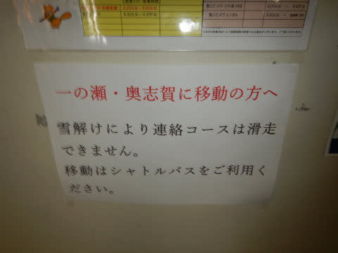

# 2021/4/29(木・祝)の志賀高原スキー場は…終日小雨．午後は風が強まったけど，ザーザーぶりにならず雪はまだ大丈夫！

📅 投稿日時: 2021-04-30 00:18:03

🏷️ カテゴリ: [2021スキー滑走日記](c2b0fc073d6357d3b786f6ca655147f7d.md)

ということで．

祭日の本日も，志賀へ滑りに来てしまったわけですが．

…本日は予想通り，朝から雨．終日雨．

ずっと雨の一日でしたが…

でも，ザーザーぶりにならず．小雨が

ぽつぽつ降り続ける程度で．

気温もそれほど上がらなかったので．

日差しが当たる晴天よりも雪は

解けなかったのでは？

という一日でした～！

なにより，ガラガラで午後まで完全

あさイチと同じような状態をキープしてくれて．

雨で比較的板も滑ったので．

晴天の妖怪板つかみ大量発生の日より

楽しかったですよ！

ってことで．

今日も焼額第2ゴンドラスタートなわけですが．

朝8時頃の2ゴン前駐車場は．

予想通り雨が降ってますね…(涙）

だもんで．

早朝も20人ほどしか滑ってなかったようですが…

でも，2週間前の土曜みたいなザーザーぶりでは

なく．

ぽつぽつと降る程度で．

これなら全然OK！

と，通常営業開始の一番ゴンドラで

山頂に登りますが…

山頂の気温は+5℃と，やはり高め(涙）

でも，昼になっても朝のこの気温が

ずっと変わらず．

意外と肌寒さを感じるほどの一日

だったのですが…

でも，雪解けが進んでしまい．

山頂を経由して，焼額⇔奥志賀の往復が

出来なくなってしまいました！（泣）

山頂コースは完全に止められているので．

奥志賀への往復はバス移動になります…

ってな感じなので．

コース上も雪解けが進み．

一部コース脇から土が侵食し始めている

ところも出てきてますが…

でも，基本的にはまだほとんどの部分で，

コース幅いっぱい雪が着いてます！

雪は，表面が汚れいていて，さらに朝からの

雨の水を吸った重い雪ですが．

でも，ザブザブに板が潜る雪ではなく，

むしろ水を吸ってどっしりと固まったような，

意外と気持ちいい，滑りいい雪です！

そして…

今日もコース上に，人がいませんね…

雨は心配したほどひどくなく，レインウェアの

フードをかぶってなくても気にならない

程度の雨の量で．

時折完全に止むタイミングもあったりして．

緩斜面では，雪の汚れで多少スピードは

落ちるものの．

晴天時のストップスノーって程でもなく．

激烈ガラガラ貸し切り状態の，結構

楽しめる感じのバーン状況ですよ！！

ただ…

第4ロマンスの横，サウスコースのど真ん中．

一部，ちょっと穴があき始めている

部分があり…

コースのど真ん中なので，この穴が広がると

ちょっと嫌な感じ…

そして，サウスコース最後の落ち込み部分も，

ちょっとコース脇近くの雪が薄くなり．

コース幅がちょっと狭くなってきました…

とはいえ．

今日は雨が思ったほど強くなかったので，

意外と雪はそれ程激しく解けず．

そして，焼額全体で，最大ピークでも

滑っているのは20人ほど．

ゴンドラは，いつ来ても完全飛び乗り！

午後になると10人以下しか滑ってなかった

のもあり…

バーンは汚れてきたものの，午後まで

朝と同じ，完全圧雪かけたてに近い

フラットなまま！

いや，これ，楽しいよ．

意外と楽しいよ！！

晴天の日でありがちな，板が潜ってしまううえに，

さらに板に張り付く楽しくない雪より，

雨でずっしりした感じで，そこそこ滑る

フラットバーンの方が100倍楽しい！！

いいよ，楽しいよ…！！

と．

午後1時からちょいと風が強くなり，

ゴンドラは減速運転になったものの．

意外と良いバーン状況だったため．

…天気が悪いので早く帰ろうと思っていた

朝の思いと裏腹に，

いつまでも帰ることができず，昼ごはんも

食べずに，小雨の中ひたすら滑り続けたの

でした…

でも．

今日はちょいと都合があったので．

15:30の営業終了よりちょいと早めに

切り上げて．

…こんなところにやってきました～！！

そうです．

[私がブーツを作ってもらった](e84a3c4f3e87605ea154c49f2e9927b90.md)，長岡のエキップさん．

いや，作ったREXXAMのブーツ，インナーが

ヘタって，ちょっと当たるようになって

きたので…

…しかし．

当たり出しだけのつもりが，今回も

しっかりいろいろ見てもらいました．

シェルの削りやら，かかとの高さの

フットベッドの調整を入れて，

その他シーズン中の微調整やら．

そのほかいろいろやって来ました．

…いや，ホントにいろいろやったので．

明日から，また滑りが変わるかも！？？

## 💬 コメント一覧

### 💬 コメント by (ikkun)
**タイトル**: Unknown
**投稿日**: 2021-04-30 10:41:43

ささささすが～豪傑？スキーヤーさんに敬服m(__)m  しかし素晴らしい 行くならば４日かな？と

ぇ～長岡迄???すごいまたまた尊敬しますm(__)m下がりっぱなし( *´艸｀)

### 💬 コメント by (ダウンヒル)
**タイトル**: Unknown
**投稿日**: 2021-04-30 17:22:50

滑ったあとに、エキップさんに伺うなんて···

素晴らしいです!!

夏場にブーツ絡みで遠征を画策中なので、リニューアル後の記事を期待しちゃいます···。

### 💬 コメント by (アリス)
**タイトル**: 驚き以外の言葉が見つかりません
**投稿日**: 2021-04-30 18:28:30

S様

たぶん志賀へ行く前は殆ど寝ずの移動だと推測します。

一日中滑り、さらに新潟へ移動しブーツの調整後帰宅し車やスキーの手入れしてブログ更新なんですね。

この状態で、普通に生きていることが不思議でならないです。

雨が降ろうが槍やミサイルが降ろうが、Sさんの滑走日記で、『本日はつまらなかった』って記録は見たことないです♪

スキーヤーとして見習わないといけないです♪

まだまだ雪はありますね。

中央部がダメでも横手山もありますし、月山もあることですから本年度のオフの期間は５ケ月程度かなって思っています。

### 💬 コメント by (かず)
**タイトル**: Unknown
**投稿日**: 2021-04-30 22:03:20

初GW行くか迷ってます  雨の後 混み具合……難しいです

### 💬 コメント by (Skier_S)
**タイトル**: 今日も睡眠不足
**投稿日**: 2021-04-30 23:25:30

＞ikkunさま

4日はすごい気温が上がるので，雪が解けそう…

4日なら，焼額・奥志賀より渋峠がよさそうです．

＞ダウンヒルさま

ブーツが当たって痛くなって来たのでやむなく長岡へ行くことに…

エキップさんはいいお店なので，ぜひ行ってみてください！！

＞アリスさま

志賀へはほとんど寝ずの移動でした（涙）

でも，金曜が休みだったので，昨日は長岡泊まりです．

帰宅せずに済んでいます…

＞かずさま

GW，早朝がちょっとまともなくらいで，昼間はダメです…

むしろ雨が降ってくれた方がいいくらい，滑らない雪になります（涙）

5連休の人出は読めませんが，焼額はガラガラじゃないかと．

