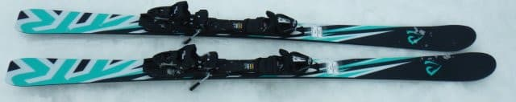
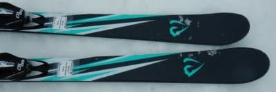
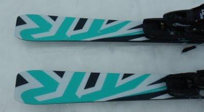
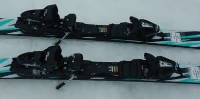
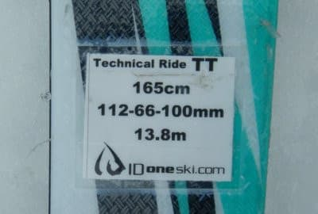

# 2022シーズンモデルのスキー板，試乗レポートその9…ID one TR-TT

📅 投稿日時: 2021-06-18 06:25:13

🏷️ カテゴリ: [スキー板試乗](c0bd8048615710cee890e403a36cc9a2b.md)

うーむ．

今日もなんだか更新時間がすごい

時間になってしまった…

でも．

今まで仕事していたわけじゃなくて．

昨日，夜中12時までのWeb会議が終わって，

それから夕食食べて，記事を書きかけで

机に突っ伏して寝てしまっただけで．

今意識を取り戻しました…(涙）

どうせ寝るなら，布団で寝たかった…

ということで．

記事を書き上げたので投稿！

今日はスキーの試乗レポート．

私としては珍しい，ID-oneに乗ってみました．

では，どうぞ～！

○ID one TR-TT 165cm

基礎小回り

モーグル板のイメージが強いID oneが贈る，

基礎板が，このTR(Techinical Ride）シリーズ．

メタルが入っていない優し目のTTと，

メタルが入っている強めのTTMの

2種類があるようですが．

今回試乗したのは優し目のTTの方です．

2021シーズンモデルと同じデザインですが，

これも2022シーズンはデザイン変更なしの

継続のようですね…

で．

どうやらこのTTは，

「1級合格を目指すレベルの板」

という触れ込みらしく．

「…メタルが入ってないTTは，

　Sさんにはちょっと柔らかいかも？」

という一言をもらっていたのですが．

滑ってみると…

ウッドコアがしっかりしているのか．

メタルが入ってなくても，意外と

板の張りはしっかりしています．

スピードを出していっても，コアの強さで

耐えてくれて．

（コアというより，グラスファイバーの強さかな？）

ペタペタにたわみきってしまわない感じ．

ただ，メタルが入っていない分，

圧の溜まりと返りが弱く．

そして，トーションが弱めてあるようで，

スピードを出すと，ちょっとエッジグリップ

が抜けていき，安定感が落ちていきます…

でも，逆に言うと，スピードを

出して行っても板は動かしやすく．

どうしようもなくガッツリグリップして

板なりに走っていく板ではなく，

スピードを出して行っても，

足元でどうにでも板が操作できる板です．

エッジグリップはマイルドで，

かつ板のコア自体にはしっかり張りの

強さがあるので，自分の好きな方向に板を

ずらしたりひねったり，好きなように

動かせます．

エッジグリップは弱めでも，優しく

抑えて板なりの方向に動いて行けば，

きれいにカービングしていき．

また，コアの張りの強さもあるので，

「あるスピードを超えると，一気に

　不安定になってズレズレになる」

ということもないので．

低速から高速まで，非常に楽に

カービングとズラシの出し入れを

自由にしながら滑れる板です．

私はもっとガッツリエッジグリップ

して，メタルの返りがビンビン来るような

板が好きですが．

エッジグリップがガンガンに強い

板をまだ使いこなしきれないけど，

カービングとズラシをうまく使い分けながら

上達していこう，という人を見事に

狙った板ですね．

そういう意味では，この板を設計した

人の狙いがよく分かる板でした…
