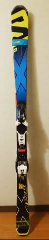

# SALOMON X-Race X12 165cmをデビューさせてみた…インプレッションレポート

📅 投稿日時: 2015-01-07 01:40:31

というわけで．

大回り用Volkl Platinum CDとATOMICブーツの相性が

あまり良くなく．

大回りの板をどうしようか…

と思っていたところで．

なぜか，[想定外に小回り用の板を買ってしまった](efb7a35a863f49c11192814a01ff642c2.md)

わけですが．←いつも通り，他のみんなにとっては十分想定の範囲内だったんでしょうが…

いや，この板．

前にも書いたように．

フレックスと高速安定性がそんじょそこらの

大回り板より強いので．

十分大回りで行けるだろう…

と踏んで，朝イチ焼額かっ飛ばし用に買ったわけですが．

実際，朝イチ焼額で履いてみた，そのインプレッションを…

いや．

この板．

すごいわ．

これまで，朝イチ大回り用に，180cmクラスの

GS板とかも使ってたこともあるけど．

この板，自分がこれまで履いた中で，史上最高の

高速安定性じゃないかしらん？

もう，整地では無敵の安定性＆トップスピード耐性．

とても165cmとは思えない…

少なくとも，178cmのVolkl Platinum CDよりは．

安定性，高速耐性はずっと上．

Platinum CDは．

ATOMICブーツの，異常に強いかかと部分で

板を押し込んでいくと，簡単にグリップを失う…というか．

板のヒールピース付近だけにたわみが集中して，

板がきれいに抜けず，減速感を感じるので．

乗り手は板に仕掛けず，板なりに乗っていき，

自然に落ちていく…という滑りが，もっとも気持ちいい板．

板なりに落ちていけば，すごく楽に長い谷回りを

取れて，大きな傾きの気持ちいいロングターンで，かなり

楽に滑っていける，いい板なんですよ．

傾きで回転弧が容易にコントロールできる，

楽な板なんですよ…

でも．

X-Raceは．

トップスピードを出しても，ガッツリ圧をかけていける，

無敵のグリップ力を誇ります．

もう，ありえない横Gを感じられます．

ここまでスピードを出して，ここまで圧をかけても

板が逃げずに，まだ耐えるのか！？？

って感じで．

乗り手がしっかり仕掛けていけて，超ハイスピードで

強烈な横Gを楽しめる，Platinum CDとは違った快楽を

与えてくれる，ヤバい板です．

これまで履いた板で，最高の横Gを生み出す板です．

滑走スピードは間違いなく，Platinum CDより上．

谷回りの早い段階から，しっかり手の位置を気にして

いないと，雪面に手があたって持って行かれるし，

新雪が乗った斜面では，膝に雪が触れるほどの深い

傾きを楽しめます．

ガンガン攻めていけます．

逆に言うと．

この板のおいしいスピード域は，かなり高め．

その高いスピード域で，強い横Gに耐える，

強い筋力を必要とします…

普通の人が普通のゲレンデで履くには，重いし

硬いし，筋力も使うし，ちょっとつらいかも…

＃私もトップスピードで数本滑るとヘロヘロに…

＃こんな疲れる板も初めて．

ってことで．

朝イチ整地には最高ですが．

…朝イチ整地以外で履く気はあまり起きません（笑）．

雪が荒れたり，低速で滑るときはATOMIC Bluester DEMO SXが

気持ちいいです．

…で．

X-Raceを履いた後に，ATOMIC Bluester DEMO SXを履くとですね～．

普通のエキスパート用としては比較的重めで，

グリップもかなり強めのこの板が．

むちゃくちゃ軽くて，好き勝手に振り回せる

お手軽板に感じます…

＃決して，この2台目のSXがもうマイルド化している

＃わけではない…と，信じたい．

とりあえず．

自分の中では．

朝イチ整地用としては．

最高のスピード耐性と，

最高の傾きを生み出せる，

超過激な快楽を発生させるマシンとして．

激烈に気に入りました！！

## 💬 コメント一覧

### 💬 コメント by (Goku)
**タイトル**: Unknown
**投稿日**: 2015-01-07 19:03:08

って言うことは、『大回り』板は買わないんですよね（笑）

### 💬 コメント by (Skier_S)
**タイトル**: Gokuさま
**投稿日**: 2015-01-07 23:07:00

ええ．

その通りです．

大回り板なんて，買いませんっ！

買わないぞ～っ！

買わない…はず．

うん．

買わない…だろうな．

きっと．

たぶん…

### 💬 コメント by (komu)
**タイトル**: でも…
**投稿日**: 2015-01-07 23:26:26

買ってしまうのですね…

あ、もしかして買ってしまったのですかU+2048

### 💬 コメント by (Skier_S)
**タイトル**: komuさま
**投稿日**: 2015-01-07 23:44:14

いや…まだ，自制しています．

まだ，買っていません．

そう，現時点では…

