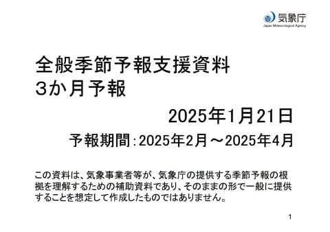
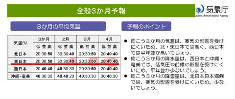
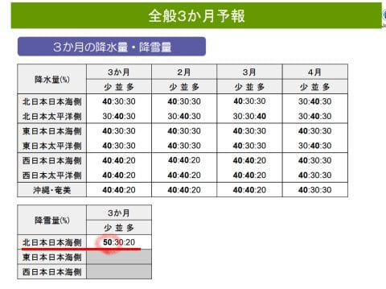
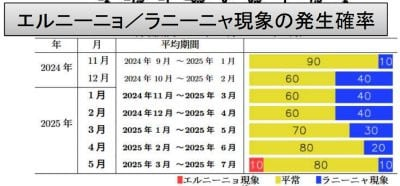
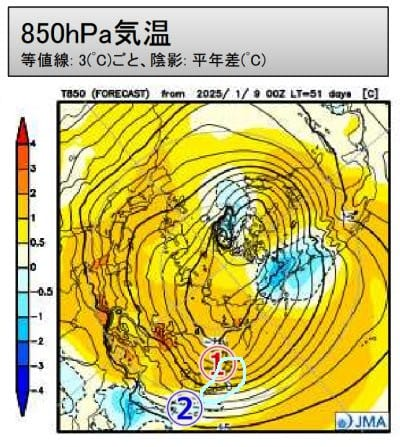
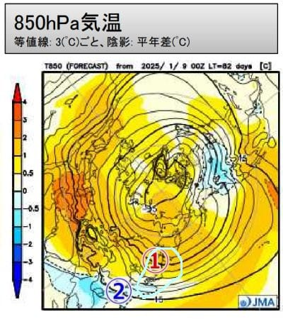

# 気象庁3か月予報が出たよ！…2月はだいたい平年並み，春スキー時期の3，4月は気温が上がりそう…

📅 投稿日時: 2025-01-23 08:35:07

ダメだ…

ちょっといろいろクリティカルというより，

疲れているのか．

いつもなら夜3時すぎまで起きている

ところ，昨日も深夜1時ごろ，眠さに

勝てず寝てしまった…

うーん．本格スキーシーズン開始で

土日の睡眠時間が短くなったので，

疲れが溜まっているのか…

なので，朝に手短に更新！

21日に，気象庁の3か月予報が出ました～！

2，3，4月の予報ですね．

中身を見てみると…

うーーーーーーーーむ．

2月は気温が高くなる確率40％でも，

低くなる確率も30％と大きく変わらず，

まぁ平年並みよりちょっと高くなるかも，

という程度だけど．

3月は気温が高くなる確率が50％と

半分まで上がり，

4月も気温が低くなる確率は20％と

低く，冷え冷えの可能性はあんまり

高くない感じ…(泣)

さらに降水量を見ると…

うーん．

北日本ですが，日本海側の雪が少ない

確率が50％と，積雪も少なそう(涙)

12，1月は良かったけど．

3，4月は冷え冷えじゃないのか…

1，2月は多少暖かくても雪はそこまで

悪くならないので，3，4月に冷えてくれると

嬉しいんだけどな…

ラニーニャは秋から冬は冷えるけど，

春は暖かくなるのが早いんだよな…

でも，ラニーニャ傾向も5月には終わって，

エルニーニョ傾向になる確率も10％くらいに

なってるし．

予想が変わって，3，4月は冷える方向に

行ってくれるといいな…

でも，3月や4月は平年より気温が上がりそう

ということだけど．

3月の850hPa気温図を見ると…

北半球は全体的にオレンジの高温域に

覆われており．

その中でも，水色に記した日本付近は，

南に平年より低い水色領域があり．

北半球の中でも，気温が低めなんですよね…

なので，ぎりぎり平年並みかそれより

ちょっと高めというところに収まっていて．

この，日本より南側の水色領域が

無ければ，もっと気温が上がってるはず…

4月も同じく，日本は南側に水色領域が

あって，他の北半球のエリアよりは気温が

低いようなので…

まだ恵まれてるのかも？？？

ってなことで．

冷え冷え4月にはならなさそうですが．

高温傾向は北半球の他のエリアよりはマシ

ということで，自分を納得させるのかな…

とりあえず．

昨シーズンの奇跡の3月がまた来てくれると

嬉しいけど．

そこまでの奇跡が起きなくてもいいから，

異常高温にならず，何とかGWまで普通に

滑れますように…！！

## 💬 コメント一覧

### 💬 コメント by (レインボー77)
**タイトル**: Unknown
**投稿日**: 2025-01-23 20:18:22

木曜日の志賀高原情報

朝の蓮池-4℃。風もなく穏やかな晴れ。

ニゴンから快適な白樺、やや硬めな唐松、申し分ないGS。

ただ、オリンピックだけは大きな雪玉にびびってずりずり滑り。

パノラマも三高も夢のよう。なんか内膝も曲げられるようになってきた。77歳にして、生涯最高の滑りができている(低い次元ですけど)。こんなに楽しいのに２時間ちょっとで終了。我らの暗黙のルール「誰かがやめると言ったらやめる」は生きている。

### 💬 コメント by (Skier_S)
**タイトル**: ＞レインボー77さま
**投稿日**: 2025-01-24 00:04:45

今日も全体的に良かったんですね…

そしてこの歳でも上達しているのがお見事！でも，たぶんまだまだ上手くなりますよ～！

しかしそんなにいいコンディションで2時間だけとはもったいない（笑）．

### 💬 コメント by (こてつくん)
**タイトル**: Unknown
**投稿日**: 2025-01-24 07:41:21

何言ってんだ

昨年はそれで桜の開花が遅れたんだ

### 💬 コメント by (Skier_S)
**タイトル**: ＞こてつくんさま
**投稿日**: 2025-01-25 02:01:46

一昨年まで，東京では平年比10日ほど早く桜が咲く年が多く，温暖化おそるべしと思ってましたが．

昨年は1，2月が異常に暖かかったのに3月が冷えて，桜が平年並み+5日遅れくらいになりましたね…

