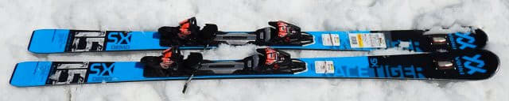

# 2020シーズンモデルのスキー板，試乗レポート…VOLKL編その２

📅 投稿日時: 2019-05-31 00:51:45

ってな感じで．

今週末はかぐらも渋峠も営業していない…

ということが．

頭で分かっていても，未だに

身体で理解できてない，Skier_Sです．

うーん．

まだいつもの営業終了時期に比べれば，

雪がいっぱい残っていたので．

「かぐらももう終わりだよね…」

という実感がないまま終わってしまい

ましたね…．

でも，ライブカメラを見ると．

かなり雪が減って．

もうコースが途切れてますね…（涙）

火曜の雨で，かなりやられちゃったようですね．

…しかし．

ホントに一気に雪が消えたなぁ…

ってなことで．

本題へ．

本日はスキー試乗レポート．

フォルクル編です．

では，どうぞ～！

○VOLKL RACETIGER SX DEMO 168cm 

基礎オールラウンド．

説明書きには小回り系オールラウンドTOPって書いてますが…

履いた板はR=15．

163cmの板でも，R=14なので．

ギンギンの小回り用というより，

中回り程度に合わせたサイドカーブの

板ですね…

そして．

小回り系のTOPモデルには，RACETIGER SL DEMOが

ありますし．

この板はセンター幅の広さもあり，

小回り～大回り，さらには硬い雪から新雪まで，

いろんなシチュエーションでの

滑りやすさを重視した，基礎オールラウンド…

と言った位置づけの板でしょうか．

かなり荒れたバーンコンディションでの試乗でしたが．

履いてみたところ…

かなりの軽快さを感じます．

軽くて動かしやすい！

…でも，フワフワキョロキョロする板ではなく．

結構しっかり山回りでグリップして切れ上がって

行きます．

R=15mですが，ガッツリ突っ張るような

強いフレックスの板ではないので．

谷回りからすっとたわませることができ，

良くたわんでカービングでR=15より

小さく感じる半径で回っていけます．

でも，やはりR=15なので，小回り専用板より

ゆったりとしたリズムでも滑りやすく．

普通に滑っていたら，短めのロングターンまでは

問題なくこなせます．

で．

このモデル，トップにUVOが着いているからか．

荒れた斜面でも結構安定感があり，

板が軽いのに，ザクザク春雪の荒れた

斜面でも，板が叩かれて暴れる感じは

そんなにありません．

センター幅が広めなのも効いているのか，

春の荒れたザブザブ雪でスピードを出しても，

荒れた上を乗り越えていくような感じで，

意外な安定感で滑っていけます！

…しっかりしたエッジグリップもあるのに，

板が軽いので，荒れた斜面の中でも，

板を自由に振り回していける動かしやすさが

感じられて．

うーん．これ，荒れた雪では，結構いい感じ…

硬い斜面をガッツリグリップさせて

ギンギンに切って小回りをしたい人は，

SL DEMOを買えばいいけど．

柔らかい雪や，春の雪だと，こっちの板が

滑りやすくていい感じ…

硬めの斜面で履いて評価してみたかったかな．
