# 2月4日(土)の志賀高原は天気が良かったみたいですね…夜は降っているようですが．明日は早朝は雲が残るけど，朝から晴れそう！！

📅 投稿日時: 2023-02-05 01:03:22

🏷️ カテゴリ: [日記](cc4b5682fb7b8b144980957a978653fb0.md)

ということで．

土曜日というのに．

週末というのに．

家で泣きながら仕事してました(泣)

だもんで．

おそらく．

今日の志賀高原は，槍かミサイルか

血の雨が降っているに違いない

と思っていたら．

え？

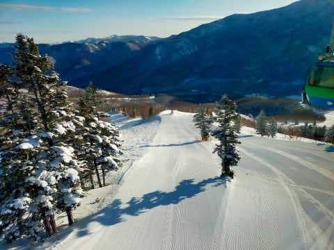

ええ？？

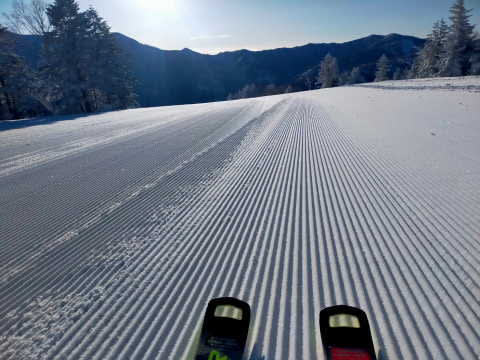

うげげげげ～！！！

先週同様，シーズンにそうそうないレベルの

最高晴天冷え冷えシマシマバーンじゃ

ないですか…！！

それも，西舘山でも滅多にないレベルの

きれいなシマシマだったみたいだし…

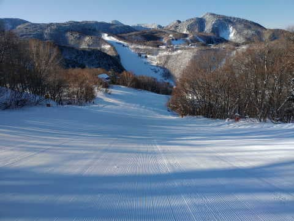

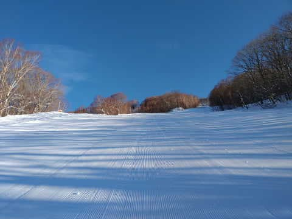

朝日が山陰に隠れてるので，曇って

見えますが．

奥志賀も空は雲一つない青空だし…

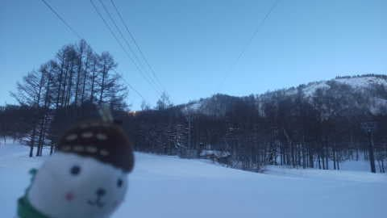

見事なシマシマ！！

あさイチの気温は-9℃で，

晴れてるのに気温が上がらない，最高

バーンだったみたいだし…

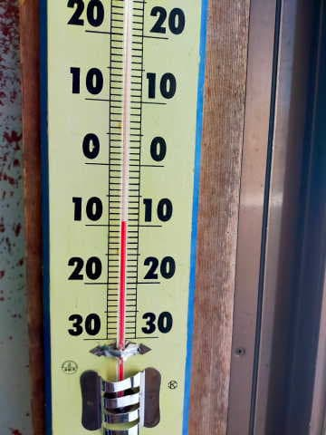

なぜ，私の行かない週に晴れるかな～…

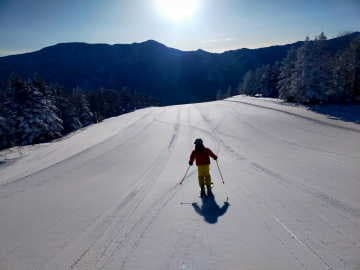

私の天気の神様への指導が足りなかった

かな？←お前は何様だ

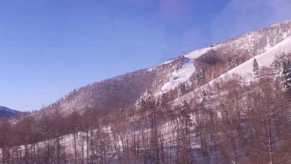

ただ．

私の怨念がわずかに届いたのか．

午後3時ごろには曇りだし，雪が

降り始めたようで…

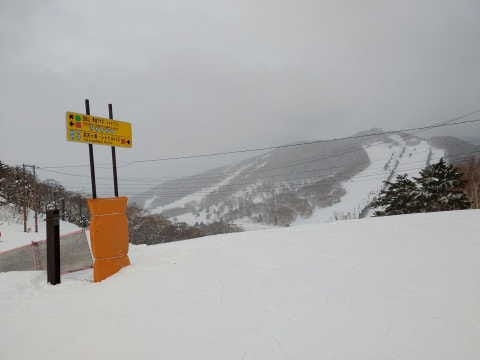

午後4時過ぎのリフト終了時には，

うっすら積もるレベル．

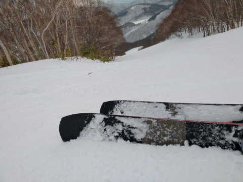

ふふふ．

私の怨念で，一日中晴れになる事態は

なかったようだな…

で．

ナイターの時も雪は降り続き．

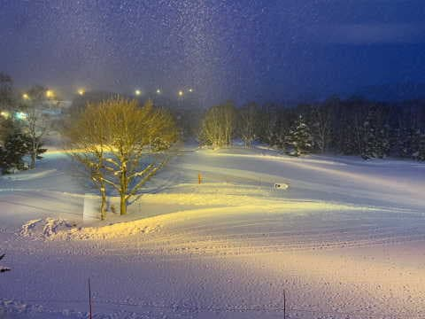

ナイターはシマシマの上にうっすら軽い

新雪だったようですが…

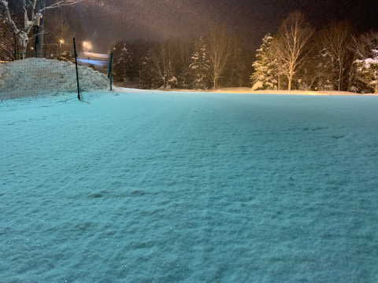

なんだか，むしろ軽い新雪が積もった方が

楽しそうに見えるのは気のせいかな？？

…どっちにしろ，昨日の記事に

　そして．土曜の夜から日曜にかけては

　数cmほど雪が積もるかも？

と書いていたので．

夜に雪が降るのは予想していたことだったん

ですが…

この雪は，日曜明け方までうっすら積もり続け．

朝には止みます．

そして，リフト営業の頃には晴れてるんじゃ

ないかな～…

って．

薄っすら新雪が積もって圧雪されて

晴れって…

それ，

最高の一日

じゃないですか…！！

うがーーー！！

滑りたい～！！

滑りたいっ！！

あまりものくやしさ＆滑りたさで，

明日，私の怨念が実体化したものが

焼額で滑ってるんじゃないかな…

とりあえず．

明日も滑る方は，最高の冷え冷えコンディションを

楽しんでください！！！

PS.

来週10日(金)の850hpa図を見ると…

え！！？？？

0℃線，志賀より北！？？

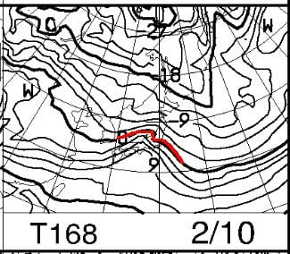

そして…

降水域がかかってるってことは…

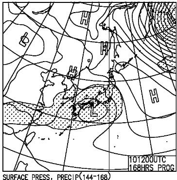

金曜，ヤバいです．

このままなら標高が高い志賀は

ギリギリ雪になってくれそうですが…

もう少しでも気温が上がると，

かなり湿った重い雪～みぞれ，

ヘタすると雨になりそう…

来週末は今週ほどコンディション良くないかも(涙)

## 💬 コメント一覧

### 💬 コメント by (ダウンヒル)
**タイトル**: Unknown
**投稿日**: 2023-02-05 09:47:37

S様お疲れ様です。

12日参戦前に、重い雪?みぞれ?

最悪は...雨って...(泣)

その後冷えたら...スピード狂が好むアイスバーンではありませんか!そんなことあってはならぬ!

冷え冷え踊り&冷えた雪降れ降れ踊りを踊りまくります!

(人≧へ≦)。･゜*・。、+お願い～(涙)

### 💬 コメント by (レインボー75)
**タイトル**: Unknown
**投稿日**: 2023-02-05 14:40:10

日曜日の志賀高原情報

今日も愛車「鮎号」入院中のため、他車便乗。10時までの短期勝負です。

超うまの生き物の後を滑っていると、後期高齢者には辛い混雑にコースを失うことばかり。ちっとも楽しくありませんでした。

そして、いるはずのない人を探しましたが、敵もさるもの、会えませんでした。

### 💬 コメント by (Skier_S)
**タイトル**: Blog書いてる暇あったら寝ようよ＞自分
**投稿日**: 2023-02-06 02:16:08

＞ダウンヒルさま

今の天気図だと，11日に重い雪が降り，12日は志賀でも昼間の気温はプラスになりそうです…

ただ，まだ天気はどうなるか分からない．

今のところ，雨は降らないでいてくれそうなので，そこまでひどい

バーン状況にはならないと思っています…

＞レインボー75さま

10時までの短期勝負だったんですね！

私の幻からはお会いしたと聞いていないので，幻とは会えなかったようですね…（笑）

### 💬 コメント by (富山県民)
**タイトル**: Unknown
**投稿日**: 2023-02-09 07:37:06

２月４日ですが私は野沢温泉スキー場に行きました。

野沢温泉も午前中は晴れてました。

雪質も良かったです。

ただ昼過ぎから雲が増えてきて午後３時半には小雪が降り出しました。

### 💬 コメント by (Skier_S)
**タイトル**: ＞富山県民さま
**投稿日**: 2023-02-10 01:40:50

4日はどこに行ってもコンディション良かったと思います…

絶好のスキー日和，楽しめて良かったですね！

ただ，野沢は混んだんじゃないでしょうか…？

