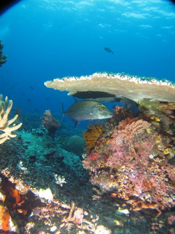
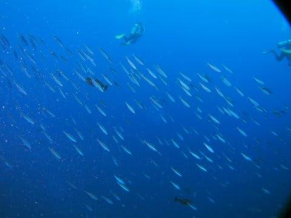

# コドモとコモド！子連れダイブクルーズ24　3度目のキャステル！

📅 投稿日時: 2011-07-28 00:42:09

日が明けて…

クルーズ5日目．

なんと．もう．

ダイビング最後の日になってしまいました…．

嗚呼．時のたつのは早いものよのぅ…

で．

船は昨日の夜から移動しておらず，今日も朝イチは北エリアの

ダイビング．

いつもどおり，1本目のダイビングは朝食前の朝7時からになります．

んで，朝イチはいつもどおり私が潜りに行きます．

ポイントは…

そう．3度目のキャステルです．

もう，ここは何度潜ってもいいですね～

エントリー後，いつものパターンで，根の流れの上流側の

ポイントに着底しますが…

あれ？

今日はいつもと違って，あんまり流れが無いなぁ．

しかし．

そこはさすがキャステル．

流れが無いけど，しっかり魚は群れてます．

これだけ流れが無くても，こんなに魚が集まるとはっ！

いつもどおり，流れの先端部分でしばらく過ごした後．

根の浅瀬を流していきます．

珊瑚の上にも，ムレハタタテダイやら，

ヨスジフエダイ，

なぜか珊瑚の下で休んでいるカスミアジなど…

で．

普通なら，珊瑚の上を流した後に，根のトップ付近，-5mの浅瀬へ

向かい，安全停止後に浮上というのが定番パターンなんですが．

ガイドのK澤さん，なんか根のトップを無視して，根の

反対側に向かって泳いで行っちゃいます．

あれ～．

珍しいライン取りだなぁ…

と思っていたら．

ついに根の反対側の先端まで来ちゃいました．

流れが変わったのか，根の反対側まで来てもかすかに

アゲインストの流れ．

こちら側にも，魚が集まってきています．

おお．ここでしばらく時間を過ごすのね…

で，浅瀬に移動かな．

と思っていたら．

なんと．

根を後にして．

だんだん沖に出て行きます．

おおお！群れ群れの魚の中に突っ込んでいく！

すばらしい！

根が後ろに見えなくなっても．

ゆっくり，ゆっくりと水深をあげながら，

沖に向かってフィンキックしていきます．

その回りを，クマザサハナムロが取り囲み．

ウメイロモドキの群れなんかがスススーッと

目の前を通り過ぎて行き．

完全ブルーウォーターの中，回りを魚が

行ったり来たり．

うおおお．

すごい．

いつもの浅瀬での安全停止も，珊瑚がきれいでいいけど．

流れが弱いときは，こんなコース取りがあるのか！！！

根を離れて10分くらい．

幸せな時間を過ごしたのですが…

安全停止中．

なんか…

私のエア残量，ちょいと心もとないなぁ．

ガイドからオクトもらうかなぁ…

まぁ，安全停止中だから，エア切れたらサイン出して

エグジットしても大丈夫かなぁ…

と．

ドキドキしていると，浮上サイン．

何とかエアが切れる前に水面到着．

＃一応，ガイドはちゃんとゲストのエア残量を

＃把握しているのでご安心を…

たっぷり60分越えダイビング．

完全エア吸いきりの1本．

いやーーーー．

ぴったりエア吸いきったな…

ぎりぎりセーーフ

（セーフじゃない気が…）

本船に戻ると，子供はおきたばっかりで，

妻ともども朝食をまだ食べてなかったみたいで．

朝食のために，家族3人で食堂に上がると．

「しまじ」は1日半過ごした天国のコモド島北エリアを後にして，

ラブハンバジョーへ向かう方角へ進みだしたのでした．
