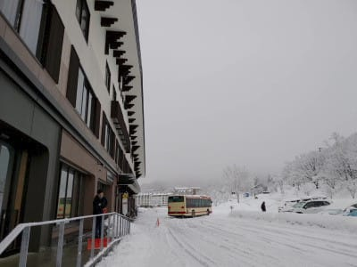

# 2021/2/15(月)の志賀高原スキー場は…予想通り雨．午前中はゴンドラも動かず．午後から雪になったみたい！

📅 投稿日時: 2021-02-16 08:52:05

えー．

昨日はバタバタして，Blog更新ができなかったので…

今朝急いで更新！

以前から予想したように，

空から液体が降ってくるデンジャラスデーだった

15日．

…やはり予想通り，朝から雨だったようです…（涙）

駐車場を叩く雨が寂しい…

雨だっただけじゃなく．

朝から風が強く，

焼額第1，第2ゴンドラも…

奥志賀ゴンドラも，朝のうちは運休．

焼額は朝イチは第4ロマンスのみ，

その後第2高速が動き．

午前10時くらいから1ゴンが動き出した

ようですが…

焼額方面への特派員は軒並みくじけて

リタイヤしたので，詳しい情報は分からず…

中央エリア方面は，ひたすらみぞれっぽい

雨が降り続け，びしょ濡れになる天気だった

ようです…

…この中で滑っていた某特派員，

なかなかの根性ですね…

ただ，この雨は，12時過ぎには湿雪に

変わっていき．

ザブザブで滑りが悪かったゲレンデを

雪が覆って，午後は滑りが良かったようです！

で，午後は結構な勢いで雪が積もって

行ったみたいで．

夕方には，そこそこの積雪に

なったようです！

うーむ．

雨のせいで，普段の2月の志賀高原では

絶対作ることができない，雪だるまが

作れてしまうような雪になったわけですが．

今日は，新雪が積もって，ゲレンデ状況

回復したのかな…？

とりあえず．

現在，志賀高原は－10℃の冷え冷えで

雪が降っているようなので．

ゲレンデ状況の回復を期待！

PS.今日も，おこみんちゃんは志賀を離れて…

猪苗代に出張だったようです！

## 💬 コメント一覧

### 💬 コメント by (レインボー73)
**タイトル**: Unknown
**投稿日**: 2021-02-16 14:47:49

火曜日の志賀高原情報２

昼食後の高天は、すごい強風なうえ雪が重く、素人には全く楽しめない。たまゴンは不思議とまだ稼働中。

そうだ、ダイヤモンドだ。

週末にポール練習した急斜面（ダイヤでは一番）が、フラットで快適勘違いバーン。その奥の非圧雪はかなり荒らされてるけど、まあ楽しめました。

そんなんで、軟弱特派員は午後の様子をお伝えすることなく、今日もレインボー（２時）まで時間を残して、退散してしまいました。明日のパウダーに期待を込めて！

なお奥志賀は、朝、三高ストップの情報を得たので、やめました。最近の奥志賀は少しの風でも運休が多発するので、要確認です。

### 💬 コメント by (Skier_S)
**タイトル**: ＞レインボー73さま
**投稿日**: 2021-02-17 07:13:36

昨日は雪が意外と重かったようですね…

で，早退だったんですね(笑)．

でも，根性の無いスキーヤーふるい落とし機能が働いていたようなので，

やむなしでしょうか．

今日，明日はまた冷え冷え雪降りです！

明日はパウダーだと思いますよ！

