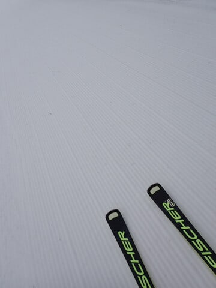

# 2024/4/21(日)の志賀高原焼額山スキー場，速報レポート！…終日曇り，午後一瞬雨がぱらつく．気温が高かったけど朝は硬めバーン，午後はユルユル雪（涙）

📅 投稿日時: 2024-04-22 01:04:39

ってなことで．

今日も一日志賀高原で滑ってきて．

先ほど帰ってきました…

今日は早朝から滑ってきたので，

朝5時起き．

…ただでさえ睡眠不足気味なのに，

今日も睡眠時間を削って朝から

滑ってしまい．

そして帰りも300㎞運転．

…明日も仕事があるので，

今日はさすがに早く寝ないと…

とはいえ，もう深夜1時近く(泣)

だもんで．

日曜帰宅日定例，速報モードにて

本日の志賀高原レポート！

えー．

まず．

本日は朝6時の早朝営業から参戦！！

今日は朝6時から，第1ゴンドラと

第2ゴンドラの2本のゴンドラが

動くという，ゴンドラ2本体制の

贅沢な早朝営業で，GSコースと

パノラマイン・パノラマ＆サウス

コースが早朝から滑れます！！

ゴンドラ2本，コースも複数あるので，

早朝にはそこそこの人がいたけど

コースもゴンドラもガラガラ！

早朝6時から，すでに気温は+3℃と

プラス気温でしたが，明け方にぼちぼち

冷えたのか，朝は硬めに締まった

シマシマバーンで，2～3本目くらいに

ちょうど表面が緩んでいい感じのバーンに

なっていきました…！

天気は朝から曇り空だったので，

日差しで雪が一気に緩むことはなく．

早朝の時間の間は，比較的いい感じの

バーンを貸し切りに近い状態で

滑れましたが…

ただ．

気温自体は高かったので．

午前9時くらいになるとかなり雪は

緩んできて，緩斜面での板の滑りが

悪くなり始めてきました（泣）

朝6時からの4時間券の有効時間が切れる

朝10時ごろには，怖いくらいに

ゴンドラ乗り場もコースも全く人がいない

状態になっていきましたが…

でも，バーンコンディションは悪化の一途で．

昼前にはストップ雪というほどではないけど，

コース全面汚れが浮き始めてきて，

滑りがあんまりよくない感じになっていき…

そのうえでバーンも荒れ荒れです（泣）

そして．

追い打ちをかけるように，12時半ごろに

一瞬液体がぱらつくタイミングも…（涙）

ただ，雨はそれほどひどくなく，

ゴンドラの窓にせいぜいこの程度

水滴がつくくらいの降りでした．

ポツポツ降ってた雨は30分も経たずに

止みましたが．

ゲレンデの荒れは一気に進んで，

GSコースのごく一部，ちょっと

雪が薄いところが出てきました（泣）

うーん．

GSコース，GW最後までもつか微妙…

この雨が効いたのか．

午後はホントに滑っている人が全く

いなくなり…

コースの上から下まで滑っても，

誰にも会わないことが多数．

そのせいで，バーン表面に浮いた汚れが

蹴散らされないので，だれも滑ってない

ゲレンデは表面に汚れが浮いてきて，

さらに滑らない状況に…（激涙）

ってなことで．

午後3時ごろになると，滑りが悪めのうえ，

水を吸ってどうしようもなく重く，板を

ずらすことを全く許されない，板が潜って

いくような雪を，泣きながら滑って

いたのでした…

いや．

今日は早朝は良かったけど，

午後は辛かった…

やっぱり早朝の雪がいい時間だけ

滑るのが基本ですね…！←あなたはリフトが動いていると帰れないでしょ

とりあえず．

明日また，余力があれば詳細レポート

書きます…←最近は余力がないことが多いよね…

## 💬 コメント一覧

### 💬 コメント by (油漏＠あちこち+筋肉痛)
**タイトル**: 週末
**投稿日**: 2024-04-22 19:30:55

お疲れ様です。私も土日で滑ってきました。

高天ヶ原に宿を取り、朝はNＨＫと一ノ瀬ファミリーを幸せに滑り、一ノ瀬９時２０分のバスで焼額に移動。更に奥志賀に移動し、コブ道場に乱入しては徹底的に叩きのめされ、２時のバスで一ノ瀬に戻り夕方まで滑るというパターンでした。こんなに頑張っても滑走標高差は9322メートルでした。

日曜日も同じパターンでしたが、リフトが動いていたにも関わらず３時半で上がってしまいました。一ノ瀬の繰り返しが効いたようで、9300メートル位滑ってました。

まだまだ滑れそうですが、どうぞ怪我や事故のないよう頑張ってください。

### 💬 コメント by (Skier_S)
**タイトル**: ＞油漏れ＠あちこちさま
**投稿日**: 2024-04-24 01:25:44

コメント回答遅れました～！！

土日，焼額にいらっしゃってたのですね…！

早朝滑ってないなら，なかなかつらいコンディションだったのではないでしょうか．

雪が重いし滑りが悪いので，体が疲れますよね…

私は土日とも12000mくらいで，私も一日滑っていたわりに標高差が稼げませんでした（泣）

