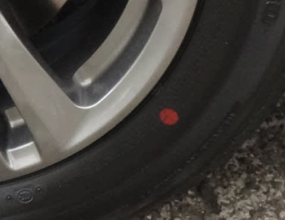
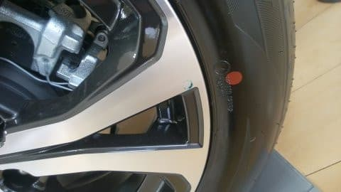

# 今の新車は，タイヤはユニフォーミティー合わせでタイヤが組まれてるのかな…？

📅 投稿日時: 2019-07-26 03:29:44

えー．

普通は，タイヤを買って，ホイールに組むとき．

タイヤのホイール重量バランスを

合わせるため，

タイヤのバランスが一番軽くなる位置（黄色マークがある位置）と，

ホイールのバランスが一番重くなるであろう位置（バルブがある位置）

を合わせて組みますが．

わがLEVORG君が納車されたあと．

タイヤのホイールへの組み込みを

見てみたとき．

タイヤの黄色マーク（軽点マーク）が

バルブに合わせて組まれているわけでも無く．

赤丸のユニフォーミティーマークがホイールの

何かの印にあわされて組まれているわけでも無く．

ホイールにユニフォーミティーマークもないので．

ユニフォーミティー合わせで組まれている

わけでも無いなぁ…

と，思ったわけで．

さらに過去の写真をさかのぼって．

BRレガシィ君の納車の時の写真を振り返っても．

黄色丸はホイールのバルブと位置は合って無いし．

赤丸部分にも，ホイールに何の印も見当たらないし．

そのほか，他社の車に試乗した時に

見てみても…

タイヤの黄色マークと赤マーク．

何かに合わせて組まれている気配が無いので．

…これは，タイヤとホイールの精度が高いから，

組み付けは軽点やユニフォーミティーを意識せず，

適当に組んでいるのかな？

（実際，最近のヨーロッパ製のタイヤなんかでは

　精度が高いからという理由で，軽点＆ユニフォーミティー

　マークが無いものが多い）

…と，思ったわけですが．

こないだ試乗したスバルXV e-Boxer．

この車のホイールをじっくり見て．

タイヤが，軽点のバルブ合わせではなく．

ホイールのユニフォーミティーマーク合わせで

組まれていることに気づきました…

ホイールに，うっすらとすぐ消えそうな

水色の丸マークが書かれていて．

ちょっとずれてますが，これとタイヤの

赤丸が合わせて組まれてます…！

同じディーラーに展示してあった，

フォレスターのタイヤも，よく見ると…

黄色マークの軽点が，バルブ位置から

ずれていて．

軽点マーク付近を拡大すると…

バルブとあってませんね．

で．

赤いユニフォーミティーマーク付近を見てみると

こちらも，ホイールに青い丸印が，

スタンプのようなものでマークされています！

…ふーむ．

てっきり，ホイールのユニフォーミティーマークって，

もっとしっかりした刻印みたいなマークだと

思っていたけど．

新車組み込みの純正ホイールは，こんなすぐに

消えそうなマーキングなんだ…．

LEVORGやレガシィの時も，実はホイールに

ユニフォーミティーマークがスタンプされてたけど，

こすったら消えるようなマーキングなので．

納車時の洗車か何かの時に，消えちゃったって

ことだったのかも…？

うーむ．

とりあえず．

今の車は，新車の時はユニフォーミティー合わせで

ホイールが組まれているのかな？

でも，ホイールのマーク．

なんでこんなすぐ消えちゃうようなものに

してあるんですかね～？

詳しい人，教えてください～！

## 💬 コメント一覧

### 💬 コメント by (たっちん)
**タイトル**: Unknown
**投稿日**: 2019-07-27 08:59:38

ホイールの印が消えやすいのは、新車のときにしか意味がないからです。

ホイールも走行により、変形する為、次に交換するときに同じ場所が凹んでるとは限らないからです。

メーカーは、走行中の異常振動の初期不良を嫌って、赤マークに合わせています。ユニフォミティーは調節できませんが、重さは重りで調整できますので。

### 💬 コメント by (Skier_S)
**タイトル**: ＞たっちんさま
**投稿日**: 2019-07-27 10:49:13

なるほど！

経年変化によるホイール変形があるから，

逆にすぐ消えるマークにしているわけですか…！

疑問が解消しました．

ありがとうございました～！！！

