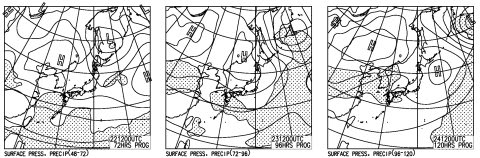
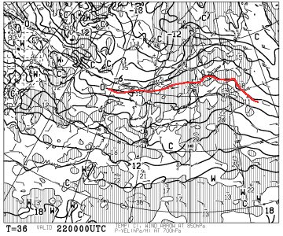
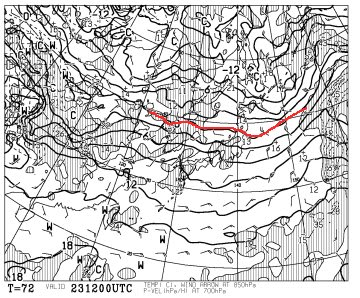

# 11月22日の3連休，スキー場オープンが次々確定！…で，3連休の天気は？？

📅 投稿日時: 2014-11-21 02:36:12

えー

今週末は，3連休がやってくるようですが．

かぐらも無事，[22日オープンが決定](http://www.princehotels.co.jp/file.jsp?id=79656&0.7930179606633698)したようですねっ！！！！

クワッドが初日から動くようで．

この時期唯一の，高速リフトを滑れるスキー場に

なるのかな？

丸沼も，[22日からイエローとバイオレットの2コース](http://www.marunuma.jp/news/2683/)

動くようですね～

湯の丸スキー場も22日オープン確定らしいんですが…

[あんまり雪があるように見えない](https://www.facebook.com/yunomaruski)のは，気のせい？

鹿沢も[予定通り22日オープン](https://www.facebook.com/kazawasnow/posts/377546042413354)確定したようです．

アサマ2000も，すでに報告したように，22日オープン確定なわけで．

…ただ，残念ながら，白馬方面のオープン予定はないみたいですが…

って感じで．

22日オープン予定のスキー場が，ここ数日の

寒気で，ほぼ予定通りオープン確定できたようで．

スキーヤーにとっては，ほっと一息の3連休に

なりそうです…

ということなので．

気になるのは，この3連休の天気なわけで．

天気図を見てみると…（ごそごそ）

ふーむ．

…とりあえず，3日とも晴れてくれそうですね～．

3連休，22，23，24日の予想地上天気図を見ると…

こんな感じで，3日間高気圧に覆われて．

雨が予想される網掛け部分は，3日とも

本州にはかかっていないので．

信州は，晴れの3日間になるかな！

ただ，この3連休．

ちょいと気温は高めになりそうで…

これが初日の22日の朝9時の850hpa気温図．

これが2日目の23日の850hpa気温図ですが…

うむ．

どちらも0度線ははるか北．

昼間はそこそこ気温が上がって，

日差しもあって，ちょいと雪の表面が緩むかな～

ただ，夜はそこそこ冷え込んでくれそうなので，

夜中～早朝は，人工降雪機が動かせるかな．

でも，昼間の人工降雪は厳しい感じ．

とりあえず．

この3連休．

そこそこ天気は良く．

ちょっと昼間の気温は上がっちゃうけど．

壊滅的な雨などに悩まされることなく，

夜は人工降雪機が動かせそうで．

まぁ，いい感じの3日間になりそうかな！
