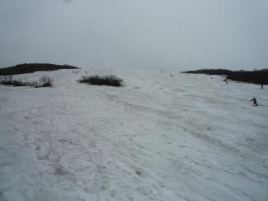

# 6月16，17日　月山スキー場のゲレンデ状況は？？

📅 投稿日時: 2012-06-19 01:04:22

んで．

この週末．

月山に行ってたわけですけど．

ゲレンデ状況などの追加情報＆写真をば…

とりあえず，積雪は．

例年より多いですね～

駐車場降りてからリフト乗り場までに，まだ結構雪の上を歩かねば．

姥沢ロッジ前がこんな感じです．

で．

この時期，まだリフト乗り場まで板を履いて滑り込めますし…

リフト降り場からすぐ板を履いていける…

のですが．

日曜の雨で，リフト降り場からの道は…

あっという間に溶けちゃいましたね（涙)．

リフトを降りてすぐゲレンデに出れるのは，この日で終わりって感じですかね…

来週は，リフトを降りてゲレンデに出るまで，板を担いで3分ほど歩くコースに

なりそうな予感…

でも．

トラバースコースにはまだ雪がたっぷりだし．

大斜面も沢コースも，まだ雪がたっぷり．

沢コースは来週まで，余裕で持ちそう．

＃台風がどうなるかにもよりますが…

木が出てくる沢コース下も，まだ大丈夫．

で．

去年はクレバスだらけで悲惨だった，肝心の大斜面は…

まだまだ幅いっぱい．

コブラインの本数も多く，うまくいけばあと2週間はいけるかな～（楽観的観測)

6月20日近くでこの状態って，今年は雪が多いですね～．

今回滑らなかったリフト上のTバー部分はこんな感じでした．

んで．

雨が降ってたからだろうけど．

混雑はそれほどでもなく．

リフト待ちは，最大でここに見えてるくらい．

3分も待ちません．

…晴天だった先週とはえらい違いのようで．

…でも．

豪雨の日曜は，こんな感じで見えない中の大斜面でしたが．

おかげで，ほかの人がほとんどいない中滑れました…

（よかったのか？？）

しかし．

昨日も書いたけど．

土曜は小雨時々曇り．

日曜は小雨時々本降り，と．

天候に恵まれず．

雨にぬれて，かな～り寒かった2日間でした．

まぁ．

とりあえず．

月山は，あと2週間はリフトで滑れるんじゃないかな～

## 💬 コメント一覧

### 💬 コメント by (ひろりん)
**タイトル**: Unknown
**投稿日**: 2012-06-19 11:40:13

もうやめなさいってｗｗｗｗ

と言いつつ、、

いいコブですねぇ・・・ヨダレが・・・

まぁ、ヘタレな私は雨が降ったら出ませんが（汗）

### 💬 コメント by (Skier_S)
**タイトル**: まだ滑れますよ…
**投稿日**: 2012-06-20 00:27:33

うふふふ．

これがいいコブだと思うんでしたら…

まだまだ滑れますよ（笑）．

今週末，いかが？？

