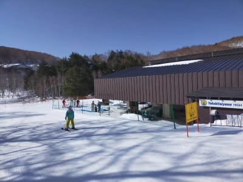

# 2021/3/18(木)の志賀高原スキー場特派員情報…そしてやはり3月21日(日)は暴風雨になるなぁ…

📅 投稿日時: 2021-03-19 01:27:23

ということで．

今日も志賀高原には数人の特派員が

滑りにいっていたようですが…

誰かの肩に乗っているおこみん越しに

見える空．

雲一つない晴天ですね！

そして．

あさイチの気温は-3℃で．

ふはははは！

これは予想ぴったり！

朝は晴天シマシマのバーンだった

ようですが…

かなり固めの，結構なスピードが出る

ハードバーンだったようです…

で．

土曜から故障していた焼額第2高速リフト．

本日から無事運転再開！

…いやー．

晴天でガラガラでいい感じのバーンで．

うらやましい…

けど．やはり昼間の気温は+6℃と，

予想よりちょいと上がったせいか．

焼額は昼ごろにはちょっと雪が緩んだ

ようですが…

でも，一の瀬方面は昼過ぎくらいまで

下地がしっかり硬めの滑りいいバーン

だったようです…！

さすがに，日当たりのよいバーンは

夕方にはちょいと重めの雪になったよう

ですが．

それでも滑っている人が少ないからか．

午後になってもバーンはコブになるほど

荒れなかったようですね…

ってな感じで．

　朝はガチガチ，一の瀬方面は昼くらいまで

　割としっかりした雪．

　日差しが強いところは午前から緩み，

　午後は春の重い雪に．

　でも，春スキーと割り切れば

　いい天気で楽しめそうな一日．

って予想がぴったり当たったな…

と自画自賛できる一日だったわけですが．

明日の金曜も，今日に似た感じで．

今日よりちょっと雲が多めかもしれないけど

晴れて，朝はガチガチだけど，

午後に向かって気温が上がって

雪が緩んでいく感じになって．

まぁ，春スキーと割り切れば

いい一日かな．

で．

明後日土曜は．

昨日予想した通り，朝は晴れそうだけど…

時期に雲が出てきて，昼には曇り空．

リフト営業終了までは天気がもちそう

だけど…

リフト終了した後から，パラパラ

液体が降るかも…

で．

日曜はやっぱりダメです．

諦めましょう．

朝から+10℃近い高温の強風が

吹き，ゴンドラどころかリフトも

止まりかねず．

…そして，降ります．

終日雨で，時折強く降ります．

暴風雨

ってやつです．

先週の土曜はまだ午後雪になったけど．

この日曜は夜まで液体が降ります…（涙）

高温・強風・雨の三重苦で，

雪はかなりやられちゃいます（激泣）

なんだか．

気のせいじゃなければ，

ここ3週間連続で週末に雨

になってる気がするんだけど…

いや．

理由は分かってるんです．

私が週末スキーに行けてないから，

「天気，どうなってもいいや…」と．

今シーズンはまともに例の踊りを

踊ってないからなんです．

…そうなんです．

多分，私のせいなんです…←違うから，いつも言ってるけど，違うから

## 💬 コメント一覧

### 💬 コメント by (新米パパ)
**タイトル**: Unknown
**投稿日**: 2021-03-19 08:14:50

頻回のブログ更新、本当にありがとうございます。

降れ降れ踊りですが、バランスドームの上で股関節を意識してやる？とか、、オフトレにいかせるメニューがあれば是非購入したいとおもいます。

### 💬 コメント by (レインボー73)
**タイトル**: Unknown
**投稿日**: 2021-03-19 18:53:37

金曜日の志賀高原情報

朝の蓮池０℃　2ゴン上ー1℃。暖かい。日差しが弱いので雪が持ちそう。

朝一はパノラマからシラカバ。硬いけど快適。

カラマツもカッチンカチン。

ＧＳもオリンピックも硬めだけど幸せバーン。

そのあと、小３の天才女の子なおちゃんを捕獲して、１ゴン→パノラマ→１ゴンのロングコース。めっちゃとばせて気持ちいい！　なおちゃんも超速い。

 奥志賀へはシーズン初の連絡路コギコギへ。なおちゃんはいいな。可愛いから師匠に引っぱってもらってらっくらく。哀愁ただよう私は可愛くないから自力でした。

ダウンヒルも快適、なおちゃん速い。

エキスパートは食い込み悶絶バーン。久々の奥志賀ですが、いがったいがった！

ダイヤモンドはまたも圧雪なし。

パーフェクタは今日もポール無しで開放。ありがたく頂きました。

寺子屋はやっぱりパラダイス。師匠がなおちゃんに教えると、やっぱり若い子は飲み込むが早い。私は呑み込みには自信があるのですが。

昼食は、お姫様のチョイスで、高天原ホテルでピザ。

### 💬 コメント by (レインボー73)
**タイトル**: Unknown
**投稿日**: 2021-03-19 20:45:22

金曜日の志賀高原情報２

昼食後、西たてを下ったけど、ズクズク。

でも目指す寺子屋は今日も君臨します。エス様には悪いけど、副業してる場合じゃないです。気持ち良すぎ勘違いパーン。ここではまた別の母子が師匠のレッスン。みんな幸せそう。幸せを求めてスキーに来るんだから、みんなの笑顔が嬉しいですよね。

帰りのファミリーは、まだ快適。今日は雪質維持の日でした。サウスはやっぱりズックズク。

ヤケビはこの時期は朝のうちだけですね。

### 💬 コメント by (Skier_S)
**タイトル**: 今週末はダメだ…（涙）
**投稿日**: 2021-03-20 01:23:29

＞新米パパさま

踊りがスキートレーニングも兼ねれば，一石二鳥ですね…！

＞レインボー73さま

エキスパート，良かったんですね…！

今日はもう緩んでダメかと思いましたが．

寺小屋，まだ雪がいいコンディションキープしているんですね…

あぁ…滑りに行きたい…

