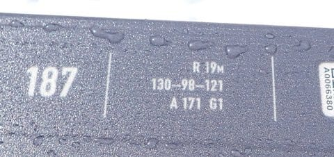

# 2024シーズンモデルのスキー板，試乗レポートその14…FISCHER RANGER 96

📅 投稿日時: 2023-06-12 03:21:07

🏷️ カテゴリ: [スキー板試乗](c0bd8048615710cee890e403a36cc9a2b.md)

本日，体重計に乗ったところ…

うぎゃーーーー！！！

なんだこれはっ！！

ついに，自分が成人してからの最低体重記録を

更新してしまいました…(涙)

スキーシーズン中はスタミナを落とさない

ように，無理してでも食べて，何とか

ベスト体重-3㎏以下まで落とさないよう

体重をキープしていたのに…

ちょっと気を抜くとこれだ（泣）

振り返ってみると．

先週の木曜・金曜と会議が続きすぎて夕食を

食べる暇がなく．

木曜も夕食を抜いたのに，さらに金曜まる一日で

口にしたのは，朝にパンちょっとと昼の

カロリーメイトだけ．

それで金曜深夜に仕事が終わったら夜ご飯も

食べずに死ぬように寝て，土曜に起きたのが

午後3時過ぎだったので…

24時間以上，何も食べてませんね…

今日も朝と夜はパソコンの前で仕事しつつ

軽く掻き込んだだけだったので．

気づいたら，ベスト体重ー5㎏まで落ちて

ました…（涙）

やばい…

とりあえず．

体重を減らしたいという皆さん！

スキーダイエットと

ご無体お仕事ダイエット

の二つのダイエットをミックスしたら，

激烈に痩せられますよ！！！

毎週末スキーに行って朝一から最終リフトまで

滑って，平日は毎日深夜まで仕事してみましょう…！

痩せること間違いなし！！←スキーは健康的なはずなのに，

なぜかすごい不健康なダイエット方法に見えるのはなぜだろう…

ってなことで，本題へ．

今日も2024シーズンモデルのスキー板の

試乗レポート．

本日は，フィッシャー編です．

では，どうぞ～！！

〇FISCHER RANGER 96 187㎝

センター96㎜ファット

一見，今シーズンモデルと変わってないように

見えるこの板ですが．

来シーズンモデルは，ロゴの色が微妙に

変わったのかな…？

最近ではセンター100㎜を超えないと

ファット板と呼ばれないようになりつつ

ありますが…

RANGERシリーズは，細いほうから

84，90，96，102，108，116とあるようで．

細いほうから3番目のモデルになりますね…

細めのモデルはそこそこ長めのチタン

プレートが入っていて，フレックスも強めに

なっているようですが…

どちらかというと，このRANGE96でも，

オフピステや新雪メインで考えられていて，

ゲレンデ「も」行ける…という位置づけの板の

ようです

一応スペック上は，R19ｍということですが…

比較的締まった圧雪バーンで滑ると，

板に圧をかけてもグリップするというより

板のトップとテールが逃げていく感じで，

板のたわみは出しにくく，板が回って

来るというより，サイドカーブなりに

落ちていく感じ．

締まった圧雪斜面で，しっかりグリップして

傾いていくという板ではないですね…

そこまでは固くない圧雪斜面でも，板は

グリップせずにずれていく感じです．

チタンプレートが入っているので，

硬めの斜面でもそこそこのグリップがあるかと

思ったけど…

やっぱり，圧雪バーンをがっつりグリップ

させて滑るという使い方は，この板の使い方

として間違っているという感じです（笑）．

この板は硬い斜面でその本領を

発揮する板ではなく，板がある程度埋まるような

柔らかい雪でこそ，そのポテンシャルを100％

発揮する板ですね．

ということで．

今回，柔らかい雪がなかったので…

この板の本来のポテンシャルが発揮できる

状況ではなく．

本来の使い方である，新雪などの柔らかめの

斜面での性能が確認できなかったので，

この板に対しては，ちょっと正当な評価が

できませんでした…

残念．

## 💬 コメント一覧

### 💬 コメント by (新米パパ)
**タイトル**: Unknown
**投稿日**: 2023-06-12 16:45:53

ご無沙汰しております。

今季はブーツも板も大幅値上げとお聞きしましたが。

ご教授いただきたいのですが、昨年のクリスマスはプリンス東館予約でナイター、あわよくばファストラックを期待したのですが、雪不足で未開催。

あとで聞くと西館前でナイター営業したとか、、

今年も東館予約すべきか西館か。

ちなみにファストラックは来年いつ始まり、また、ナイターはどの斜面でやるのか、知ってる範囲でお願いできれば、末代までの光栄、喜ひの涙で焼額山の雪を溶かします。

### 💬 コメント by (新米パパ)
**タイトル**: Unknown
**投稿日**: 2023-06-12 16:52:33

来年の、ではなく例年の、間違いです。

スンマセン、先輩。

### 💬 コメント by (Skier_S)
**タイトル**: ＞新米パパさま
**投稿日**: 2023-06-13 01:52:56

ファーストトラックは，大体新年1月1日の新年ファーストトラックから開始だったと思います…

例年，12月はファーストトラックはやってないです．

ナイターは，例年12月最終の週末から営業なんですが，今シーズンは雪が少なく，

第3高速が最終の週末までに営業開始できなかったので，臨時で南館前の第4ロマンスでのナイター営業になりました．

雪が多い年は予定通り第3高速で営業しますが，これまで2－3回，12月の最終週末のナイターが

雪不足で第4ロマンスになったことがありますね…

12月最終の週末のナイターがどのゲレンデになるかは，雪の量によるので，

なんとも言いにくいです…

### 💬 コメント by (新米パパさん)
**タイトル**: Unknown
**投稿日**: 2023-06-13 10:54:32

貴重な情報ありがとうございます。

今年は大雪期待して東館！でなく西館狙いでいきます、

中華　獅子が近いのもあり。

### 💬 コメント by (Skier_S)
**タイトル**: ＞新米パパさま
**投稿日**: 2023-06-14 04:49:12

西館狙いですか…

もし，ナイターが第3高速なら東館，第4ロマンスなら南館が近いんですが…

南館は12月最終週はやってないですかね．

西館だと，ナイターは車かシャトルバスですね…

しかし，もう早くも来シーズンの予約ですか？

