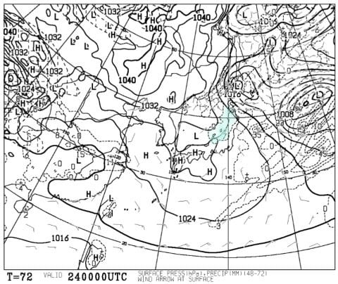
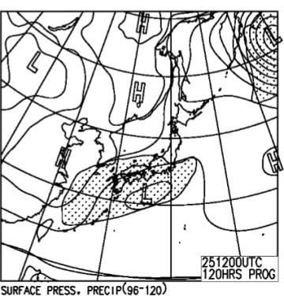

# 2月24，25日の週末の志賀高原スキー場の天気は…

📅 投稿日時: 2018-02-22 00:00:15

志賀高原は，昨日の昼はちょっと降ったようですが…

それほどの積雪は無かったようで．

うーむ．

やっぱり冷えてるけど，降らない日が続くなぁ…

ってな感じで．

更新時間がとんでもないですが…（泣）

ちょっと最近ご無体時間の仕事が続いている，

Skier_Sです（涙）．

とりあえず，水曜夜（木曜朝だけど…）

定番の，天気予想．

あんまり記事を書いている時間がないけど．

とりあえず義務なので書くのだ！偉い！！←自分をとりあえず褒めておく

…まず，24日の土曜ですが．

850hpa気温を見ると…

水色の-9℃線が志賀に近づいているので．

この日の朝も-10℃クラス．

結構な冷えですね．

そして，土曜の地上天気図は…

うーむ．

水色の降水域が志賀に掛かっているので．

この日は雪が降りそうです…

けど．

ドサドサ積もるほどの本格雪にはならず，

ぱらつく程度の雪が昼過ぎくらいまで

降り続く感じかな…

続いて，25日日曜ですが．

850hpa気温は…

赤い0℃線がちょっと北上してきますね…

でも，志賀高原は-3℃線のちょっと北なので．

この日の昼間はぎりぎりマイナス気温をキープ，

って感じでしょうか…

地上天気図を見ると．

うーむ．

南岸低気圧が近づいている…

南岸低気圧は，ちょっとでも位置がずれると

天気が大きく変わるので．

予想は難しいけど…

降水域の網掛けが志賀に掛かってないので，

この日は降らなさそうかな．

午前は晴れて，午後から雲がふえてくるか…

だもんで．

まとめると．

土曜：朝は-10℃クラスの冷え．

　朝から雪がちらつき，良く冷えた圧雪の上に

　ごくわずか新雪が乗っているか…

　昼間の気温は-5℃～-3℃程度と，冷え込みはそれほど

　ひどくなさそう．

　昼過ぎまで雪がちらつくけど，午後は止んできそう．

　ただ，曇り空で太陽は拝めないかな．

　午後になると，急斜面は一部固めの下地が

　出てくるかも…

日曜：朝は雲が多め．運が良ければ午前中は

　日が射しそう．

　ただ，日が射すとしても午前中のみで，

　基本的に曇り空の一日．

　朝の気温は-5℃程度．

　前日夜の積雪は無いので，朝イチは冷えたいい感じの

　いい圧雪が滑れそう…

　昼間の気温はこの時期としては高めだけど，

　マイナスをキープ．

　この日も，午後は急斜面にちょっと

　固めの下地が出てくるか…

ってな感じで．

すっきり晴れの週末にはならなさそうです…

いや，晴れないならドカドカ降ってくれた方が

嬉しいんですけど．

中途半端な曇り空なのが惜しい…

## 💬 コメント一覧

### 💬 コメント by (まいる)
**タイトル**: 今週末は
**投稿日**: 2018-02-22 19:45:07

Sさん、お疲れ様です。

今週末の志賀高原は、まずまずのようですね。

予定通り志賀高原に行くことになりましたので、運が良ければ焼額にてですかねー

### 💬 コメント by (olaf2125)
**タイトル**: Unknown
**投稿日**: 2018-02-22 22:19:35

なんだか土日は白樺・ぶなコースが貸切になるようですね。

また混むんですかね。 （ ｉ _ ｉ ）

### 💬 コメント by (はっち)
**タイトル**: 土曜日は快晴！
**投稿日**: 2018-02-22 23:23:12

との予測をしています。

予測通りとなるように晴れ晴れ踊りを踊ってください（笑）

しばらく志賀はお休みですが。。。

### 💬 コメント by (Skier_S)
**タイトル**: 土曜は絶好のスキー日和かな…
**投稿日**: 2018-02-23 01:08:55

＞まいるさま

今週末は，土曜が天気がよさそうな予想に

変わってきたので，いい週末になりそう…！

（もう少し降ってくれた方が嬉しいけど）

今週末，焼額でお会いしましょう…！

＞olaf2125さま

ホントですね…

焼額のFacebookに書いてありましたね…

うーむ．

白樺が滑れないのは痛い…

でも，1ゴン側は普通に滑れるみたいだし．

人が混まなければいいんですけどね~！

＞はっちさま

ご指摘の通り，土曜は晴れそうですね…！

朝はちょいと雲が多そうですが，午前早くから

日が射しそうな感じです．

…でも，しばらく志賀はお預けですか…．

今度はいつ復活でしょうか…？

またその時にお会いしましょう…！

