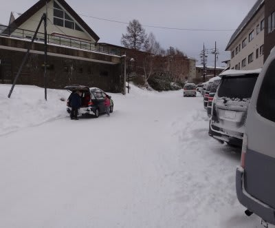
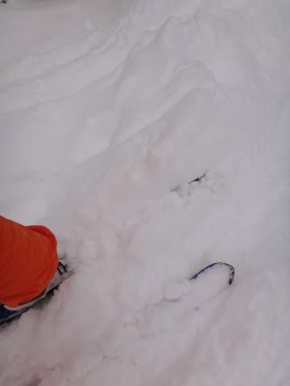
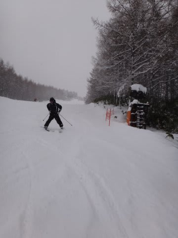
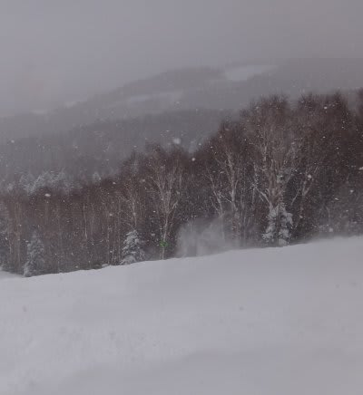
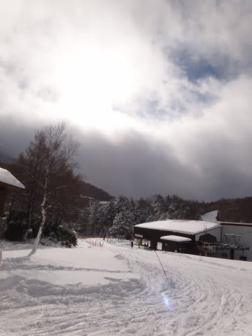
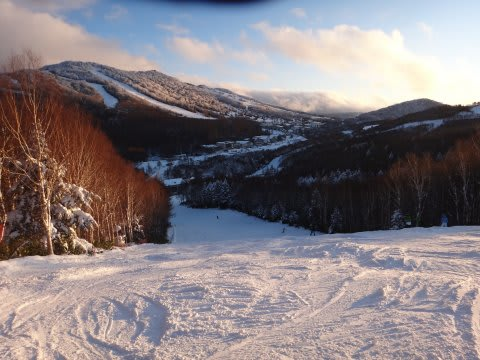
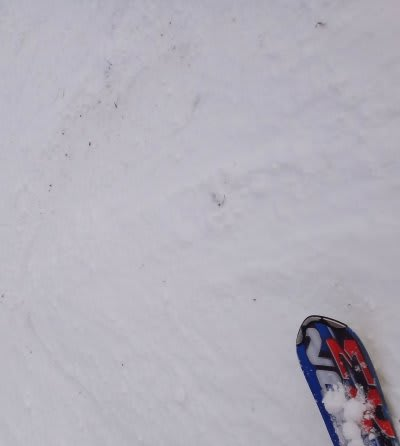

# 焼額の写真追加

📅 投稿日時: 2011-12-20 02:05:49

🏷️ カテゴリ: [2012スキー滑走日記](cca3a0e9524e0203150f790b1fc3c71ad.md)

この週末の焼額の写真を追加しておきます…

言うまでも無いですが，志賀高原の道路はしっかり雪が着いてます．

スタッドレスタイヤを履いていきましょう…

土曜の朝イチは，20cm程度の新雪が積もってましたね～

朝の気温はマイナス10度だったので，雪質はかなり軽い！

土曜の午前中は結構いい感じで雪が降ってたんだけど…

土曜の昼ごろからは，雪が止んじゃいました

夕方にはゲレンデは結構でこぼこしてましたねー．

…この写真じゃ分かりにくいか．

焼額ゴンドラの急斜面，ごくわずかにこの程度浮石があります．

でも，コース全体で浮石エリアはごくわずか．

ほとんど気にならない程度です．

第2高速沿いはたっぷり人工雪が着いているので，浮石など

全くなし．

ガラガラってほどじゃなかったけど，これまでに比べれば，

比較的効率よくゴンドラでがんがんロングコースを滑れたので，

かなり良かった感じですが…

やっぱりもうひと雪ほしいかな．

第1ゴンドラも動いて欲しいし…

とりあえず，今週末はドカ雪でゲレンデ状況は改善するはずっ！

＃でも，すごく混むのかな…
