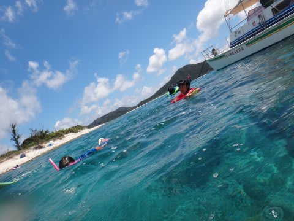
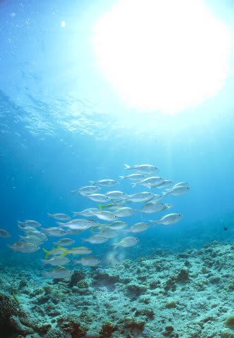
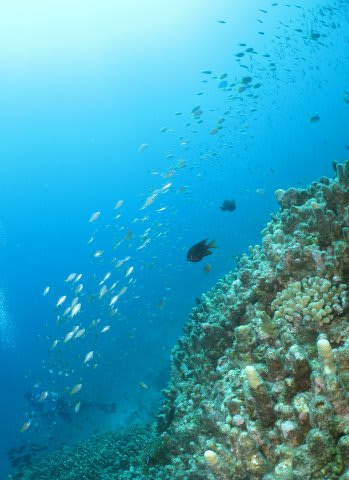
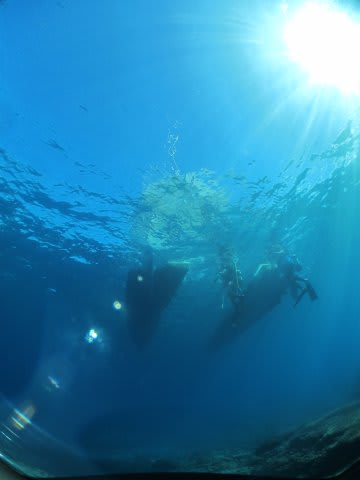

# 2013年7月　子連れ座間味ダイビング旅行記その14…2日目午後のダイビング

📅 投稿日時: 2013-08-11 01:58:25

という感じで．

えー．

お盆休みですが．

座間味の旅行記が続きます…

---

昼食後，同船の体験ダイバーさんたちが潜っている間．

ひたすらひたすらシュノーケリングしていた我が娘ですが．

体験ダイビング組が上がってきたら，今度は

我が夫婦のダイビングタイムです．

娘は，「まだ泳ぐ～！！！」

といっていたので，また雄大さんに娘をお任せして．

われわれ夫婦は，本日3本目へ！

うーむ．

娘の面倒をしっかり見てもらえてありがたや．

夫婦揃って3本潜れるとは…

ポイント名は「ブツブツサンゴ」

ノコギリダイとアカヒメジのお出迎えのあと…

ハマクマノミ．

台風でサンゴがやられちゃったところも多いけど，このポイントは珊瑚が元気！

ちょっと魚が小物ばっかりだけど，沖縄っぽい感じ．

元気なサンゴと，魚がいっぱい！

エビがいるんですが…分かるかな？

幻想的～

体長1mほどの，小ぶりなホワイトチップシャークが，石の下でお休みしてましたね～．

目の前まで近づけました．

＃ノンダイバーはサメ見たらびっくりするのかな？

船の下に戻ってきます．

満喫した後は，エグジット．

ダイブタイム1時間．

今日は全く流れもなく．

午後から透明度も回復してきたので．

いい感じになってきましたね～！
