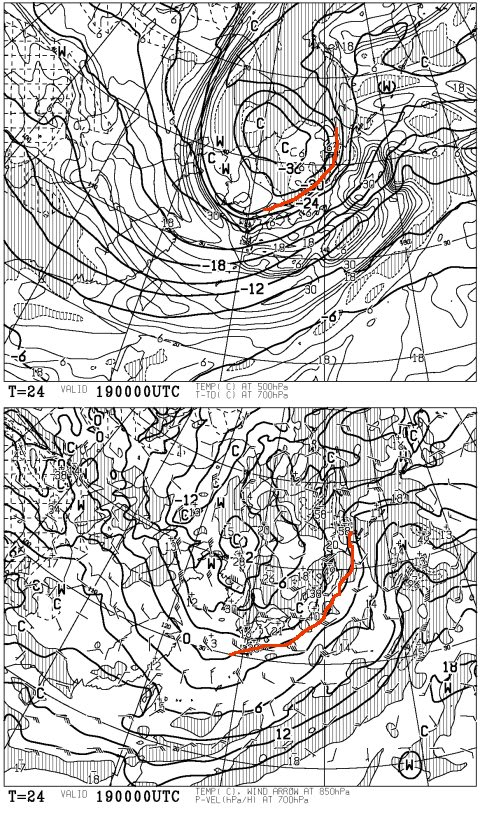
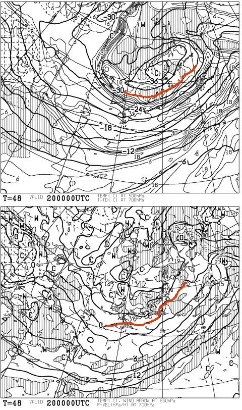
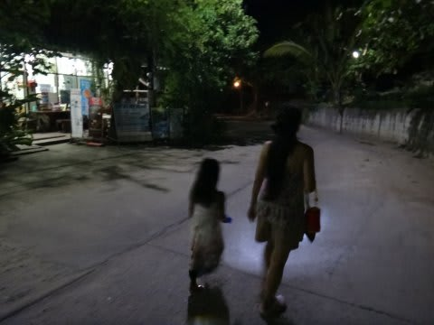
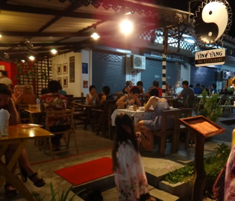
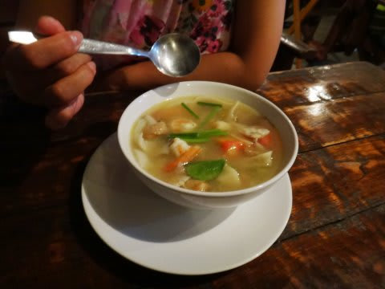
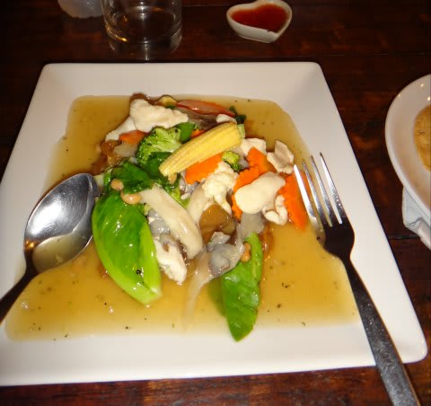

# 2013年9月　子連れタイ・タオ島ダイビング旅行記　その26…4日目の夜

📅 投稿日時: 2013-11-19 00:29:12

うむ？

なんだ？これは！？

…19日，朝9時の高層天気図ですが．

上のほう，500hpa面に，赤く記したように．

また，マイナス30度という真冬並み寒気が入っているではないか！！！

で，下のほうの850hpa面．

これも，赤く記した0度線が日本の南まで下がっているので．

…これは，かなり冷えますね～．

降れば絶対，間違いなく雪．

標高の低いスキー場でも，また雪が降りそうですね～．

で，こっちは20日の朝の高層天気図．

20日でもまだ-30度の寒気が居座るので．

この日も冷えますよ～．

この寒気．

23日の土曜日まで，続くのだ．

…でも．

ちょいと残念なことに．

風向きが悪いのだ…(泣）．

志賀高原をはじめとする長野の内陸部では，そんなに雪が

積もらなさそうなのだ．

…雪が降らない風向きなのだ（涙)．

さらに，雪が降ったとしても，風が強いし，冷えて軽い雪なので．

積もるより，むしろ飛ばされちゃうかも…

…まぁ，日本海側の海沿いのスキー場は．

19，20，21日と3日間，どっさり積もりそうなんですけどね～．

とりあえず，気温は冷えるので．

人工降雪機はがんがん動かせそうですよ～！

23日オープン予定のスキー場は，予定通りオープンできるでしょう．

とゆーわけで．

本題へ←しつこいようだけど「スキーヤー日記」としては，ここまでが本題では？

--

ダイビングから戻ってきて．

しばらく海岸で夕日を眺めていた娘ですが．

娘「やっぱりプールに行きたい～！」

ってことで．

夕日が沈むのを眺めながら

セレブなプール遊びをしていると．

また，とっぷりと日が暮れます…

日が暮れた中，今晩も夕食を食べに，街中へ繰り出します．

…おととい来たタイ料理店，Yin Yangが結構おいしかったし，

また食べて見たいメニューもあったので，再訪．

定番のトムヤムクンと…

パッタイを頼んでみましたが．

この店，んまいよ！

…しかし．

知らなかったのだが．

タイでは，この日何かの祝日だったらしく．

店員「アルコールは売れないんだよ～」

といわれて，今日はビール抜き…(涙)

帰り道の途中のお店で，ビールをGetしていこうか…と，

コンビニなんかによっていきましたが．アルコールが入っている

冷蔵庫すべてに，カバーがかかってました…

…タイには，そんな日があるのか…

外国人向けに，ホテルのレストランや売店ではお酒が売ってたんですけどね～．

ってことで．

…今日もジンベエが見れず残念な一日だったけど．

…明日，明日こそ！

最終日の明日こそ．

ジンベエが見れるはず！

ジンベエ様，出てくれるはず！

と．

おいしいタイ料理を食べつつ，残り一日のチャンスでの

リベンジを誓ったSkier_S夫婦なのだった．
