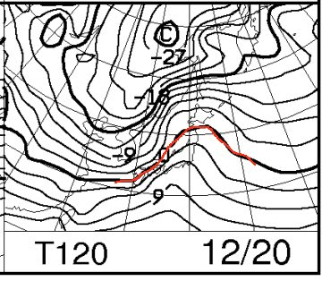
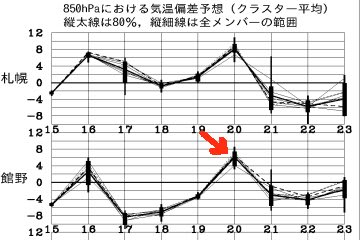
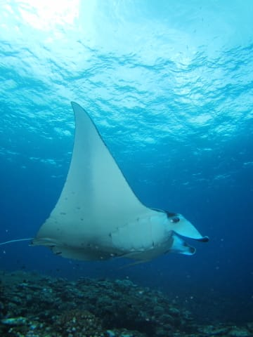
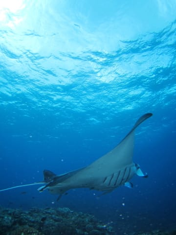
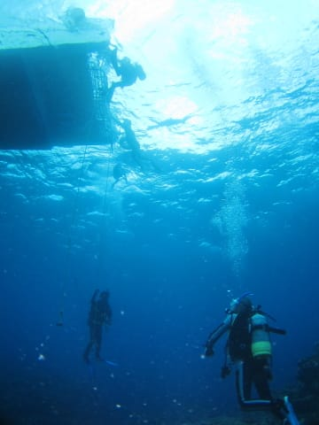
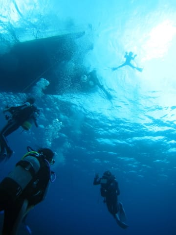
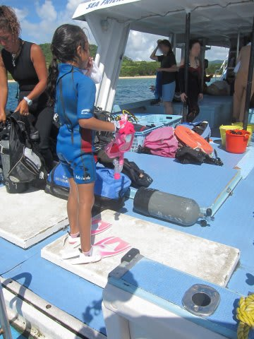
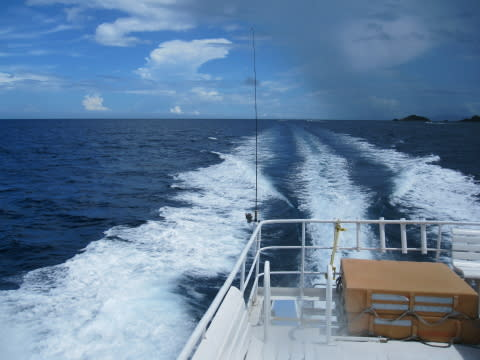
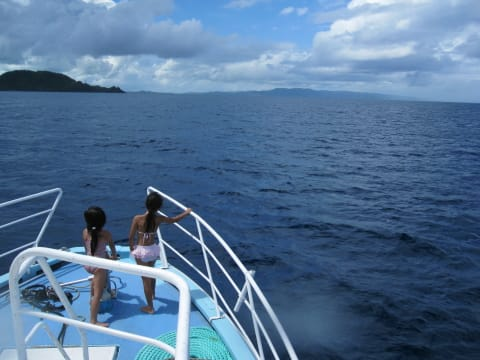
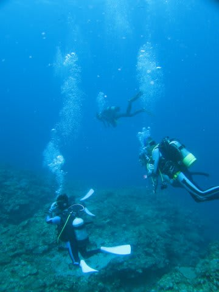

# 2014年9月　3連休，子連れ石垣ダイビング　その13

📅 投稿日時: 2014-12-17 01:03:40

🏷️ カテゴリ: [ダイビング日記](ce3a7a8d424d112fce83ee85c81a0e344.md)

なんだか．

爆弾低気圧のニュースが，世の中を騒がせてますが．

…確かに17日，すんごい暴風の天気になりそうですね～

志賀高原は，17，18日とも，ゴンドラ・リフトは

動かせなさそうな暴風です…

で．この2日間は，そこそこの積雪にはなるものの．

ドサドサ積もる感じではなく．

むしろ，風で飛ばされて，斜面によっては，

そんなに積雪量の積み増しは無いかも…

…さらに．

なんだか．

20日の土曜日なんですが．

…な…なんだ，これは！！？？？

850hpaの0度線が，かなり北まで上がっちゃってるんですがっ…！

そして，18日の平年比ー8℃から，20日は平年比+6℃と，

2日間で14度ほど気温が上がってしまってるんですがっ…！！（涙）．

なんだか．土曜日．

危険です．

気温がぐぐぐっと上がりそう…（涙）

ヘタすると，土曜日に雨かみぞれっぽい感じになって，

日曜は氷のコロコロバーンになるかも…

18，19日の冷え冷えパウダーが，いい状態のまま

週末までもってくれるように．

みんな，祈るのだっ！！！

…ってことで．

このBlogの本題の，スキー情報をお送りしたあとは．

あまり読む人がいないだろう，ダイビング日記へ行くのだ…

----

ということで．

浮上しようとして，ボート下に戻ってきたら．

なんと．

マンタ様がそこでぐるぐるしていたわけで…

我々夫婦も，娘も．

家族全員でマンタを堪能できた，この1本．

マンタ様も去って行ったので．

浮上です…

水面では，娘がお出迎え．

とりあえず．

娘も私も大満足の1本だったようです…

ってことで．

船は，ただちに2本目のポイントへ移動します．

船の移動時間は，20分ほど．

2本目のポイントは，

「御神崎オープンハート」

地形ポイントのようです…

娘は，またお友達と一緒にいるのがいいみたいなので．

今度も．

心置きなく，夫婦で潜りに行きましょうか～！

