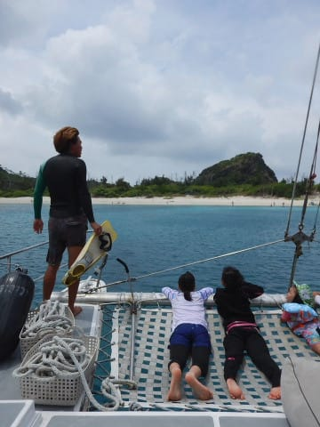

# 2017年8月，小学生の子連れで座間味でダイビングその10…ダイビング2日目も，娘の体験ダイビングチャレンジ！

📅 投稿日時: 2018-07-12 01:40:52

ってな感じで．

昨日はこのBlog本来のスキーネタを挟んだわけですが．

…どうやら，月山のTバーも終了したようで．

もうスキーシーズンも完全に完了した感じですね～．

というわけで．

本日は夏モード本来のダイビング旅行記へ，Go!

---

1本目のダイビングが終了し．

ダイバーみんながボートに上がったら…

泳いでいた子供たちを回収して，

お昼休みポイントへ移動！

…今日も大勢，子供が乗ってますね…

で．

今日のお昼休みポイントは，安室島の前ですか…

島のそばの浅瀬にボートを止めたら．

もう，お昼なのですが…

あれ？？

お昼ご飯の前に．

また，娘が何か準備していますけど…

…そうです．

お昼休みを取る，この浅瀬．

「体験ダイビングにちょうどいいところなので，

ここでまた潜れますよ」

ということなので．

娘に2回目の体験ダイビングをさせてみました～！

今度は2回目なので．

いきなり足がつかない，ボートの後ろから

エントリーしています…

まぁ，基本的な呼吸法やらマスククリアやらは

昨日のうちに練習しちゃってるので．

今日はいきなり潜り始めるようですね…

ロープ潜行で，深度5m程度の海底へ向かって

ゆっくり潜って行って…

着底．

まだ2回目なのに．

慣れたもんですね～．

あとは，インストラクターに連れられて，

海中散歩スタート！

ここも一応ダイビングポイントなので．

他のボートのダイバーの横を通過しつつ…

ゆっくりと泳いでいきますが．

…やっぱり，まだ一人で中性浮力が

取れるわけがないので．

インストラクターにレギュのファーストステージを

むんずと捕まれての移動です…

うーむ．

魚がごっちゃり…というポイントじゃないのが

ちょっと惜しいけど．

ゆるゆるとサンゴの上を移動して…

時折着底して，いろんな魚を

見せてもらったようです．

もう，全く怖がったりする様子もなく．

潜るのが当たり前…って感じの

顔をしてますね…

で．

時間にして30分ほど．

ぐるっとあたりをひとめぐりしたら…

ボートに戻ってきました…

…ダイビングを終えた娘曰く．

むちゃくちゃ楽しかったみたいです．

楽しくて仕方がなかったみたいです．

早くCカードとって，ダイバーになりたい

みたいです…

うーむ．

海の好きな娘だと思ってたけど．

わが娘．

予想以上にダイビングにハマりそうな予感…
