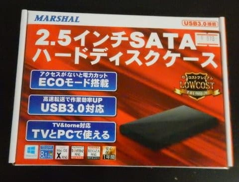
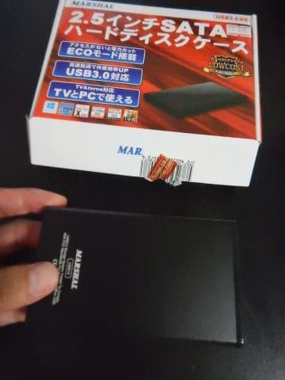
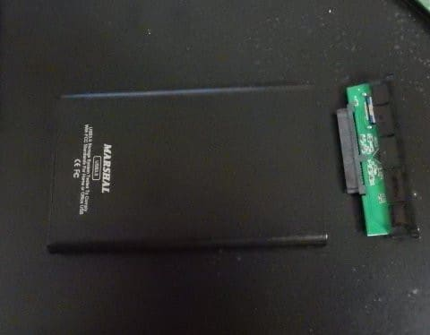
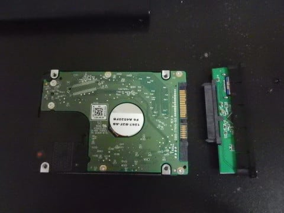
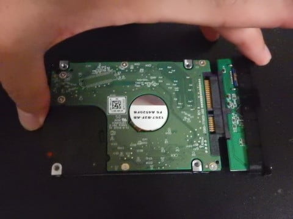
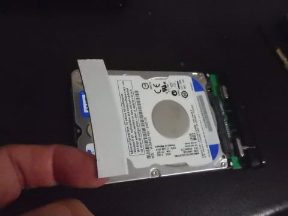
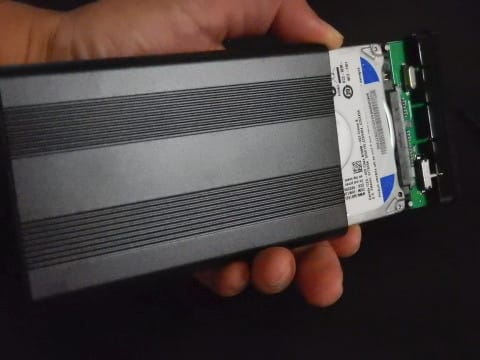
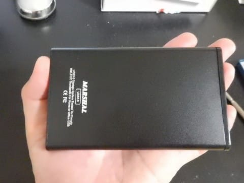

# ACERの2-in-1タブレット，Aspire switch　10を分解，SSD化してみる…その3

📅 投稿日時: 2018-10-23 00:14:11

ってなわけで．

この週末に，

無事？（というか，落雷＆停電という波乱万丈の）シーズンインを

果たしたわけですが．

本日は，スキーネタじゃなく．

ノートPCのSSD化の記事の続き．

[その1](e1dddcdb06b2065a23b9d053df0f1a158.md)，[その2](e2aa82f12f358b3de46a55194b2ef0b12.md)に続く，3回目です…

…とりあえず．

前回で，ACER Aspire Switch 10のSSD化が完了した

はずなのに．

なぜ，この記事がまだ続くかというと．

今回，こいつをSSD化したのには，もう一つ

理由があって…

実は．ポータブルHDDが欲しかったのだ！

…それが，今回のSSD化と何の関係があるの？

ポータブルHDD買えばいいんじゃない…？

…と，思われそうだけど．

普通に500G程度のポータブルHDDを買おうとすると，

安くても5000円くらいしちゃうのだ！

ならば．

私のノートパソコンに入っている，意味もなくデカくて

電力も消費する500GのハードディスクをSSDに交換して．

余ったハードディスクを外付けケースにいれて

ポータブルHDD化すりゃいいんじゃないか？？？

…ということで，実は今回のSSD化に至ったわけで．

だもんで．

SSDと同時に買ってきたのが，こいつ．

2.5インチHDD用外付けケースです！

USB2.0だともう少し安いのがあったけど．

USB3.0で最も安いケースを選んできました…

このケースのお値段が900円ほどなので．

SSD3000円＋ケース900円

の，3900円で．

ノートパソコンがSSD化できて，

500GのポータブルHDDをGetできるのです！

ポータブルHDDを買うよりすっとおトク！

それでノートPCもSSD化できるなんて…

なんて賢い解決策だろう！←自画自賛モード

ってなわけで．

買ってきたこのケースに，取り出したばかりの

ハードディスクを取り付けます…

このケースは，こんな感じで．

外枠と，ハードディスクに差し込む

アダプタ兼フタのセットになっており．

このアダプタ兼フタを，

ハードディスクに差し込みます．

ここで．

このケースは9mm厚のハードディスクに合わせてあるようなので．

今回のような7mm厚のハードディスクを使う場合は．

こんな風に，厚みのあるテープか何かで

ガタガタしないようにする必要があります…

そして，テープを貼ったハードディスクを，

外枠にはめ込めば．

これだけでポータブルHDDの完成！

とりあえず．

これで，USBケーブルに差し込めば読み書きできる，

ポータブルHDDとして動くので．

さっそくSSDを差し込んだばかりのAspire Switch 10に

繋いで，データの中身をSSDにコピーできるようになりました～！

すばらしいっ！！！

…しかし．

あれ？

なんだか…

ハードディスクからのコピー速度が，ちょっと

遅い気がするんだけど…？？？

そして．

コピーが終わったあと．

SSDのデータの読み書きをテストしてみると．

爆速SSD化したはずなのに．

なんだか，アクセス速度が遅く感じるんだけど…？

一体，何が起こっているんだ！？？？

（続く）

## 💬 コメント一覧

### 💬 コメント by (megalith)
**タイトル**: Unknown
**投稿日**: 2018-10-23 12:13:23

ご無沙汰しています。

もしやと思いますが、再インストールしたWindowsをSSDに最適化されていないのではないですか？

よくあることなのですが、移行ソフト等でそのままSSDに移行してSSDから起動すると思ったより遅いと感じることがあります。

それは移行したWindowsが以前のHDDの設定のままなので、SSDに換装しても速度が出ないばかりか余分な負荷がかかってSSDの寿命をを短くされなりかねません。

そのためSSDのメーカーによってはSSD最適化のためのソフトを提供していたりします。

またメーカーから提供がない場合はフリーのソフトで最適化ができるはずです。

ただし、一からWindowws8.1や10をインストールし直した場合はデフォルトでSSDに対応したした設定になりますが、Windows8や7の場合はデフォルトでは設定されず、インストール後手動でレジストリをかまうか、最適化ソフトを使って変更する必要があります。

これは、8や7はSSDが登場する前に販売されたため、最初から想定されていないためです。

また最適化する前のWindowsでデフラグするのもSSDの寿命を短しかねませんので、SSD対応のWindows標準のデフラグソフトが、SSD対応のフリーのデフラグソフトでするのが良いかと思います。

### 💬 コメント by (megalith)
**タイトル**: 追記
**投稿日**: 2018-10-23 12:49:29

移行ソフトによっては移行時にWindowsをSSD対応に変更して移行する物があったはずですので、利用するのも手です。

たしか、SSDメーカーによっては移行ソフトも提供していたと思います。

ただし、フリーの移行ソフトは相性(？)によりうまくいかない場合がありますのでご注意を。(^_^;)(経験者は語る(苦笑))

### 💬 コメント by (Skier_S)
**タイトル**: megalithさま
**投稿日**: 2018-10-24 01:14:46

いろいろ教えていただきありがとうございます～！

いや…後日記事にしますが．

遅かった理由は全く違う理由だったんです…

ちなみに，このPCはWin8.1ですし．

今回はシステムディスクではなく，ドライブD:として

見えるデータディスクの交換でした．

だもんで，交換したSSDは，システムから

「ソリッドステートディスク」

として見えていて，OSからの最適化も

デフラグではなく，Trimが走ります…

システム的には完全にSSDとして認識されているようで，

その点は安心です…

