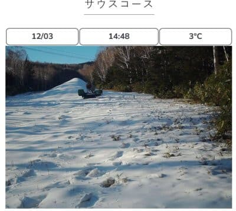
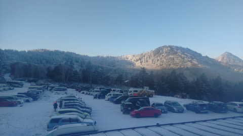
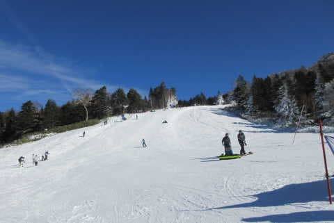
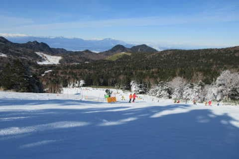
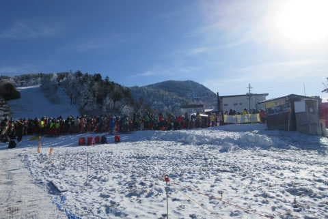
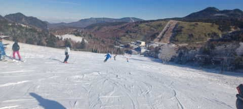
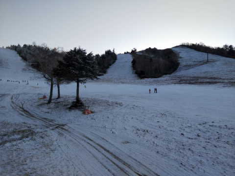
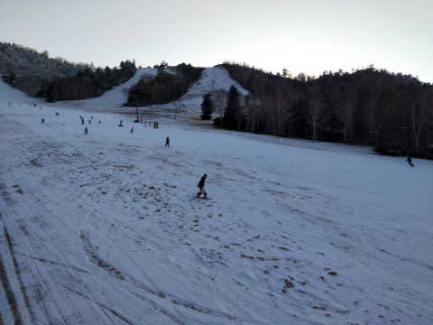
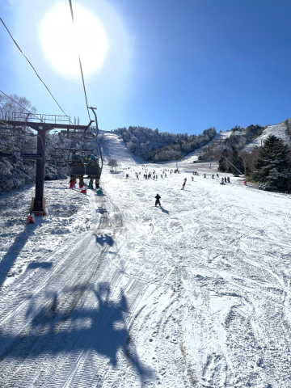
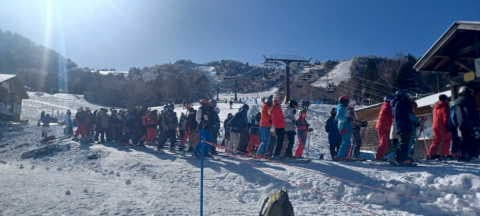

# 2022/12/3(土)の志賀高原横手山，熊の湯スキー場の状況は…特派員によると，横手30分待ち，熊の湯5～15分待ち

📅 投稿日時: 2022-12-04 03:26:46

ってなことで．

ホームゲレンデの焼額がオープンできなかった

本日．

仕事が大量にたまっていたのもあり，

スキーに行くのを諦めたわけですが…

もしかしたら

土曜にガンガン人工降雪が

進んで，日曜に焼額がオープンしたり

しないかな？？

…と思ってたけど．

…今日のライブカメラを見ると，

焼額は昼間はプラス気温だったみたいで．

昼間は人工降雪を打ててないようですね…(涙)

（[焼額山スキー場ホームページ](https://www.princehotels.co.jp/ski/shiga/livecamera/)より)

これでは，とても4日の日曜にオープン

できるわけないですね（泣）

しかし．

12月第1週の週末で．

一の瀬ファミリーペアリフトも，焼額も

動かなかったというのは，

私の知る限り，本当に初めての異常事態…（激烈涙）

これは．

暖まれ暖まれ踊りの踊り手，かなりの手練れ

どころか．

ここ30年に1度現れるかどうかというレベルの

歴史的達人ですね…！！！

必ず見つけ出して抹消せねば…（強い誓い）

ってなことで．

結局明日も滑りに行くのは諦めて．

大人しく仕事をすることに決めたわけですが．

…いや．

昨日の段階では，「日曜に滑りに行こうかな」

と思っていたけど．

焼額がオープンしないのと，

今日の特派員の志賀高原情報を見て，

滑りに行くのは諦めました…

本日，志賀高原には数多くの特派員が

行っていたわけですが．

まずは横手山．

陽坂の駐車場が7:30には早くも満車に

なっていたものの…

天気も良く，コースは割と広めだし，

ゲレンデ状況は悪くなさそうなんですね…

コースはちょいと固めなものの，

しっかり締まってエッジが効く，

いいバーンだったみたいです．

ペアリフト1本しか

輸送力が無いので，ゲレンデはそこまで

混んでないようだし．

良さそうに見えますが…

ただ…

リフトがすごい（涙）

朝から混んで，最大30分待ち．

…というか，20～30分待ちがずっと続き，

1時間に2本しか乗れなかったようです…

いや．これは耐えられない…

そして熊の湯．

天気もいいし．

一見幅が広そうにも見えるけど…

実は滑れるのは人工降雪が載っている

かなり幅の狭いエリア．

人工降雪がないところに行くと，

雪が薄くて草やら石やらがゴロゴロ

している，危険エリアだったようです…

人工降雪がないところは，完全に

草が見えちゃってますね．

午前中はコース幅が狭いわりに，

ペアリフト2本で人を送り込むから

コース上の人口密度は高かったみたいです…

ただ，ペアリフト2本をフルで動かしたので，

リフト待ちはそこまで長くなく．

横手山よりずっとマシな5-10分程度．

午後のリフト待ちは5分以下に短く

なったようですね…

とりあえず．

この週末の志賀高原．

リフト5分以上待ちでコース幅が狭い

熊の湯か，

コース幅は広いけどリフト20分以上

待ちの横手山か．

この二つのうちどちらかの究極の選択

みたいです…

まぁ．

明日一日も志賀高原は積雪は全く

期待できないし．

悔しくないもん．

こんな状態の志賀高原だったら，

行けなくても，悔しくないもん…！！

と．

特派員からのレポートを見て，

自分を必死に慰めていたSkier_S

だったのでした…
