# 2025シーズンモデルのスキー板の試乗レポート速報…FISCHER編その1，そして3月15日(金)の志賀高原スキー場特派員によると，晴天なれど高温，午後はザブザブ雪．

📅 投稿日時: 2024-03-16 00:03:53

えー．

本日も，志賀高原特派員から写真が

送られてきてるわけですが…

うぎゃーーーー！！！

目の毒！！！

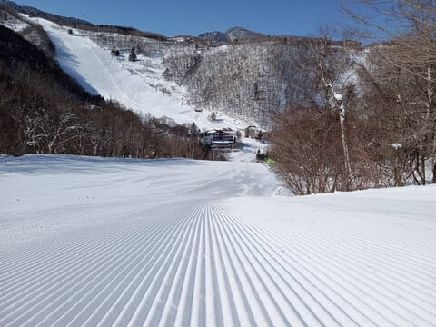

…ええ．

もう．朝イチは最高の晴天の

シマシマバーンだったみたいで…

いや．

こんなよさそうなガラガラバーンで

滑りたい…っ！！

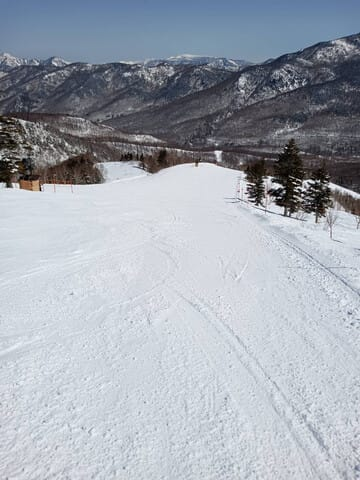

ただ，あさイチは私が予想した通り，

ちょっとコロコロも出ていたみたいで…

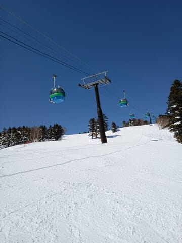

さらに朝のうちから気温は高めで．

朝でも-2℃．

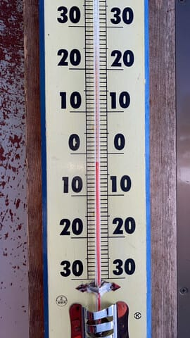

だもんで，昼に向かって雪はかなり緩んで，

ざぶざぶになっていったみたいです…

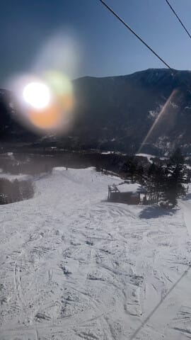

昼間の高天ヶ原前の温度計で，+3℃と

プラス気温を越えてるし．

道路の雪も融けちゃってますね…

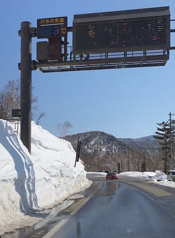

日差しも強かったので，午後の雪は

ザブザブに緩んでかなり荒れたようで．

明日の朝はこの緩んだ雪が冷えて固まった，

コロコロバーンになる可能性が（涙）

惜しい…あと半日，今日の夕方まで冷えて

くれれば，

明日土曜のあさイチも最高だったのに…

でも．

この焼額プリンス東館の階段の埋まり具合を

見ると．←わかる人にしかわからん基準ポイントだ

先週は雪面が上から2段目より下だったのに．

今は上から1段目くらいのところまで

雪が来ているので…

これ，今がこのシーズンで一番積雪量が

多くなってる感じですね．

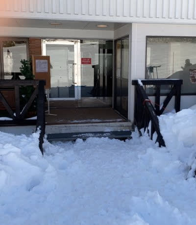

また来週積もるので…

3月末に向かって，さらに積雪が

増えていきますよ～！！

…でも．

今週はやはり土日とも気温が上がります（泣）

そして，日曜は晴れるのは朝のうちだけで，

午前中から雲が広がるかも…

とりあえず，週末の志賀高原の天気は，

15日(土)：朝から終日晴れ！！

　あさイチの気温は-5℃程度，

　朝は表面が固まった感じのしまった

　シマシマ，ところどころ殺人コロコロ．

　午前中からかなり気温が上がり，

　コロコロはすぐ解けて表面が緩み

　滑りやすいバーンに．

　昼間は+5℃を越え，暑さすら感じる

　ほど気温が上がる．

　昼過ぎの雪は3月下旬っぽい，春の

　ザクザク雪になっていく．

　午後の雪は荒れそう．

16日(日)：たぶん朝は晴れ．

　あさイチの気温は-2℃程度と

　この時期としてはかなり高め．

　あさイチのバーンはそこそこ硬く

　固まったシマシマ．

　午前中の日差しで緩み，エッジが

　食い込む硬めのいいバーンになるか．

　場所によってコロコロが出る

　ところも…

　昼頃，早ければ午前10時ごろから

　雲が増え始める．

　昼間の気温はわずかにプラスになりそう

　だけど，日差しが弱まるので，雪は

　そこまでザクザクにならないかな～…

　でも，春のしっとり重い雪に

　なっていく．

ってな感じでしょうか．

ちなみに，今週末はまた第3高速が

復活するようです…！！

白樺・ブナコース以外は，完全に

復活ですね！！

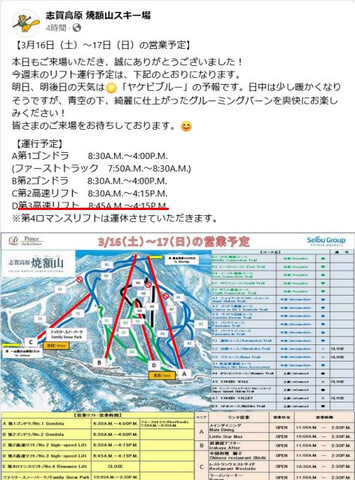

（[焼額山スキー場Facebook](https://www.facebook.com/yakebitaiyama/posts/pfbid0JNMFLRjDcu6sCp9RPi488MoDZgqoSdyuNV7DyPnY5FKWLrsA8vLKamTax6XMZjEMl)より）

ってなことで，今週も志賀高原で

滑ってます～！！

で．あと4時間後に出発なのですが…

とりあえず，せっかく来シーズンモデルの

スキー板を試乗してきたので，

2025シーズンモデルのスキー板試乗の

インプレッション速報版

を載せておきます！←相変わらず情報量が多いブログだ…

〇FISCHER THE CURV M-PLATE 171cm 

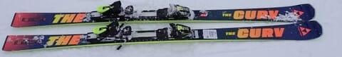

FISCHERのTHE CURVシリーズの頂点，

昨シーズンモデルのお値段25万円．

基本的に昨シーズンのキャリーオーバーで

サイドカーブは15.5m，センター幅70㎝は

昨年と変わらず．

基本的にグリップが強めの板，

トップからテールまでエッジがしっかり効いて，

たわみで曲がっていく板．

比較的フレックスも強く，グリップも強めなのに

どこに乗っても曲がっていってくれる

楽さがある．

あんまり低速で滑ってずらしを入れても

楽しくないので，

ゲレンデをハイスピードで中回りから大回りの

トップスピードで楽にクルーズしたい人に向く．

〇FISCHER THE CURV GT 80　173cm

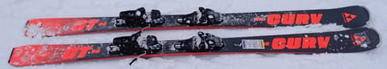

これは来シーズンモデルから新たに

登場する，THE CURVの幅広モデル．

定価14万8000円．

あまり幅広板っぽくない乗り味．

R14.5 なので小回りってわけではないけど，

トップが雪面に食いついて内側へ内側へと

ステアリングしていくような，回頭性が

高い板．長さ173cmにしては良く回る！

荒れた雪でも優しく乗り越えて，

それでずらしのコントロールもしやすい．

幅広板の乗り味じゃないのに，

幅広板の荒れた雪面への対応能力や

新雪での浮力を楽しめる，不思議な板．

中級者はこれ1本持っていれば

どんな斜面でも行けそう．

〇FISCHER THE CURV GT 85　175cm

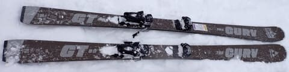

THE CURV GT 80は14万円台だったのに，

この板は定価21万4500円！！！

GT 80よりかなり足元がしっかりして，

安定感・グリップともに強い感じ．

でも，この板も何もしなくても良くたわんで，

トップが内に入ってくるように回ってくる，

オートマチック板．

それでいてセンター幅85mmなので，

浮力もあって，試乗した日は新雪10cmが

蹴散らされた荒れ荒れ雪だったけど，

そんな中で板なりに楽に深回りカービング

ができちゃう，衝撃の板．

圧雪でも荒れた雪でも新雪でも，

楽ちんに板なりにハイスピードカービングが

できるので…結構おススメ！

## 💬 コメント一覧

### 💬 コメント by (大阪のK)
**タイトル**: Unknown
**投稿日**: 2024-03-16 01:58:44

25万円ですか❗

恐ろしい値段ですね😅

でも、50年前にニシザワフォーミュラーが68,000円だったから、25万円でも安いくらいなのかも知れません。

でもでもでもでも、買えないわ😱

### 💬 コメント by (Skier_S)
**タイトル**: ＞大阪のKさま
**投稿日**: 2024-03-16 21:35:38

定価25万です…

とても私が買えるいたじゃないです…

今から35年ほど前，確かヤマハの板でLegeroシリーズとかいう20万する板があった気が…

OGASAKAでもハンドメイド板で20万越えがありましたよね…

スキーバブルならではの板ですねぇ…

