# 2016/17シーズン3日目，11月3日のYetiのゲレンデ状況は…空いてて良かったよ！！！

📅 投稿日時: 2016-11-04 00:32:47

はいはいはい．

今日も行ってきましたよ．

祭日のイエティへ，滑りに行ってきました～！！！

本日朝．

通常オープンの8時には．

昨晩からの雨は上がったものの…．

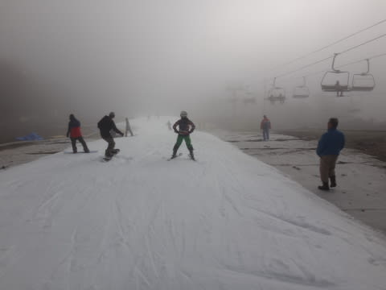

…ガスです（涙）．

ゲレンデはうっすらとガスに覆われてます…

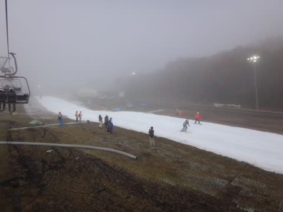

でも．

朝方まで雨が残っていたからか，

ゲレンデの人は少なく．

朝9時を過ぎても，リフトは飛び乗り状態！！

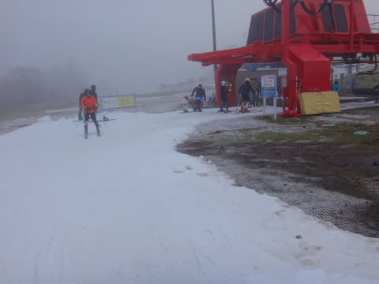

この時期のYetiとしてはガラガラなんですけど！？？

…でも，10時ごろになると激込みになるんだろうなぁ…

…って思いつつ．

9時半ごろには．

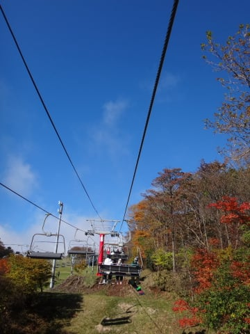

ををっ！

ガスが上がって，すっきり晴れたよっ！！

ゲレンデも，はっきり見通せるよ！

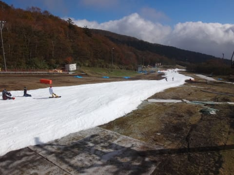

…そして．

冠雪した富士山もきれいに見えるよっ！！

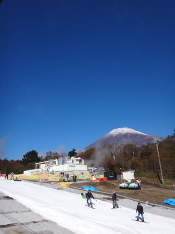

…だのに．

しっかり晴れているのに．

なぜか，いつもだったら混みだす

10時を過ぎても，ゲレンデの人は増えず…

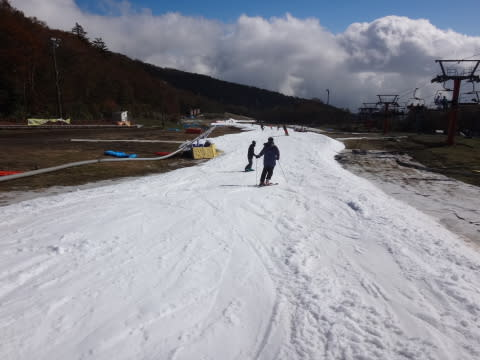

昼になっても．

向こうに見えるリフト乗り場，人が並んでないんですが？？

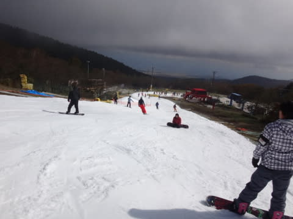

今日の昼間，最大3分待ち．

運が良ければ待ち0，という．

普段の休日ではありえないリフト待ちの短さ！

ゲレンデも，比較的すいてます…

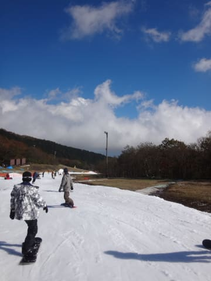

いや，

すっきり晴れてるのに，

リフト待ちはほとんどなく．

これは，いいんでないかい？

…と思っていたけど．

日が射すゲレンデは，

雪が緩んで，ちと張り付く雪に…（涙）

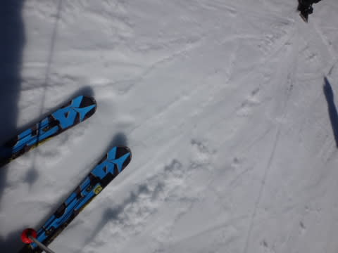

全面ドボドボ雪になるのは避けるよう，

係員が昼間も硫安をゲレンデに撒き続けるのですが…

硫安が効いているところ以外は，

スキー板が張り付く雪になちゃってます．

あぁ…

こんな晴天にならなくていいから．

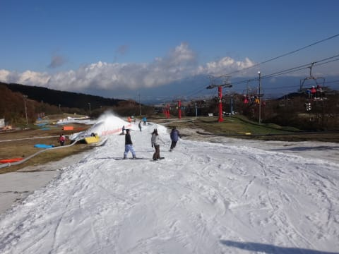

ちょっと曇ってくれる方が．

雪がドボドボにならずに，うれしいんだけどな～．

と，思っていたら．

この願いが通じたのか！？？

午後3時ごろには，雲が結構太陽を隠すような天気に！

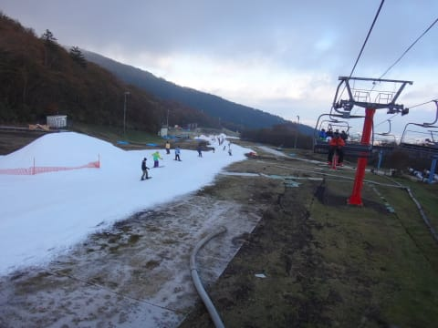

日が陰ると．

気温がかなり寒いのもあって

（ウェアのジャケット着ないと絶対に耐えられない寒さ！），

板が走る雪になってきました…！

そして．

いつもなら混んでいる昼間営業終了前，

3時半ごろでも．

リフト待ちはこんな感じで．

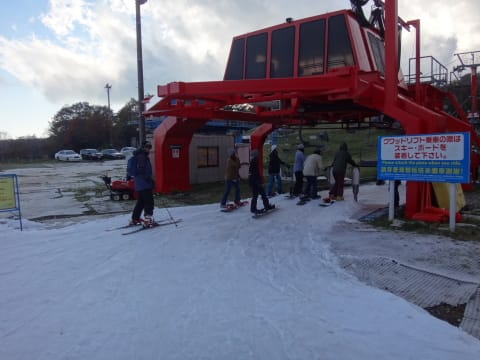

今日は1日，リフト待ちが極めて少なかったのだが？

一体，何があったのか気になるほどの

ガラガラ具合でした…

で．16:00～17:00にコース整備でいったんクローズに

なり…

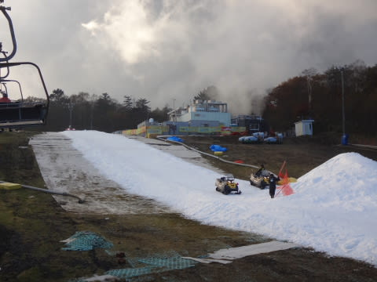

17:00のナイターゲレンデオープンを待っていると…

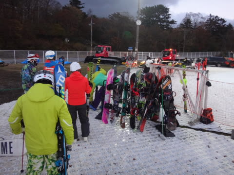

17時に，ナイター開始！

この時期としては，これ以上望むことのない

シマシマバーンがっ！

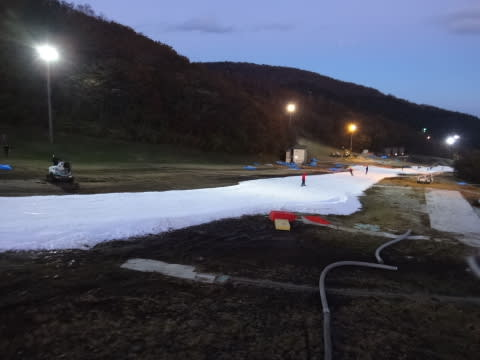

いや…

すばらしい！

そして．

ナイターは，昼間よりさらに人が少なく．

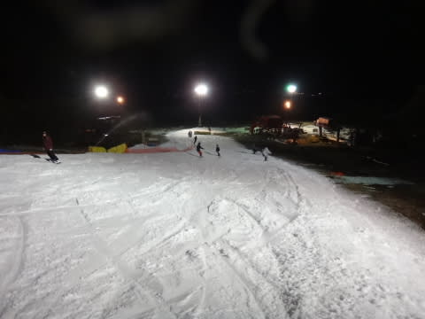

営業開始直後だけでなく，

たびたびクリアラップを取れるうえに…

リフト待ちも，ヘタな平日より少ないのでは？？

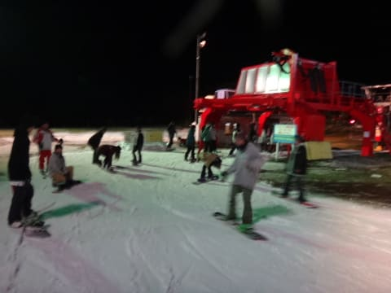

なぜ…

なぜ，こんなに空いてるの？？

＃とはいえ，ゲレンデはそこそこの人がいますが…

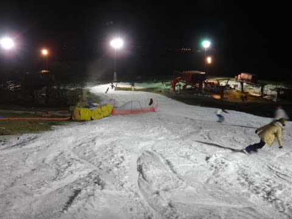

ってことで．

リフト待ちほぼ無し，

ナイターは気温が寒かったこともあり．

（0℃程度…かなり寒かったよ！）

雪も滑る雪になり．

予想以上に楽しくて．

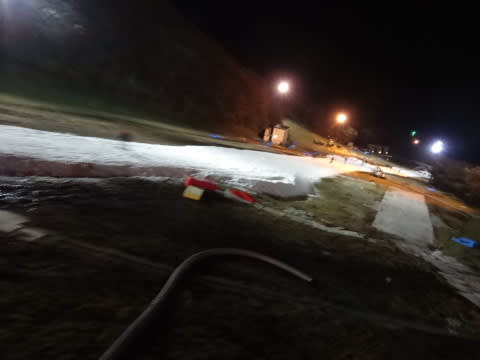

「…あれ？？？

　もしかすると…Yetiって，楽しい？

　こんなに楽しいスキー場だったっけ？」

と思う一日を過ごせたのでした…

待ち時間も少なかったので．

一日でリフト70本以上乗れたし．

うむ．

今日のイエティは，楽しめましたよ～！！！

## 💬 コメント一覧

### 💬 コメント by (はなげ親分)
**タイトル**: リフト70本
**投稿日**: 2016-11-04 01:51:35

イエティで通常営業からナイターまですべると70本以上ですか・・・

きっとニコニコしながら滑っていたんでしょうね！

私は3時間が限界です、どうしても飽きてしまうので。

下界は結構暑くて、ビール飲みながらしてたせいかもせれませんがワックスがけしていたら相当量の汗をかきました。

### 💬 コメント by (yama)
**タイトル**: ナイター
**投稿日**: 2016-11-04 06:07:34

今日は１日ご一緒させていただきありがとうございました。yetiで楽しいO(≧∇≦)oと感じることは少ないのですが、昨日は滑る雪とリフト待ちのがほとんどないこと、ゲレンデが空いていること、一緒に滑っている人と良い条件が重なり時間を忘れて楽しみました。Komu様、ご一緒させていただきありがとうございました。ではまた、来週(^-^)//

### 💬 コメント by (komu)
**タイトル**: 80本では？
**投稿日**: 2016-11-04 12:37:02

エス様、YAMA様

昨日はご一緒ありがとうございました。

脳から汁出ましたね〜

みんな終わった人になってしまいましたね〜

ところで、

リフトは80本の誤りでは？

### 💬 コメント by (ひーちやん)
**タイトル**: イエティ最高
**投稿日**: 2016-11-04 13:35:59

昨日は、突然の、ご一緒ありがとうございました。皆様の、若さと、アドレナリンには、びっくりです。そして、コレだけ楽しいイエティ初めてです。皆様、今日もきつと、元気に、お仕事でしょうね（笑〕また、宜しくお願い致します。

### 💬 コメント by (Skier_S)
**タイトル**: ここしばらくないほどの恵まれたYetiでした！
**投稿日**: 2016-11-04 23:59:49

＞はなげ親分さま

実は…

先週土曜も，朝10時からナイター終了までで

77本滑ってます（笑）

今シーズン3日目にして2度目の70本越えです…

でも，昨日はよかったんですよ．

ホントに，「まだ滑りたい～！！！」と

思うほどに…

全然飽きませんでしたよ！

＞yamaさま

昨日はおせわになりました…

いやーーーーー

ホントに楽しいYetiでしたね！

Yetiであんなに楽しかったのは初めてです．

もしかすると，今週末も日曜にすべりにいくか

もしれません．

その際は，またよろしくお願いします！

＞komuさま

ちゃんと大人な我々は8時過ぎに切り上げたので．

残念ながら，71本でした…

しかし，良かったですよね～！

またご一緒しましょう！

＞ひーちゃんさま

昨日はおつかれさまでした！

…というか．

なんだか，超ハイペース滑走に巻き込んで

ごめんなさい…って感じです（＾＾；

20000mクラブな2名が揃っていて．

さらに空いている…

ということで．

ついつい飛ばしてしまいました…

でも，楽しかったですよね～！

これに懲りず，またご一緒させてください！

