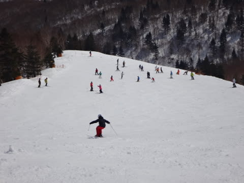
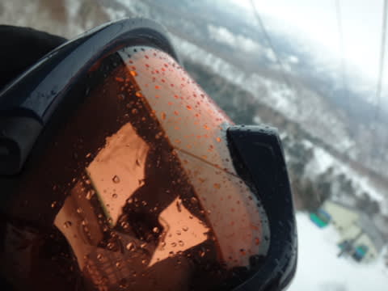

# 3月29日の志賀高原詳細…午前は予想よりは楽しめたよっ！

📅 投稿日時: 2015-03-31 02:45:11

ということで．

昨日速報した，日曜の志賀高原．

詳細レポートですが…

えー．

はい．

昨日も書きましたが．

なんだか．

朝6時半に気づくと．

…ゴンドラ乗り場に立っている私がいました．

…あれ？

なぜ．

なぜ，こんな時間にゲレンデにいるんだ？？

…私の記憶が確かなら．

確か，昨日はナイターストップまで滑った気がするのだが．

それから，9時間ちょいしか経ってない気がするのだが．

…6時間寝てない気もするんだが．

…土曜の朝も，4時間睡眠で出てきたので，睡眠時間が

足りてない気もするのだが．

なぜか，気が付くとゲレンデに立っていた…と．

うーむ．無意識の行動は恐ろしい（汗）．

…でも．

昨日は昼間とナイターのみ，

今日は早朝と昼間のみ，ということなので．

一日で早朝～ナイターまでぶっ続けで滑ったわけではないので．

早朝からナイターまで滑り続ける，どうしようもなく

終わった人ってわけではないのだっ！！

まだ，常識の範囲内のはずなのだっ！！！

…と．

自分に言い訳しながら，早朝のゲレンデを滑るわけですが…

朝イチはちょいと曇り気味の天気だったけど．

うーむ．

朝6時半から，もう気温はプラスか…

でも．

ゲレンデは．

しっかり締まったシマシマバーン！

うははは．

このために，わざわざ早朝にやってきたのだ～っ！！

では，行きま～すっ！！！

…と，滑ってみたところ…

あり？

なんだか，ゲレンデに氷のコロコロが…

い，板が流される！

ちょっと滑りにくい…（残念）．

まぁ．

でも．

ところどころコロコロはあったものの．

天気も良くなってきて．

景色も良く，人も少なく．

ハイスピード飛ばしたい放題の早朝．

やっぱり気持ちいいですね～！

そして．

通常営業開始の8時半には，第1ゴンドラ側へ移動し，

また，誰にも荒らされていないシマシマをいただくのだ！

このころには，ゲレンデもかなり柔らかく．

エッジで深く掘りこまれるようなバーン状態だったけど．

んでも，

誰にも荒らされていないシマシマを，深く掘りこみながら

滑るのは気持ちいいのだっ！！

いやー．

早朝から滑って，良かった～！

通常営業開始時には，天気はもうすっかり快晴！

すっきり快晴のシマシマバーンを，朝9時半ごろまでたっぷり堪能…

そして．

10時ごろには，雪もかなりゆるみ…

ゲレンデの人も増えてきたけど．

許す．

もう，早朝からたっぷり滑ったので．

もういい．許す．

もう3時間以上，人のいない，雪がいいゲレンデをかっ飛ばし続けて，

かなり満足度高し…

…でも．

午前中から気温が高く，雪は重くなったものの．

先週積もった雪は，まだザラメ化しておらず．

雪は緩んだものの，ザブザブに融けちゃわないので，

意外と荒れずフラットなままで．

結構午前中は楽しめました…

ただ．

昼ごろから，やはり雲が増えていき…

雪もさらに緩み，さすがに午後はちょっと

バーンにバンプができてきたなぁ…

でも．

午後から崩れる予想の天気．

午前中の段階では，午後1時くらいから雨が降り始めそうな

雨雲の予想だったけど…

…午後3時になっても，まだ空から液体は降ってこないぞ…

ふふふふ．

それは，私の日ごろの行いが良いからだっ！

…と，思っていたところ．

午後3時過ぎに．

降ってきたけど…

なに？これ？？

雪？？まさか？？

気温は山頂でも昼間はプラス5度ほどあったので．

まさか，雪になるとは…

でも，雨じゃなくて，よかった～！

と，滑り始めたら．

やはり，雪だったのは山頂付近だけで．

コースの半分ほど降りてきたら，雨になってました…（涙）．

…でも．雨が降っていたのは30分くらいで．

それも，山頂付近はずっと雪で．

さらに，そんなにひどい降りにもならなかったので．

まぁ，これもやっぱり．

私の日ごろの行いが良いおかげですね←だから，絶対違うから

…とりあえず．

パラパラ降った雨のおかげで，ちょっと雪は水っぽく

なってきたけど…

午後は人もいなかったので．

ゲレンデはそれほど荒れることはなく．

…ザブザブな雪でどうしようもないほどにドボドボになることなく，

無事リフトストップまで乗り切ったのでした…

うむ．

とりあえず．

予想通り気温は高めで．

春の雪になってしまった週末だったけど．

先週の冷え冷え雪でコンディションが多少改善したおかげか．

先週末の壊滅的ザブザブ雪に比べれば，かなりマシな状態で．

さらに土日とも晴天のなか滑れて．

楽しめた週末だったかな！
