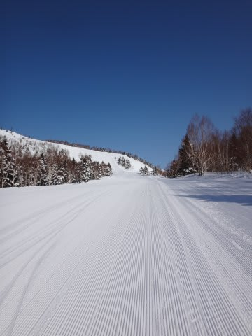
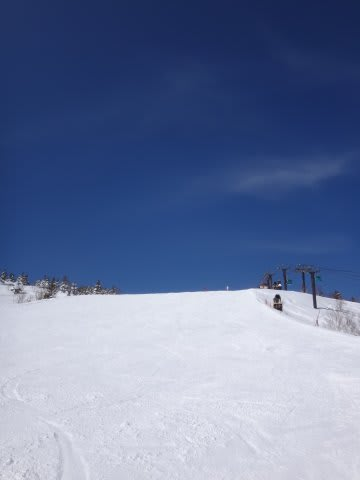
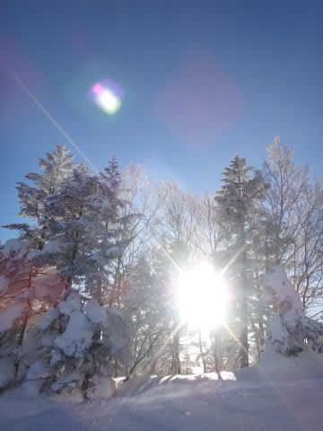
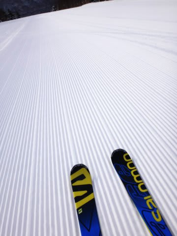
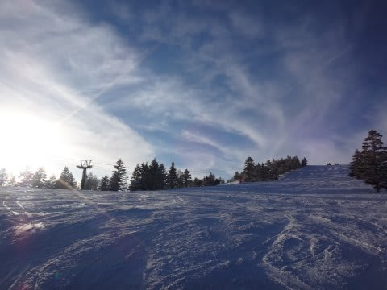
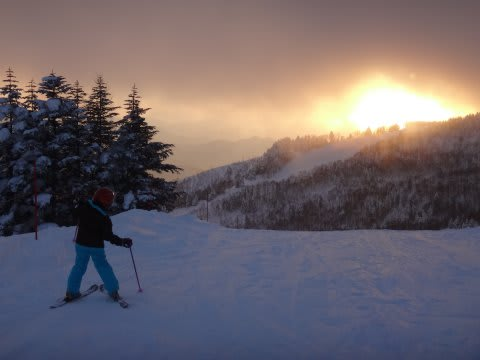
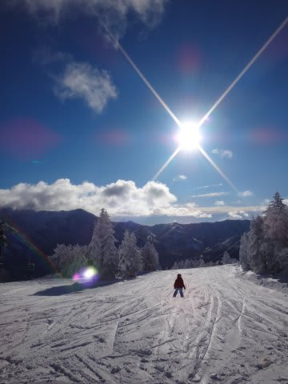
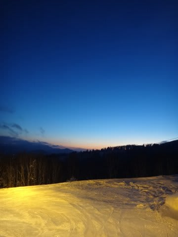

# 2015シーズン終了…このシーズンを総括してみる

📅 投稿日時: 2015-06-25 01:32:39

えーー．

まだ．

まだ，本人的には納得できていないのですが．

全く，体は納得していないのですが．

…どうやら．

私の2015シーズンが，すでに終了しているようです…

…

…本当に，終わってたっけ？←あきらめが悪い

とりあえず．

シーズン終了時の定番．

今シーズンの総括をば…

○シーズン滑走日数　68日

去年より4日増えたよっ！！←社会人として終わってる日数だと思わないのか？（自己突込み）

わが最高記録，70日に迫る滑走日数でしたね～．

でも．

月山がもう少し滑れればな～．

シーズン終わりがいつもより2週間以上早いのが，

ちと寂しかった…

○行ったスキー場

志賀　54日！！（うち1日ナイターのみ）

Yeti　4日

アサマ2000　3日

白馬五竜　1日

かぐら 5日

月山　2日

…

…偏ってる．

偏ってるよ…

志賀以外，志賀のオープン前のYeti＆アサマ，

志賀クローズ後の，かぐらと月山．

…それ以外は，試乗会の五竜1日のみ！！！

…最近，全く新しいスキー場を開拓していない…

まぁ，シーズン券を持っていると，他の

スキー場に行くと余計なお金かかるし．

子連れだと，定宿以外はいろいろ融通が利かなくて

困るし…

うーむ．

でも．

ちょっと偏りすぎかな～．

○ナイター滑走日数　13日．

うーーーむ．

少ない！

例年20日近いことを考えると．

かなり減ったなぁ…

1月，2月に都合で日帰りになったり，

2月，3月の3連休がなかったのが効いてるか…

○早朝滑走日数　13日．

去年は7日だったので…倍増しましたか．

ナイターと同じだけ早朝を滑っているとは…

今シーズンは，なぜか土曜の朝から早朝…

というパターンが多く，日数が増えましたね～

＃土曜の早朝に間に合うために，土曜は朝…

＃というより，金曜深夜の2時前に出発という

＃地獄パターンが多かった…

○トータル滑走標高差　659000m

659km，ですか…

昨シーズンより滑走日数が増えたので，

昨シーズンより，滑走標高差が12km増えてますね…

まぁ，去年と大体同じく．

東京-広島くらいの距離に匹敵する高さまで

駆け上って，そこから滑り降りたくらい

ですか…

ちなみに，滑走標高差のうち，

574kmが志賀高原．

志賀高原以外は，83kmほどです…

○自動車走行距離　約25000km

…まぁ，大体例年通りって感じですか…

スキーシーズンだけでこれだけ走るって，

車も過走行になるわけだ…

＃スタッドレスも2シーズンしか持たないし（涙）

○転倒回数　1回．

…でも．

[自損転倒は0回](e034f4fdd4793e70377cecc6692082800.md)！！！！

…一回ぶつけられて転んだのが惜しかったけど…

まぁ，68日滑って1回しか転ばなかった，

自分を誉めてあげよう．

○かかったお金

…

…

…

計算しないでおきます…

ってことで．

無事（？），2015シーズンも，終了です…

　

　

　

## 💬 コメント一覧

### 💬 コメント by (すぎぃ)
**タイトル**: 物欲＆定宿
**投稿日**: 2015-06-25 10:04:09

2015シーズン大変お疲れさまでした。

物欲に負け以前から気になっていた

ＳＡＬＯＭＯＮ　Ｘ－ＭＡＸ１７０㎝を

先日早期予約してしまいました(笑)

価格交渉し税込￥１２９６００⇒税込￥９８０００

でＧＥＴしました。

Sさんの定宿差し支えなかったらご教授お願いします。

小生の定宿は銀嶺です。

以前はサンモリッツ、白樺荘、ラフォーレ、オリンピック

を利用していました。

貴殿のスピードについていく事は困難でしょうが

来季は是非ご一緒出来ればと思っております。

### 💬 コメント by (Goku)
**タイトル**: ついに・・・
**投稿日**: 2015-06-25 19:25:12

15シーズンが終わったのですね・・・

お疲れ様でした。

それにしても毎週Ｋ県から通うこと68日ですか！

凄すぎます。

しかも、土曜朝イチから日曜のラスリフまで、あのスピードで滑り続け・・・

ほとんど『神』ですね。

長野にいながら26日しか滑っていない私は『根性なし』だな～（笑）

来シーズンもＳさんのスピードに必死でついていきますので一緒に滑ってくださいね。

最近滑りたくてしょうがないGokuraku Skierでした。

### 💬 コメント by (KENKEN)
**タイトル**: お疲れ様でした。そして夏モードも楽しみにしてます。
**投稿日**: 2015-06-25 22:05:28

今年の冬は人生初の大怪我でシーズン途中リタイヤと悔しい思いもした一方で、

憧れの焼額でSさんはじめ、Gokuさん、れおさんとお会い出とても記憶に残るシーズンになりました。

来シーズンも宜しくです。

夏モードも楽しみにしてます。

特にパラオが子連れでどんなのだったのかとても気になります。

我が家は7月末と9月の連休に西表予定です。

### 💬 コメント by (komu)
**タイトル**: 靴を…
**投稿日**: 2015-06-25 22:15:39

いや～、今年の志賀高原は暑くて、靴が柔らかく感じていた矢先、ふらっと行った誘惑の街で旧モデルですが破格値を提示されて…

白とライムグリーンの靴を…

はやり月山の融雪が早過ぎたのが敗因でしたね…

### 💬 コメント by (Skier_S)
**タイトル**: シーズン終わりました～
**投稿日**: 2015-06-26 00:56:32

＞すぎぃさま

2015シーズン，終わっちゃいました…（涙）．

でも，ついにX-MAX買っちゃいましたか．

この時期に10万切れば安いですね…

私の宿は，子連れだとオリンピックホテルを利用しています．

子供がいないときは，アストリアを愛用中です…

機会がありましたら，来シーズンお会いしましょう！

＞Gokuさま

終わっちゃいましたよ…

終わっちゃいました（泣）．

しかし，ホントに68日．

よく続いたなぁ…（お金が）

…でも．

こと滑走速度については，Gokuさんの方が

私より速かった気がするんですが（笑）．

いつも私の前を滑っていた印象ばかりが

残っています（＾＾

＞KENKENさま

今シーズン，まさかスキーにご一緒できると

思っておらず．

お世話になりました…

でも，そのあとの怪我はちょっと残念でしたね…

実は，10月に西表，仮予約しました．

ご一緒できればいいなぁ，と思いつつ．

今回はわが両親を連れての慰安旅行（？）

ですので…

うちの両親が行かない機会に，また西表で

お会いしたいですね～．

＞komuさま

あれれれれ？

物欲大魔王降臨の結果は，ブーツですが…

白とライムグリーンって，何でしょうねぇ？？

15シーズンだとダルベロくらいしか思い浮かばない…

しかし．

月山の融雪が早すぎたのでブーツ購入って．

なんだか，確実に終わってる人パターンに

入っちゃってませんか？？（笑）

