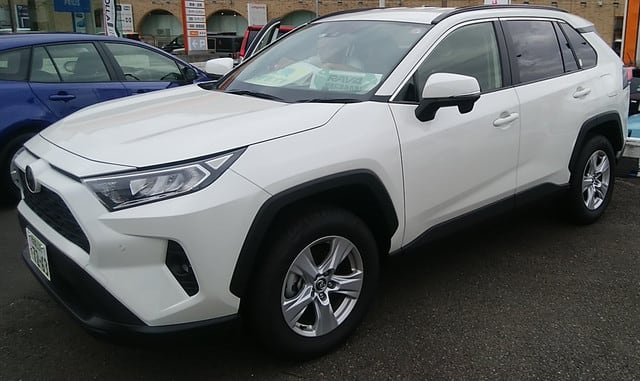

# TOYOTA RAV4に乗ってみた

📅 投稿日時: 2019-11-14 06:07:11

🏷️ カテゴリ: [車試乗](c07dec5709d34bd74e1f6cb9c8291061b.md)

ってなことで．

今日もちょいと帰宅が遅かったので．

書きためておいた，車の試乗レポートです…

眠い…

では，どうぞ～！

---

カローラツーリングに乗った後．

TOYOTAでちょいと気になっていた，

RAV4にも乗ってみました…

試乗したのは，2Lの一番安いグレードの

FF車でした．

試乗車にハイブリッドが無く，

2Lガソリン車しかなかったので…

ホントは2.5Lのハイブリッドに

乗ってみたかったんですが…

ってなことで．

実際に見てみると．

結構デカさがありますね．長さはLEVORGより

短いのですが，幅1.855mと日本車としては

かなりの幅があり，

かつ高さがあるので，見た目はかなりごつく

デカく感じます．

室内は高さもあるので，そこそこ

広さを感じます．

リアシートも，普通に座るには

十分な広さ．

内装の質感は…Mazda車を見たあとだと

ちょっとプラスチック感がありますが，

まぁこのクラスとしては標準的な感じ

でしょうか．

うーむ．最近のMazdaやSUBARUは

内装頑張ってるなぁ…

運転してみると…．

車幅かなり広いけど，

運転席はそこそこ高めで，かつ

ボンネットが角ばっていて運転席から

ボンネットの角が良く見えるので，

車両感覚はつかみやすいです．

狭い道でも「をを！デカい！」と

思うことなく運転できました…

エンジンは，1.6トン超えの車体なので，

2Lのガソリンだとやっぱりアンダー

パワー気味かな…

でも，CVTが頑張っていて．

モードセレクタをパワーモードにすると，

高回転をキープして，

結構ピックアップよく加速していきます．

…エンジン回転数が上がるので，

ちょいと落ち着きがなくなりますが，

エンジン音は静かで，結構スムースに

回るので，それほどエンジンが頑張って

唸っている感じは無くて．

パワーモードにしておけば，

アンダーパワーに感じる場面は

それほどなく，緩い上り坂も

頑張って登っていきます．

エコノミーモードにすると，

コーストに入れるとギア比をぐっと

高くして，エンジン回転数を落としに

行くので．

そこから再びダッシュするためには，

アクセルを踏んでからCVTのギア比が

変わって，エンジン回転数が上がって，

それに加速がついて行く…

という動きになり．

ダッシュのレスポンスは多少落ちます．

まぁ，街中を緩やかな加速で走るなら

これで十分かな．

足回りは…

ボディ剛性は高そう！

突き上げは結構しっかり受け止めます．

バネレートは当然カローラツーリングよりは

ずっと高いけど，トヨタ車らしい

段差乗り越え時のショックの

少なさがあります．

街乗りでは，適度な路面インフォメーションが

ありつつも，ガタガタ感の少ない

乗用車的乗り心地で走っていきます．

ただし，この車も，試乗ルートが街中

だったので，素早い切り返しや

大きめの横Gをかけたりできません

でしたが…

とりあえず．

ハイブリッドや4WDに乗れなかったのが

ちょいと残念でしたが．

FF車の2Lでも，街中メインなら

これで十分かも…？

と思わせる車でした．

うーん．

でも，欲を言えば．

欠点はそれほどないんだけど．

やはり，ワクワクさせる何かが

ちょいと足りない…
