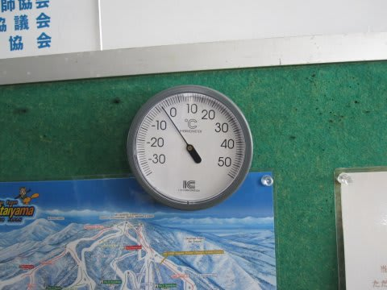
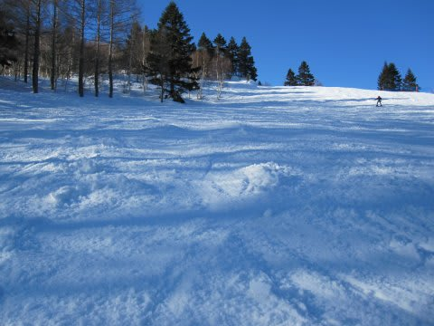

# 4月3日の志賀高原速報

📅 投稿日時: 2011-04-04 00:34:49

🏷️ カテゴリ: [2011スキー滑走日記](ca488c98cfb9169941c3e73770dcefb56.md)

さて．

日曜の志賀高原．

終日天気は良かったですね～

気温は昨日より低く，朝のゲレンデは4月にしては良い状態．

というより，かなり良いです．

4月か？？？？

って感じ．

しっかり冷えた，ハードパック．

アイスバーンではなく，きれいに引き締まった圧雪です．

4月上旬にこれ以上を望むのは無理，という最高コンディション．

景色も完全真冬です．

午前中はちょっと人が多かったかな～．

…っていっても，焼額第2ゴンドラは5分待たなかった

ですね．平均3分待ちかな？

午後はがらがらになりましたけど．

雪は昼近くまで，結構いいコンディションをキープ．

土曜みたいに張り付く雪にはならず．

ちょっとやわらかいけど，気温もプラスになるかならないか，

ってところなので，どろどろになりません．

ただ，やわらかかったので，昼を過ぎると荒れ初めて来ましたね～

夕方まで気温は低め．

っていうか，南向きで昼間にちょっと緩んだ斜面は，

3時過ぎにはカリカリに凍りはじめました．

うーん．日が射す南側で，3時ごろに凍り始めるとは．

南側でないところも，夕方にはゲレンデが氷のコロコロで

じゃがいも畑になっていたり，ちょっと滑りにくく

なってました…

リフトストップ時には気温はマイナス6度．

結構冷えましたね～

雪はまだまだまだまだたっぷりです．

焼額だけでなく，西舘，ブナ，ジャイアント，

蓮池，丸池，サンバレー．

まだ全面，たっぷり雪が残ってます．

これで営業やめちゃうなんてもったいない…

でも，帰りの道路はほぼドライ．

トンネルの中以外は，凍ってません．

…でも，日が暮れると凍りそうなウエット部分が

ありますし，トンネルの中はちょっと滑りそうな

ところもあるのでまだスタッドレスは必須です．

帰りの関越は，先週よりさらに車が増えましたか…

午後6時ごろ，高坂付近が1-2km渋滞していたみたいです．

横川のサービスエリアはかなりの混雑．

中央道上りも10km以上渋滞していたみたいだし，

そろそろ高速の交通量も戻りつつありますね…
