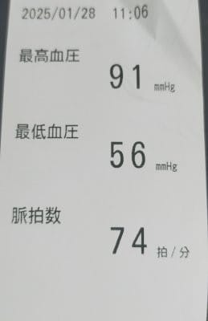
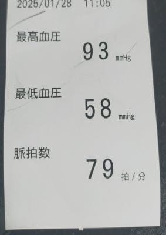
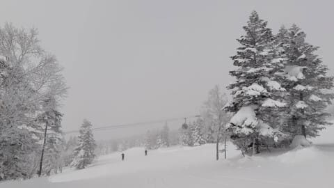
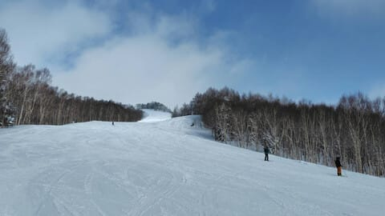
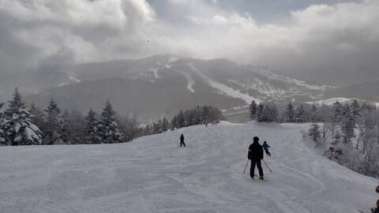
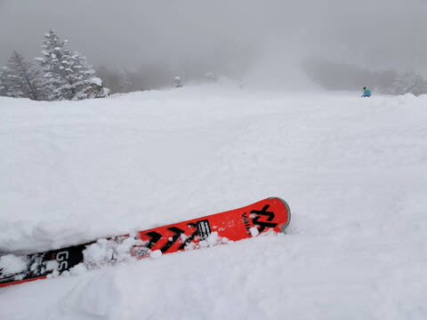

# 今週末も志賀高原でスキーしてます！…土日とも晴れ間はほとんどなく，積雪もほぼない感じだけど，金曜朝までのいい雪のおかげでバーンは良さそう

📅 投稿日時: 2025-02-01 00:00:50

🏷️ カテゴリ: [日記](cc4b5682fb7b8b144980957a978653fb0.md)

えー．

先日．

とある病院で健康診断を受けてきたときのこと．

「こちらの機械で血圧を測ってください～」

ということで，血圧を測ったわけですが…

看護師さん「あれ？ちょっと低いですね…」

…まぁ，いつも最高血圧が100前後なので，

特に低いと思わないんですが…

看護師さん「測り方が悪かったのかな？

　もう一回測りましょう！！」

と，腕のセット位置が正しいかどうかを

しっかり見てもらいながら再測定

したわけですが…

その結果．

看護師さん「…低いですね…やっぱり…」

私「いつもだいたい低めですけど…

　低いんですか…これ」

看護師さん「かなり低いですね…」

さらに最後の結果報告にて，

お医者さん「胃はきれいですね～！！

　血圧も高くない，ストレスによる身体影響はない

　感じですね」

私「え？は？？？…あれ…？

　ストレスなさそうな感じですか…！？？」

お医者さん「ストレスにそんなにやられてない

　感じですね」

私「そうですか…（納得いかない…）」

ということで．

…ストレスを受け続けると，普通は血圧が

上がるようなのに，その気配もないし．

胃も荒れてないし．

これだけの睡眠不足やらご無体仕事やらの

ストレスを受け続けているにもかかわらず，

身体はまだ無事なようです…

うーん．

職場でもほかの人から体の心配をされるほどの

ご無体状態が続いていて，かなり身体は

ボロボロだと思っていたのに，意外と

頑丈だな…

ってなことで．

今週もかなり睡眠時間が短いご無体デーが

続いたものの，身体は大丈夫なようなので．

今週も無理をおしてスキーに行きます！←無理していくところじゃないから

話題は変わって，金曜の志賀高原．

特派員によると，終日曇り空だったよう

ですが…

まず，前日からの積雪は30cmほど．

柔らかトップシーズンのいい雪でスタート！

昼間はほぼ雪は降らず，それどころか

午前中は一瞬晴れ間ものぞいたようです…！

春節だったからか人は平日にしては

多かったのかな～．

雪はすごい良さそうに見えますね！！

ただ…雪が柔らかかったので，

夕方のバーンは結構荒れ荒れになって

しまっていたようです…

とりあえず，

午後は荒れたものの，いい雪が入荷した

みたいなので．今週末もいい雪で滑れそうな

感じですね…！

ってな感じで，この週末の天気ですが．

日曜の南岸低気圧，思ったより南にずれた

ので，日曜は雪も降らず，そこまで気温も

上がらなさそうな天気図になってきました…

土曜：朝から曇り，ときどき雪がぱらつく．

　前日から朝までの積雪は数cm～10cmくらい．

　朝の気温は-12℃くらいと冷え冷え！

　朝はちょいと柔らかめながらエッジが噛む

　いい感じのバーン．

　天気は終日曇り，ときどき雪がぱらつく．

　午後はちょっとだけ青空が見える

　タイミングもあるかも…

　午後はバーンは凸凹になっていく．

日曜：朝から曇り．終日曇り．

　朝の気温は-5℃程度．

　前日からの積雪は無し．

　朝イチはトップシーズンのシマシマ

　バーン！

　視界さえよければ最高のコンディション．

　土曜ほど雪は柔らかくないし，昼間も

　マイナス気温なので雪も緩まず，

　土曜ほど雪は荒れず，いい雪で

　滑れそう．

　だけどさすがに午後は人の多い

　バーンは荒れていく

といった感じでしょうか．

ってなことで．

あと３時間ちょいで出発です…

昨日も4時間睡眠なのに，また，3時間

睡眠で300㎞運転して滑ってきます～！

## 💬 コメント一覧

### 💬 コメント by (副院長)
**タイトル**: Unknown
**投稿日**: 2025-02-01 08:21:10

S様、おはようございます。血圧低い、健康です。やはりヤケビは健康にいいのですね、私もせっせと通って、血圧下げる努力します。日曜は五竜の友人と合体なので、2ゴンスタートかもしれませんが、お見掛けしたら、よろしくお願いします。視界よければいいなぁ。

### 💬 コメント by (Skier_S)
**タイトル**: ＞副院長さま
**投稿日**: 2025-02-01 23:31:00

血圧って低すぎるとよくないのかな，と思ったのですが…

日曜はお友達とご一緒なのですね．

また3高終礼でお待ちしてます(笑)

