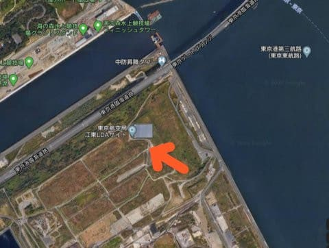
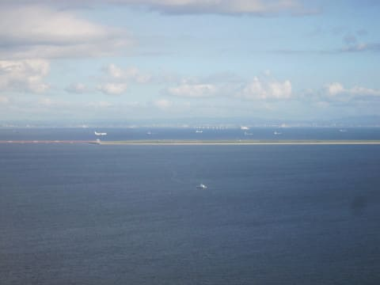

# 2019年8月，座間味で小6の娘と親子ダイビング！ファイナル…羽田へ帰着．そしてある飛行機好きの余談

📅 投稿日時: 2020-07-15 00:53:43

ということで．

座間味にお別れを告げ，

上空を飛ぶことしばし．

途中，2時間ほど完全に熟睡していて．

気が付くと，富士山の頭が見える，

関東圏までやってきてました．

そして，千葉市付近の上空までやってきたとき…

うむ？

真横を並行して飛んでいる飛行機がいますね…

真横を並行して飛んでいるっていうことは．

自分の乗ってる飛行機と一緒に

羽田へSimultaneous parallel approach

かけるんだとおもうけど…

もう，木更津よりかなり北にきてるよね？

ってことは，RWY34R&Lじゃないぞ…？

RWY22＆23のSimultaneous parallel？

RWY34 R&LのILSを利用した

Simultaneous parallel aprroachは見たことあるけど…

千葉上空からのアプローチって，

ILSじゃなくLDAアプローチのはず？

LDAアプローチでSimultaneous parallelって

できるんだっけ？

（調べてみると，今は，ILSでなくても，LDAだろうが

　RNAV-GPSだろうがSimultaneousアプローチができて，

　左右セパレーション基準も緩んでいるのね…）

全く余談になっちゃいますが，

普通の計器着陸方式は，滑走路からまっすぐ

照射されるローカライザー電波に乗って，

滑走路にまっすぐ進入する，ILS方式．

羽田RWY34R ILSのチャートはこんな感じで，

赤で示したRWY34Rからまっすぐ(磁方位337°)

木更津方面に伸びる，ローカライザー電波に

従って進入します．

それに対して，羽田にここ数年前に導入されたのが，

LDAアプローチ．

赤く示したRWY23の滑走路と，緑のRWY22に対し，

思いっきりズレた角度で照射されている

ローカライザー電波（LOC)に乗ってアプローチし，

滑走路直前の低い高度で「えいや！」

って向きを変える，結構高度な技です…

([Operational Procedures at Tokyo International Airport](http://www.schedule-coordination.jp/archives/arc_hnd/2010/operational_procedure_at_hnd.pdf)ページより)

ちなみに，RWY22用のLDAアンテナはここにあります．

赤く囲ったのが，羽田空港．

RWY22のLDAアプローチでは，

この江東LDAアンテナ（IKA)に

向かって進入していきます．

拡大すると…

こんな感じで．

左側に，縦一列に並んでいる赤いローカライザー

アンテナが見えて．

電波が照射される右側の地面は，草が生えないように

シートか何かで覆われてるのかな？？

そして．

RWY23用のLDAアンテナ（ITL）はここ．

羽田空港の，RWY16Lエンドが見えてる

あたりに…

こんな感じで，右向きのローカライザー

アンテナが設置されてます．

ってな感じのRWY22へのLDAアプローチ

なので．

自分の乗っている機は東側の千葉市上空から，

江東LDAアンテナ(IKA)に向かって進入，

東京ゲートブリッジ近辺で左旋回，

RWY22へアラインします．

RWY16Lエンド付近にあるLDAアンテナ(ITL)

に向かってパラレル進入していたJAL機は，

それよりわずか早くに左バンクを打ち，

RWY23へアラインしてます…

そして，こちらがB滑走路，RWY22へ

アラインし終わる頃．

向こうはD滑走路，RWY23エンドをパス…

そして．

こちらがRWY22へタッチダウンする前に，

インコース側を旋回することになるRWY23側の

機体は，すでにタッチダウンしてますね…

ってなことで．

こちらもいわゆるB滑走路，RWY22へ

タッチダウン！

ふーむ．

これまで，LAXとかIADとかで，ILS Simultaneous parallel approachは

経験してましたが．

羽田のRWY22＆23のLDAで，Simultaneous

 parallel approachは初体験でした…

と．

ちょいマニアックな新しい経験に興奮したものの．

…帰ってきちゃいました．

あぁ…旅行も終わってみると儚いもの…

でも．

「家に帰るまでが旅行です」

ということで．

ちょうど羽田空港につくころには

夜ご飯タイム．

ゆっくり空港で，親娘ともに大好きな

飛行機を眺めながら，沖縄旅行の

余韻を語って．

旅行の最後の締めを終えたのでした…

今日の記事は，沖縄ダイビング旅行記ではなくて，

単なる飛行機好きの独り言でしたね…

## 💬 コメント一覧

### 💬 コメント by (Hide)
**タイトル**: 私も・・・
**投稿日**: 2020-07-15 22:40:42

S 様

おひさしぶりです。

コロナ禍の最中お元気にお過ごしでしょうか？

K奈川県もちょっと不気味な増え方ですよね。

私も九州の福○県からYK浜市に帰れず幽閉されてます（泣）

↑全然伏せ字になってない・・・

私も何気に飛行機好き♬

ここから自衛隊の築城基地は近いので、天気の良い日にたま～に朝から見に行きますよ。

F2の部隊があるんですよ。

運が良い（良くていいのか？）と、マジのスクランブルに遭遇します。

実弾装着でアフターバーナー全開で目の前を離陸していく音といったらそりゃ～も～！

空気の震えでお腹の底が痒くなります。

ちなみに私は赤組ステータス所属です（笑）

### 💬 コメント by (Skier_S)
**タイトル**: ＞Hideさま
**投稿日**: 2020-07-16 01:53:35

おっと，Hideさんも飛行機好きでしたか…

民間機が好きな私ですが，実はF2は私も好きな機体で，

完全FBW制御の面白さや，某社がこのFBW制御の開発をしていた時の

苦労話などを読み込んで感動していた思い出があります

（感動するところが違っているかも)

操縦桿のピッチ制御，ギアアップだとスティック中立で1G維持（スティック前後はG制御コマンド)

なんですが，

そのためにF2はインバートに入れてスティックを中立にすると，

1GキープのスプリットSを始めます…

ちなみに，スティック左右は機軸に対するロール制御コマンドではなく，

進行方向に対するロール角速度制御コマンドなので，

AOAが45°を超える大きなピッチ領域では，スティック左右で

まるでヨーを打っているように機動します．

面白いですよね…（飛行機に関する話題になると熱く語り出す)

昔は航空祭とかも行ったのですが…

で，赤組ステータスホルダーなんですね！

青組な私は，ここしばらく赤組さんの機体には乗ってないです…(笑)

