# 焼額山スキー場，2018シーズンオープン！…12月2日（土）のわがホームゲレンデは，曇りのち晴れ．雪はちょいと硬いものの絶好のスキー日和！

📅 投稿日時: 2017-12-03 00:07:52

🏷️ カテゴリ: [2018スキー滑走日記](c11b88dc181f34079ab41db74a3587646.md)

はいはいはいはい．

ついに．

ついにオープンしましたよ～！

わがホームゲレンデ，焼額っ！！！

いやーーー．

帰ってきました．

マイホームゲレンデへ…っ！！

ってことで．

本日．

朝の本格雪道・ところどころ凍結という

道路を登り，やってきました志賀高原．

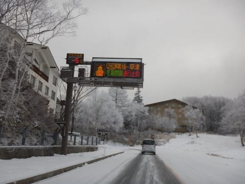

蓮池で-5度と，結構冷えてます！

今日，一の瀬～奥志賀方面で滑れるのは，

高天ヶ原トリプル，

一の瀬ファミリーペアB線，

焼額第2高速，第2ゴンドラ

の4本のみでしたが．

焼額ゴンドラ営業開始と聞けば．

目指すのは当然，焼額第2ゴンドラ！！

そして…

久しぶり～！

焼額第2ゴンドラ！！

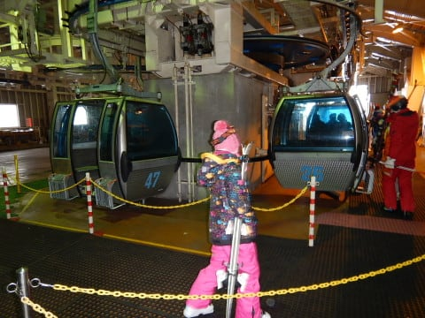

8か月ぶりのわがホームゲレンデのゴンドラとの

再会の挨拶を交わし，山頂にやってくると…

山頂の気温は-6℃．

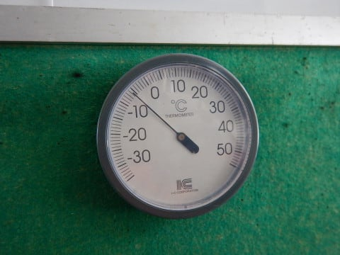

うーーむ．

-8～9℃という予想は外したけど…

でも，この時期としては冷え冷え！

そして．

本日の第2ゴンドラの営業は15:45までと

．

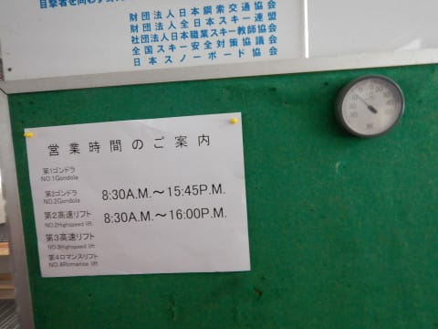

日の短いこの時期，ちょいと短めです…

で．

懐かしのこの景色！

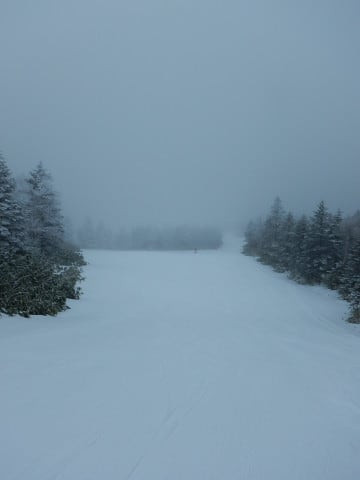

帰って来たよーーー！

焼額！！

朝の天気は，予想通りの曇り空．

多少雪もちらついており．

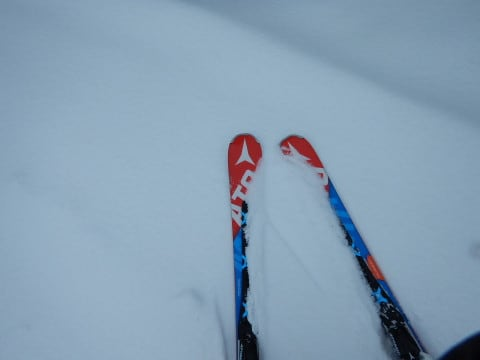

ゲレンデは，硬いバーンに前日から積もった

雪が軽く乗っているという状況で．

上に乗ったやわらかい雪の薄い層は，きれいな

シマシマっ！！

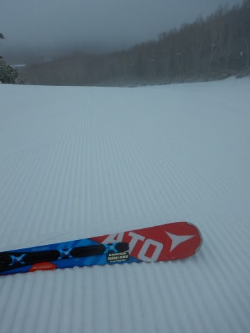

雪もたっぷりで気持ちよさそうだけど…

…でも．

実は下地は．

火曜に降った雨で融けた雪が固まった，

ちょいと硬めの下地…（ちょい涙）

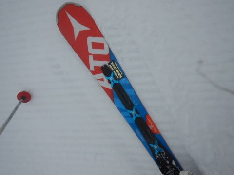

　数日間天然雪が積もっていないので，圧雪はかなり締まり気味．

　スピードが出る圧雪かな．

　もしかしたら，前日の晩にわずかに降った雪が，

　うっすら圧雪の上に乗っているかも…

という，まさに予想通りのコンディション…←天気予想が当たったことを必死にアピール

そして．

…あぁ．

やっぱり．

コロコロがところどころに…

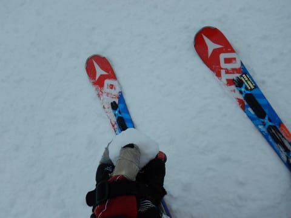

でも，妖怪コロコロばらまきが出現していたのは

ごく一部．

基本的には，コース幅いっぱい雪がついてて．

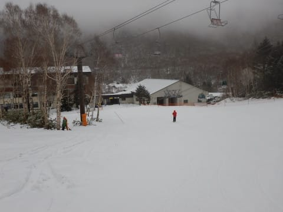

例年のオープン日と比べると，いいコンディション

じゃないですか！！

で．

朝のうちは曇っていたけど．

朝10:30を過ぎてくると…

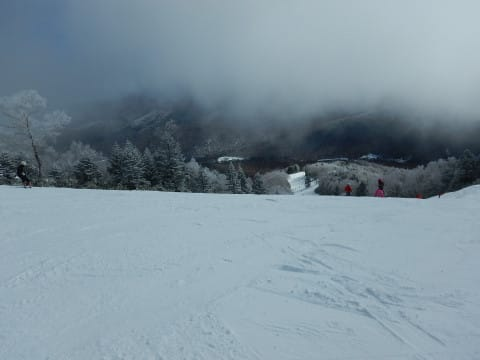

　天気は朝は曇っていたものが，昼に向かって

　日が射すようになっていく．

という予想通り，晴れてきましたよっ！！

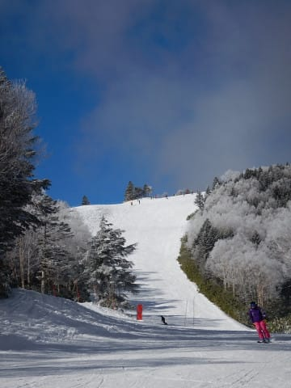

そして，11時ごろにはすっきり晴天！

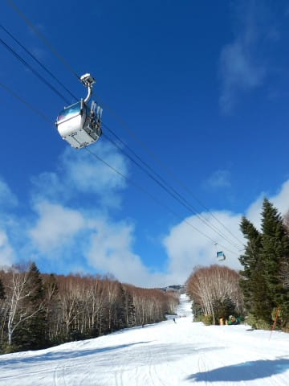

でも，気温は低いままで，絶好のスキー日和！！

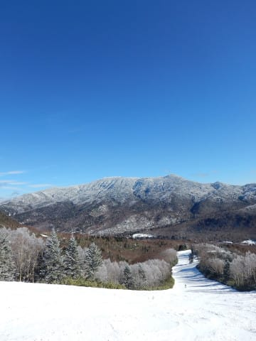

…だけれども．

ゲレンデは，ツルツルアイスバーンとまでは

行かないものの．

ちょいと固め…（ちょいと涙）

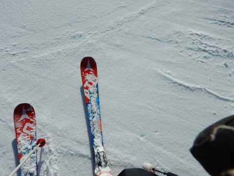

昼間も氷点下をキープしたので，

雪は全く緩まず．

ここも，

　でも，日が射しても気温は低く，雪はしっかり

　締まったままで緩まない．

という予想通りでしたね…←予想を当てたことを全力でアピール

だけど．

しかし．

景色は完全にトップシーズンなみ！

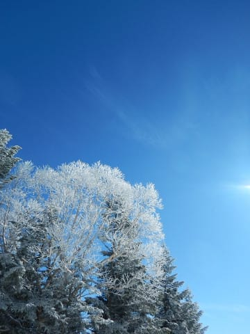

コース上は時折人が多くなる時はあるけど…

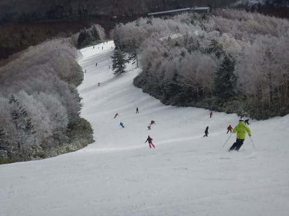

でも，基本的に好きなラインを滑れる程度の

人口密度で．

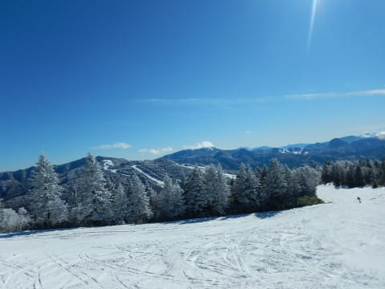

ゴンドラ待ちもほとんどなく．

ほぼ飛び乗り，

時折2-3台待つ…って程度で，

ガラガラ！

いや…

恵まれてる．

今シーズンのオープン時期．

恵まれてるよ…

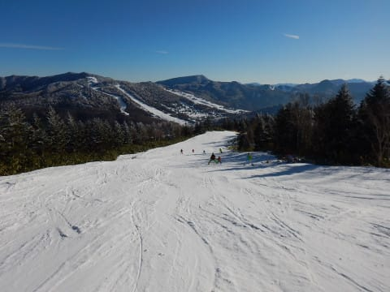

まぁ，12月第一週でこれだけ滑れれば．

ところどころ雪が硬いところがあろうが，許す．

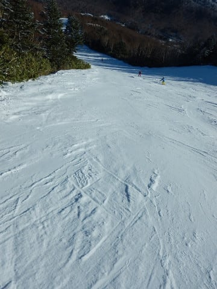

ごく一部に，ブッシュが出ていても許す！

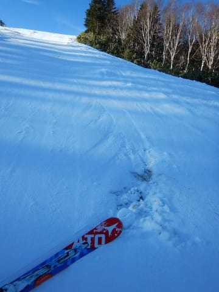

（ブッシュがあったのは2-3か所のみ，回避可能）

ってな感じで．

ゴンドラ営業は15:45までと短めだけど．

12月のこの時期．

営業終了時間となると．

もう日もかなり傾いてます…

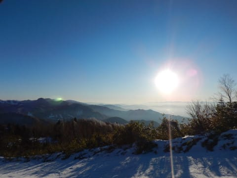

ってな感じで．

マイホームゲレンデのオープン日から,

しっかり営業終了まで

滑り続けたのでした…

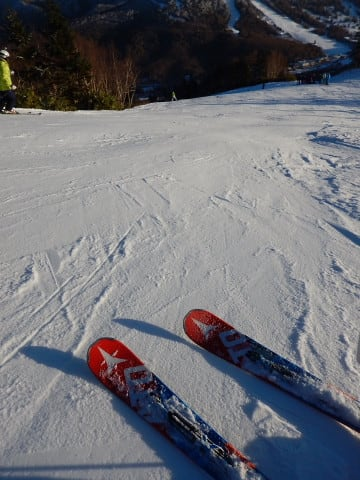

（やっぱり硬めの人工雪ゲレンデ）

…で．

終わらない．

まだ終わらない．

そうです．

一の瀬は16:20まで営業なので．

いつも通り，瞬間移動っ！！

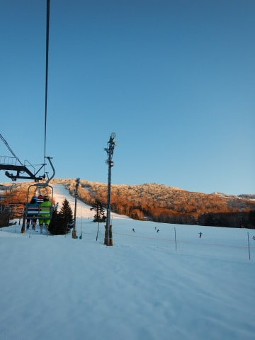

一の瀬も雪はたっぷりあるものの．

動いているのは短いペアリフトのみ

という，ちょいとさみしい状況．

でも，雪はたっぷりあって．

それも，焼額よりはやわらかい雪でした…

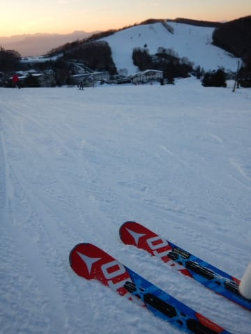

ってことで．

夕日が沈んでいく中．

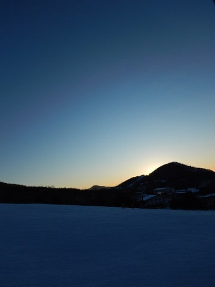

シーズン初日から，いつも通り．

しっかりラストリフトまで滑り続けたのでした…

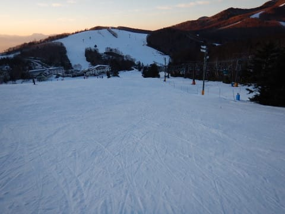

という感じで．

週半ばに降った雨の影響で，ゲレンデがちょいと

硬めになってしまっていたのは惜しかったけど．

でも，晴天冷え冷え，雪はたっぷりの焼額

オープンデー．

満足な一日でしたよ～！

## 💬 コメント一覧

### 💬 コメント by (タカ)
**タイトル**: 焼額山帰還おめでとうございます
**投稿日**: 2017-12-03 01:05:45

無事帰還されたようでよかったです。

やはり雪は固めみたいですね(泣)金曜かぐらも固めでした。来週どんどんどんどん雪が降って全山オープン太ももパフパフになるように頑張って踊りましょう(笑)怪我だけはお気をつけてください。

### 💬 コメント by (オオスギ)
**タイトル**: Unknown
**投稿日**: 2017-12-03 13:26:21

焼額のオープンも絶好調ですね！

Ｓさんに触発？！されて、お正月スキーを急きょ志賀一の瀬の宿に決めました。

志賀は約20年ぶりなので、ワクワクドキドキです！

（すみません、1月志賀高原に行くのに、ＦＦミニバン・中古スタッドレスでは無謀でしょうか？？、是非厳しいアドバイスをお願いいたします）

### 💬 コメント by (michi)
**タイトル**: お世話になりました
**投稿日**: 2017-12-03 16:25:01

昨日はゴンドラ最終までご一緒させて頂きありがとうございました。まさか初日から最終まで滑るとは思ってなかったです（笑）

娘さんのお姉さんぶりもGOODでした(^^)

またご一緒させて下さい。

### 💬 コメント by (Skier_S)
**タイトル**: 祝，焼額オープン！
**投稿日**: 2017-12-04 00:38:26

＞タカさま

無事帰還です！

もう，朝からずっといろんな人に挨拶しまくりでした．

雪は人工雪部分は固かったです．

人工雪が無いところはちょっと雪が

薄くなってきたので，とりあえずそろそろ

踊っておかなくちゃならない感じです…

＞オオスギさま

焼額は，オープン日からゴンドラ営業で，

かなり恵まれてますよ！

正月休みは一の瀬ですか！

焼額第1ゴンドラ乗り場でしばらく待っていれば，

おそらく私を発見できると思います…

正月の志賀高原，FF中古スタッドレスでも，

チェーンを持っていけば大丈夫だと思いますよ．

＞michiさま

土曜はお世話になりました！！！

娘はむちゃくちゃ楽しかったようです．

お付き合いいただき，ありがとうございました！

＃強引にラストゴンドラまでお付き合いさせてしまったという説も（笑）

お子さんにもよろしくお伝えください．

また一緒に滑りましょう！

